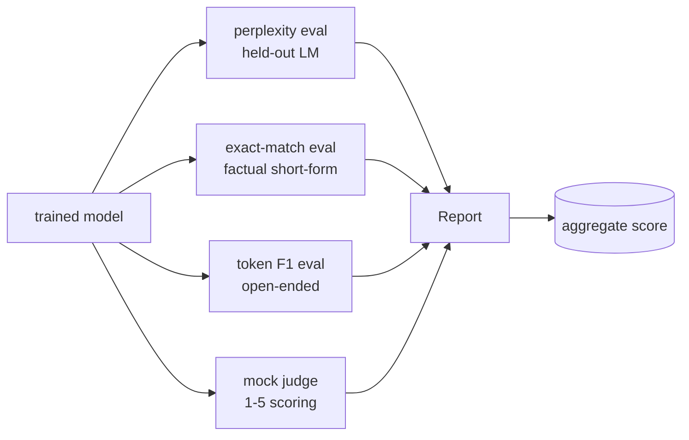
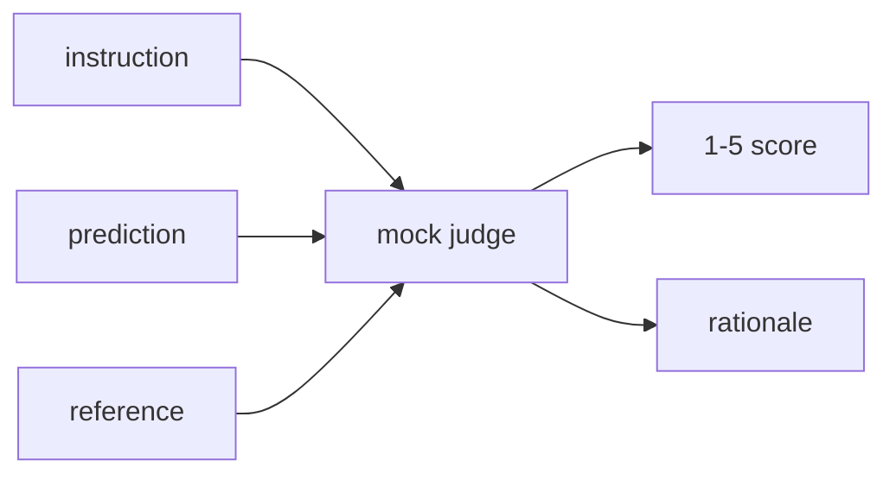
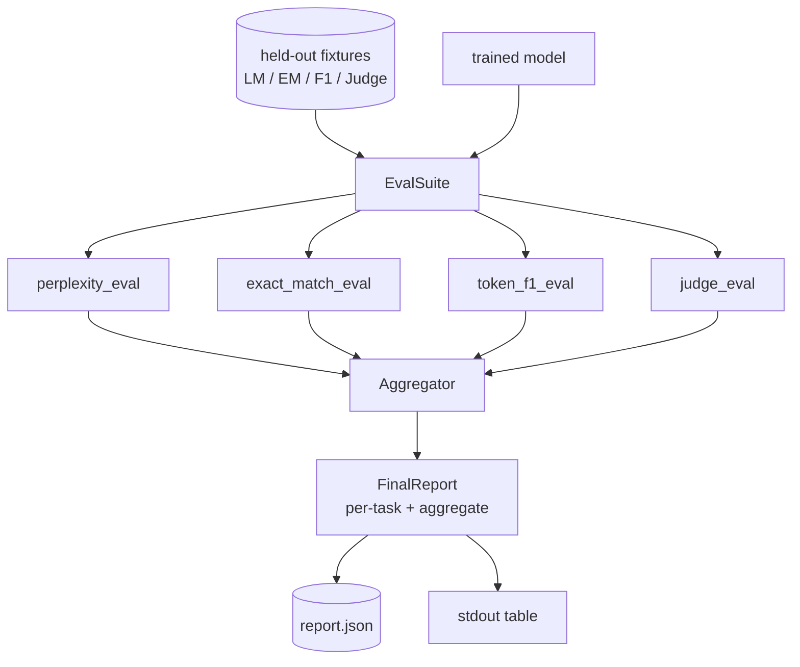

# Capstone Lesson 41: Full Evaluation Pipeline

> Обучение — это та часть, за которой можно следить по кривым лосса. Оценку приходится проектировать. Этот урок строит единый eval-пайплайн, который берет любую обученную языковую модель, гоняет по ней четыре разнородных eval'а, агрегирует результаты в пер-задачный отчет и поставляет локальный mock-судью (LLM-as-judge), чтобы цикл работал без сети. Четыре eval'а покрывают измерения, нужные каждой отгружаемой модели: языковое моделирование (перплексия), краткая корректность (exact-match), открытая похожесть (токенный F1) и качественная оценка (судья).

**Тип:** Практика
**Языки:** Python (torch, numpy)
**Пререквизиты:** Фаза 19, уроки 30–37 (трек NLP LLM: токенизатор, таблица эмбеддингов, attention-блок, тело трансформера, цикл предобучения, чекпоинты, генерация, перплексия)
**Время:** ~90 минут

## Цели обучения

- Посчитать перплексию на отложенных данных с корректным учетом маскированных токенов на крошечном трансформере.
- Прогнать exact-match-eval на кратких фактологических промптах.
- Посчитать токенный F1 между предсказанной и референсной строками с нормализацией.
- Построить локального mock-судью, оценивающего выходы модели по шкале 1–5.
- Агрегировать четыре eval'а в единый взвешенный отчет с пер-задачной разбивкой.

## Проблема

Одна метрика никогда не описывает языковую модель. Перплексия говорит, насколько хорошо модель подогнана к распределению языка, но молчит о том, отвечает ли она на вопросы. Exact-match говорит, выдает ли модель эталонную строку, но наказывает корректные парафразы. Токенный F1 прощает парафраз, но обманывается лексическим пересечением при неверном содержании. LLM-as-judge ловит качественные измерения, но дорог и стохастичен.

Пайплайн, который вам действительно нужен, содержит все четыре. Каждый eval покрывает измерение, которое остальные упускают. Каждый работает на своем подмножестве отложенных данных, подготовленном под эту метрику. Финальный отчет показывает пер-задачные числа бок о бок и агрегат — ревьюер с одного взгляда видит, какие компромиссы делает модель.

Этот урок строит такой пайплайн end to end в одном файле.

## Концепция

Каждый eval — функция `(model, dataset) -> EvalResult`. Результат несет значение метрики, пер-примерные детали для инспекции и имя для агрегата. Пайплайн компонует их конфигом, говорящим, какие eval'ы гонять и как взвешивать.

## Перплексия, посчитанная правильно

Перплексия — это `exp(средний отрицательный log-likelihood на токен)`. В реализации две ловушки:

- Среднее должно быть по фактическим токенным позициям, а не по batch * sequence. Pad-токены надо исключить из знаменателя, иначе перплексия будет выглядеть лучше, чем есть.
- Модель предсказывает следующий токен, поэтому логиты в позиции `i` предсказывают токен в позиции `i+1`. Ошибки off-by-one здесь молчаливы: лосс все равно обучает, но метрика теряет смысл.

Eval считает пер-батчевые суммы `-log p(token)` по не-pad-позициям и пер-батчевый счетчик токенов, а делит в самом конце. Это численно безопаснее усреднения пер-батчевых перплексий (которое недовзвешивает короткие последовательности) и совпадает с учебниковым определением.

## Exact-match с нормализацией

Харнес нормализует и предсказание, и референс перед сравнением:

- Нижний регистр.
- Обрезка окружающих пробелов.
- Схлопывание внутренних последовательностей пробелов в один.
- Отбрасывание финальной терминальной пунктуации (`.`, `!`, `?`), если стороны различаются только пунктуацией.

Нормализация делает exact-match практически полезным. Модель, сказавшая `"Paris"`, права; сказавшая `"Paris."` — тоже права; сказавшая `"  paris  "` — тоже. Метрика по-прежнему требует, чтобы ответ был той же строкой после нормализации.

## Токенный F1, правильным способом

Токенный F1 — гармоническое среднее precision и recall, посчитанных по мешку токенов. Шаги:

1. Нормализовать предсказание и референс (те же правила, что у exact-match).
2. Разбить каждое на список токенов (токенизация по пробелам).
3. Посчитать пересечение мультимножеств.
4. Precision = `intersection_count / len(pred_tokens)`. Recall = `intersection_count / len(ref_tokens)`. F1 — гармоническое среднее.

Если и предсказание, и референс пустые, F1 равен 1 (вакуумное совпадение). Если пусто только одно — F1 равен 0. Этот паттерн совпадает с референсной оценкой SQuAD и дает стабильные числа на парафразах.

## Локальный mock LLM-as-Judge

Настоящий судья — фронтирная модель за API. Для этого урока судья обязан работать офлайн. Mock-судья — детерминированный оценщик, берущий инструкцию, предсказание модели и референс и возвращающий оценку из `{1, 2, 3, 4, 5}` плюс однострочное обоснование. Правила оценки явные:

- 5, если нормализованное предсказание равно нормализованному референсу.
- 4, если токенный F1 между предсказанием и референсом не меньше 0.8.
- 3, если токенный F1 в `[0.5, 0.8)`.
- 2, если токенный F1 в `[0.2, 0.5)`.
- 1 иначе.

Это не настоящий судья, но у него правильный интерфейс. Позже подставьте настоящую модель, изменив одну функцию. Пайплайну все равно.

## Агрегация

Агрегат — взвешенное среднее нормализованных eval-оценок. Каждый eval репортит свое число в `[0, 1]`:

- Перплексия: нормализуется как `1 / (1 + log(perplexity))`. Перплексия 1 маппится в 1, бесконечность — в 0.
- Exact-match: уже в `[0, 1]`.
- Токенный F1: уже в `[0, 1]`.
- Судья: делится на 5.

Веса настраиваемые. Дефолтный микс — 0.2 перплексия, 0.3 exact-match, 0.3 токенный F1, 0.2 судья. Выбор весов — продуктовое решение; урок открывает ручку, чтобы вы могли экспериментировать.

## Архитектура

`EvalSuite` — тонкий оркестратор. Каждый отдельный eval — свободная функция, берущая `(model, tokenizer, dataset, config)` и возвращающая `EvalResult`. `Aggregator` собирает результаты и порождает финальный отчет. Демо печатает таблицу и пишет JSON-копию, которую может поглотить CI ниже по течению.

## Что вы соберете

Реализация — один `main.py` плюс тесты.

1. `TinyGPT`: та же decoder-only архитектура из уроков 38–40, включена, чтобы урок был самостоятельным.
2. `InstructionTokenizer`: байтовый токенизатор со спецтокенами INST / RESP / PAD.
3. Четыре фикстуры: LM-корпус, EM-набор, F1-набор и набор судьи. По двадцать примеров, детерминированные.
4. `perplexity_eval`: возвращает `EvalResult` со значением перплексии и гистограммой потокенного лосса.
5. `exact_match_eval`: возвращает средний EM и пер-примерные записи.
6. `token_f1_eval`: возвращает средний токенный F1 и пер-примерные записи.
7. `mock_judge` и `judge_eval`: пер-примерная оценка и обоснование, средняя оценка по набору.
8. `Aggregator.normalise`: правило нормализации на каждый eval.
9. `Aggregator.aggregate`: взвешенное среднее и собранный отчет.
10. `run_demo`: коротко обучает крошечную модель, гоняет все четыре eval'а, печатает таблицу отчета и пишет JSON, выходит с нулем при успехе.

## Чтение отчета

У отчета три слоя. Наверху — агрегированная оценка. Под ней — четыре пер-eval-числа. Под ними — пер-примерные разбивки для диагностики. Падающему CI-прогону обычно нужен агрегат, а ревьюеру, гоняющемуся за регрессией, — пер-примерная разбивка, чтобы увидеть, на каких входах модель ошиблась.

JSON-дамп использует стабильные ключи, чтобы CI-дашборд мог строить трендовые линии по версиям. Красиво напечатанная таблица — для людей, глядящих в терминал после обучающего прогона.

## Дополнительные цели

- Добавьте eval калибровки: совпадают ли softmax-вероятности модели с ее точностью? Разложите предсказания по бакетам уверенности и репортите эмпирическую точность на бакет.
- Добавьте eval робастности: пометьте каждый пример пертурбацией (опечатка, парафраз, дистрактор) и репортите падение метрики на пертурбацию.
- Замените mock-судью настоящей моделью за HTTP-вызовом. Сигнатура функции не меняется.
- Добавьте обучение пер-задачных весов: вместо фиксированных весов подгоните веса под целевой порядок предпочтений между моделями.

Реализация дает вам четыре eval'а, агрегатор и отчет. Настоящие пайплайны оценки наслаивают сверху много других измерений; паттерн не меняется: одна функция на eval, один агрегатор, один отчет.

## Дополнительное чтение

- Фаза 11, урок 10 — оценка и тестирование.
- Фаза 5, урок 27 — фреймворки оценки LLM (RAGAS, DeepEval, G-Eval).
- Фаза 19, урок 40 — DPO-модель, которую оценивает этот пайплайн.
