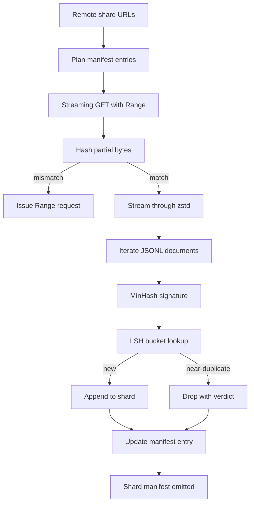

# Large Corpus Downloader

> Обучение языковой модели начинается задолго до первого forward-прохода. Корпус должен приземлиться на диск — распакованный, дедуплицированный и адресуемый, причём история resume должна быть продумана до того, как сеть отвалится на 4 процентах. Этот урок строит стриминговый загрузчик, который тянет сжатые шарды, распаковывает на лету через Zstandard, отпечатывает почти-дубликаты через MinHash плюс locality-sensitive hashing и пишет манифест шардов, которому может доверять остальной пайплайн.

**Тип:** Практика
**Языки:** Python
**Пререквизиты:** Фаза 19, уроки 30–37
**Время:** ~90 минут

## Цели обучения

- Стримить удалённые шарды через `urllib` и распаковывать `zstandard`, не буферизуя весь файл в памяти.
- Возобновлять частичные загрузки HTTP `Range`-запросами от проверенного байтового смещения.
- Строить MinHash-подпись на документ и раскладывать её по LSH-бакетам, чтобы почти-дубликаты сталкивались.
- Излучать манифест шардов с хешем содержимого, размером в байтах, числом документов и вердиктом дедупликации.

## Проблема

В первый раз, когда вы обучаетесь на корпусе в 200 ГБ, сеть падает на 41 проценте, и скрипт выходит с `urllib`-исключением. Во второй раз — на 78. К 99 процентам вы переписали цикл трижды. Два отказа, под которые надо проектировать с первой минуты, — resume частичной загрузки и удаление дублирующихся документов. У обоих есть известные решения; оба регулярно пропускают, потому что пайплайн начинается как однострочный `requests.get`, у которого потом отросли зубы.

Resume — HTTP-проблема. Сервер обязан чтить `Range`, клиент обязан отслеживать проверенное смещение по записи на диске, и это смещение обязано переживать смерть процесса. Если смещение и файл разойдутся хоть на байт, возобновлённая загрузка пишет мусор, и корпус повреждён так, что всплывёт только на токенизации.

Дедупликация — проблема подписей. Дедуп по точному хешу упускает почти-дубликаты: одна и та же статья Википедии с тремя разными boilerplate-футерами, тот же код-файл с другим заголовком лицензии, тот же блог-пост с трекинговым параметром на каждой ссылке. MinHash плюс LSH ловит их за сублинейную стоимость. Цена — одна подпись на документ и один поиск бакета на подпись.

## Концепция



### Стриминг через `urllib`

Стандартный `urllib.request.urlopen` возвращает file-like-объект. Оберните его в `zstandard.ZstdDecompressor().stream_reader` — и байты текут из сети через декомпрессор в итератор документов, никогда не материализуя ни сжатый, ни распакованный шард в памяти. Единственная стоимость по памяти — буфер строки, MinHash-подпись текущего документа и LSH-индекс.

### Resume через `Range`

Загрузчик пишет два файла на шард: сам шард и чекпоинт `.partial.json`. Чекпоинт записывает `verified_bytes`, `expected_size`, `sha256_prefix` (посчитанный по первым `verified_bytes` байтам) и исходный URL. На старте загрузчик читает чекпоинт, пересчитывает `sha256_prefix` по байтам на диске и возобновляется, только если пересчитанный хеш совпал. Если хеш неверный, частичный файл отбрасывается и загрузка стартует с нулевого байта. Молчаливое повреждение невозможно, потому что проверенные байты проверяются, а не предполагаются.

### MinHash плюс LSH

MinHash оценивает жаккаровское сходство двух множеств в фиксированной памяти. Для документа множество — шинглы (перекрывающиеся n-граммы) его текста. Подпись — `k` минимальных хеш-значений, по одному на независимую хеш-функцию. Два документа с жаккаровским сходством `s` с вероятностью `s` совпадают в любой отдельной компоненте подписи.

LSH затем группирует `k` компонент в `b` полос по `r` строк, где `k = b * r`. Два документа сталкиваются хотя бы в одной полосе с вероятностью `1 - (1 - s^r)^b` — это резкий порог вокруг того значения `s`, под которое вы настраиваете `(b, r)`. Порог для типичного дедупа корпуса — `s = 0.8`, чего исследовательская литература по LSH достигает при `k = 128`, `b = 32`, `r = 4`.

### Манифест шардов как контракт

Единственный долговечный выход загрузчика — манифест. Манифест держит на каждый шард URL, распакованный размер в байтах, число документов, число уникальных документов после дедупа и sha256 финального файла шарда. Токенизация ниже по течению читает манифест, а не листинг директории. Если шард отсутствует или его sha256 неверен, манифест велит следующей стадии отказаться стартовать. Манифест — та решающая грань между «данные скачаны» и «данные скачаны и верифицируемы».

## Соберите это

`code/main.py` реализует:

- `ShardPlanner` — читает список URL шардов и порождает запланированные записи манифеста.
- `StreamingDownloader` — открывает `urllib`-поток с опциональным `Range`, пишет во временный файл, обновляет чекпоинт `.partial.json` на каждом чанке и проверяет sha256-префикс при resume.
- `ZstdDocIterator` — оборачивает file-like-поток в `zstandard.ZstdDecompressor` и выдаёт по документу на строку.
- `MinHasher` — порождает `k`-компонентную подпись строки фиксированным семейством хеш-сидов.
- `LSHIndex` — раскладывает подписи по полосам и репортит коллизии.
- `Dedup` — сочетает хешер и индекс, помечая каждый документ `keep` или `near_duplicate` вместе с id совпавшего шарда.
- `ManifestWriter` — собирает пер-шардовую статистику и пишет `manifest.json`.

Демо внизу файла строит маленький синтетический корпус на диске, сжимает его `zstandard`, скачивает через `file://`-URL, дедуплицирует и печатает манифест.

Запустите:

```bash
python3 code/main.py
```

Скрипт выходит с нулём и печатает сводку манифеста.

## Production-паттерны

Четыре паттерна масштабируют этот урок до настоящих корпусов.

**Чекпоинт до записи.** `.partial.json` должен быть `fsync`-нут до того, как байты допишутся в шард. Иначе потеря питания переворачивает порядок: байты шарда на диске, чекпоинт без них, следующий resume верит, что проверенных байтов меньше, чем есть, и продублированный суффикс портит файл. Сначала чекпоинт, потом запись. Та же дисциплина, что у write-ahead log.

**Шардированный LSH-индекс.** Один LSH-индекс на весь корпус в RAM на масштабе 200 ГБ не помещается. Разбейте LSH-индекс по хешу первой полосы, храните партиции на диске и обращайтесь только к той партиции, куда попала бы новая подпись. Цена — одно дополнительное чтение с диска на документ; выгода — LSH-индекс больше не жёсткий потолок памяти.

**Tombstone, а не delete.** Отброшенные дубликаты записываются в манифест с вердиктом `near_duplicate` и id шарда документа, с которым они столкнулись. Удаление теряет связь между дубликатом и его хранителем. Tombstone сохраняет аудит-след и позволяет последующему проходу передумать насчёт порога.

**Пер-шардовый sha256 в манифесте плюс sha256 самого манифеста.** Манифест сам получает хеш содержимого. Стадии ниже по течению проверяют хеш манифеста, прежде чем доверять пер-шардовым записям. Без этого манифест — молчаливая поверхность атаки: атакующий, способный отредактировать один файл, портит весь пайплайн.

## Используйте это

Production-паттерны:

- **Resume на каждом CI-прогоне.** CI-раннеры эфемерны. Загрузчик обязан предполагать свежий диск на каждом прогоне и восстанавливаться из кэша или с удалённого источника. `--cache-dir` — флаг первого класса.
- **Дедуп до токенизации.** Токенизация дорогая. Гонять её дважды по одному документу — двойная цена за ту же кривую лосса. Дедуп стоит выше токенизации по течению, а не ниже.
- **Манифест как merge gate.** Обучающий прогон читает sha256 манифеста из запиненного коммита. Новая версия датасета требует нового коммита манифеста. Связь между кодом и данными — это git, а не фольклор.

## Отгрузите это

`outputs/skill-corpus-downloader.md` в настоящем проекте описал бы, какие URL кормят загрузчик, как устроена директория чекпоинтов, какую ширину шингла и тройку `(k, b, r)` использует дедуп и где манифест живёт в version control. Этот урок отгружает движок.

## Упражнения

1. Добавьте флаг `--shingle-width` и измерьте, как меняется вердикт дедупа при ширинах 3, 5, 9. Обоснуйте выбранный дефолт.
2. Добавьте поддержку gzip рядом со zstd, распознавая магические байты. Загрузчик не должен требовать от вызывающего указывать кодек.
3. Добавьте режим `--resume-only`, отказывающийся начинать свежую загрузку, если чекпоинт не найден. Полезно в CI, чтобы один прогон случайно не перекачал 200 ГБ.
4. Перенесите LSH-индекс в shelf- или sqlite-файл и измерьте throughput против in-memory-варианта.
5. Добавьте проверку sha256 манифеста на старте. Загрузчик должен падать закрыто, если манифест на диске расходится с хешем в `manifest.lock`.

## Ключевые термины

| Термин | Как говорят | Что это на самом деле |
|------|-----------------|------------------------|
| Шард | «Файл» | Самодостаточный срез корпуса со своим sha256, единица resume и дедупа |
| MinHash-подпись | «Отпечаток» | `k`-компонентный скетч множества, где каждая компонента — минимум одного независимого хеша по множеству |
| LSH-полоса | «Бакет» | Группа из `r` компонент подписи, используемая как один бакетный ключ для детекции коллизий |
| Проверенные байты | «Смещение resume» | Байты на диске, чей sha256-префикс совпадает с чекпоинтом; единственное безопасное смещение для возобновления |
| Манифест | «Индекс» | Единственная долговечная запись того, что породил загрузчик, включая хеши содержимого |

## Дополнительное чтение

- [RFC 7233](https://datatracker.ietf.org/doc/html/rfc7233) — HTTP Range-запросы, протокол resume
- [Спецификация формата Zstandard](https://datatracker.ietf.org/doc/html/rfc8478) — формат фреймов, делающий стриминговую распаковку безопасной
- [MinHash](https://en.wikipedia.org/wiki/MinHash) — семейство подписей этого урока
- [Locality-sensitive hashing](https://en.wikipedia.org/wiki/Locality-sensitive_hashing) — полосная схема за порогом дедупа
- Фаза 19 · 43 — токенизированный корпус в HDF5, который кормит загрузчик
- Фаза 19 · 44 — косинусное расписание, обучающееся на корпусе
- Фаза 19 · 45 — AMP-цикл, потребляющий расписание
