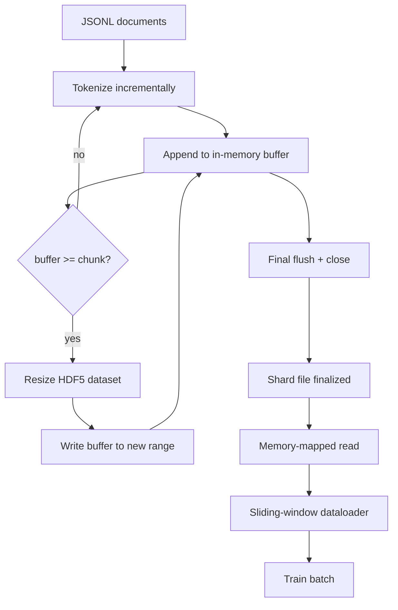

# HDF5 Tokenized Corpus

> Скачанный корпус должен приземлиться в раскладку, из которой тренер сможет стримить на скорости провода. JSONL на диске не переживает 16 dataloader-воркеров. HDF5 с растягиваемым, чанкованным целочисленным датасетом — переживает. Этот урок строит стриминговую токенизацию в растягиваемый HDF5-датасет, шардированную запись по нескольким файлам, memory-mapped чтение во время обучения и dataloader со скользящим окном, порождающий последовательности фиксированной длины с правильным паковочным правилом.

**Тип:** Практика
**Языки:** Python
**Пререквизиты:** Фаза 19, уроки 30–37
**Время:** ~90 минут

## Цели обучения

- Стримить документы в растягиваемый целочисленный HDF5-датасет с детерминированным чанкованием.
- Шардировать запись по нескольким HDF5-файлам, чтобы отказ был ограничен, а параллелизм — возможен.
- Читать токены обратно через чанкованную раскладку HDF5, опирающуюся на page cache, чтобы dataloader копировал в батчевые буферы только в момент сборки батча.
- Реализовать dataloader со скользящим окном, излучающий обучающие последовательности фиксированной длины с явными правилами паковки.

## Проблема

Современный прогон обучения языковой модели читает токены на скорости сотен тысяч сэмплов в секунду через десятки воркеров. JSONL на диске умирает на первом же page fault холодного кэша: JSON-парсер медленный, границы документов не адресуемы, а seek к «сэмплу 4 217 884» требует сканирования файла. Даже Parquet, который хорошо сжимается, подходит плохо: тренеру не нужны колонки — ему нужен плоский поток токенов с O(1) случайным доступом.

HDF5 подходит, потому что предлагает чанкованный, растягиваемый, целочисленный датасет, чьи чанки дружелюбны к page cache при чтении. Тренер просит срез `tokens[3,200,000 : 3,200,8192]`, и HDF5 копирует запрошенный гиперслэб из page cache в свежевыделенный NumPy-массив. Цена — один открытый файловый дескриптор и page-cache-след размером в чанк на воркера, что пренебрежимо по сравнению со стоимостью декодирования JSONL.

Строительная проблема — сделать честной сторону записи. Растягиваемые датасеты легко использовать неправильно: пишите по документу за раз — и HDF5-файл фрагментирован до непригодности. Запишите все документы одним resize — и смерть процесса теряет весь шард. Правильная дисциплина — буферизуй-затем-растягивай, с размером буфера, равным размеру чанка, и шардированной записью, режущей нагрузку по файлам, чтобы краш терял максимум один шард.

## Концепция



### Растягиваемый HDF5 правильным способом

Токенный датасет создается с `maxshape=(None,)` и фиксированным `chunks=(chunk_size,)`. Запись идет через буферизацию токенов в NumPy-массиве длины `chunk_size`. Когда буфер заполняется, датасет растягивается ровно на `chunk_size`, и буфер пишется в новый диапазон. В конце шарда остаточный буфер пишется в финальный частичный диапазон. Каждая запись непрерывна и выровнена по чанку, кроме последней, — читателю велено обрезать ее по записанному в HDF5-атрибутах шарда `token_count`.

### Шардированная запись

Один HDF5-файл — одна точка отказа. Пайплайн пишет шарды параллельно: каждый входной шард из урока 42 Фазы 19 порождает один выходной HDF5-шард. Индекс `shards.json` записывает на каждый шард путь к файлу, число токенов, число документов и sha256 по токенам. Тренер читает `shards.json`, чтобы посчитать глобальные смещения и провалидировать корпус.

### Memory-mapped чтение

Во время обучения каждый воркер открывает свою долю HDF5-файлов в режиме `swmr=True` и просит `tokens[start:stop]`. Чанкованная раскладка HDF5 делает это чтением из page cache, как только чанк прогрет. Воркер никогда не материализует весь файл: срез копируется в батчевый буфер dataloader'а, который затем копируется в pinned-memory обучающий тензор в момент батча. На горячем пути — один syscall на переход между чанками; все остальное — доступ к RAM.

### Dataloader со скользящим окном

Dataloader — единственная стадия, знающая о длине обучающей последовательности. Он выбирает случайный стартовый индекс в глобальном потоке токенов, читает `window_size + 1` токенов и возвращает `(input, target) = (tokens[:-1], tokens[1:])`. Границы документов не насаждаются: окно может лежать поперек двух документов, с явным `boundary_token_id` между ними, чтобы модель научилась использовать разделитель. Это стандартное правило паковки; и это же правило забывает новичок, получая корпус, где 8 процентов — обучающие граничные токены, а 92 — естественный текст.

## Соберите это

`code/main.py` реализует:

- `Tokenizer` — байтовый детерминированный токенизатор, достаточный для демо. Интерфейс — `encode(text) -> list[int]` и `vocab_size`.
- `HDF5ShardWriter` — открывает растягиваемый целочисленный датасет, буферизует токены до размера чанка, растягивает и пишет фиксированными шагами, записывает `token_count` и `sha256` HDF5-атрибутами при закрытии.
- `ShardedTokenizationPipeline` — итерирует входные документы, маршрутизирует их в writer и излучает индекс `shards.json`.
- `MmapTokenStore` — открывает файлы шардов для memory-mapped чтений, считает глобальные смещения, открывает единый API `get_slice(start, stop)`.
- `SlidingWindowDataloader` — выбирает случайные окна из глобального потока и выдает NumPy-массивы `(input_ids, target_ids)`.

Демо внизу файла строит крошечный in-memory корпус, токенизирует в два шарда, открывает их через memory map, гоняет dataloader 10 батчей и печатает форму каждого батча и чексумму.

Запустите:

```bash
python3 code/main.py
```

Скрипт выходит с нулем и печатает чексуммы батчей.

## Production-паттерны

Четыре паттерна масштабируют этот урок до настоящего обучающего прогона.

**Размер чанка равен типичному чтению.** Тренер читает `window_size + 1` токенов на сэмпл. Поставьте HDF5-чанк кратным `window_size` — и чтения выровнены по page cache. Несогласованные чанки половинят throughput, потому что каждый сэмпл трогает два чанка.

**Число токенов — в атрибутах, а не в датасете.** Хвостовой срез датасета может быть заполнен частично, потому что размер чанка не делит границу документа. Храните настоящий `token_count` HDF5-атрибутом на датасете, и пусть читатель обрезает по этому значению. Без этого читатель уходит за конец в зануленные токены, и модель учится предсказывать ноль.

**Шардированный sha256 с параллельной верификацией.** У каждого шарда свой sha256 по байтам токенов. Тренер может проверить все шарды параллельно до старта обучения. Неверный sha256 роняет прогон рано, а не на третьей эпохе после шестнадцати часов.

**`swmr=True` с обеих сторон, с `libver="latest"` на writer'е.** Режим Single-Writer-Multiple-Reader требует, чтобы writer открылся с `libver="latest"`, создал все датасеты заранее и затем выставил `file.swmr_mode = True`. После этого writer обязан вызывать `dataset.flush()` после каждого resize, чтобы воркеры-читатели (открытые с `swmr=True`) видели согласованные данные. Пропуск `libver="latest"` или включение SWMR после структурных изменений — частый источник отказов «file is locked».

## Используйте это

Production-паттерны:

- **Один HDF5 на исходный шард.** Загрузчик (урок 42) излучает по шарду на URL; токенизация (этот урок) — по HDF5 на исходный шард. Маппинг 1:1 делает resume и восстановление после частичного отказа тривиальными.
- **Id граничного токена.** Граничный токен — часть словаря токенизатора и единственный токен, который инъектирует dataloader. Обучающий лосс маскирует граничный токен, если модель должна его игнорировать; иначе она учится использовать его как разделитель последовательностей.
- **`shards.json` как источник правды.** Добавить новый шард — значит записать HDF5, посчитать его sha256 и дописать запись. Тренер читает файл один раз на старте и никогда не трогает листинг директории.

## Отгрузите это

`outputs/skill-hdf5-tokenized-corpus.md` в настоящем проекте описал бы, какой токенизатор кормит пайплайн, какой размер чанка соответствует окну тренера, где `shards.json` живет в version control и как dataloader-воркеры шардируются по файлам. Этот урок отгружает движок.

## Упражнения

1. Добавьте HDF5-writer'у флаг `--compression gzip` и измерьте стоимость по throughput на демо-корпусе. Обоснуйте выбранный дефолт.
2. Добавьте детерминированный сид dataloader'у со скользящим окном и убедитесь, что два прогона с одним сидом дают идентичные батчи.
3. Добавьте режим `--validate`, читающий каждый шард, пересчитывающий sha256 по его токенам и сравнивающий с `shards.json`. CI должен гонять это до старта обучения.
4. Сравните throughput dataloader'а при размерах чанка, равных окну, половине окна и двум окнам. Опишите эффект page cache.
5. Добавьте флаг `--max-document-tokens`, обрезающий очень длинные документы на этапе записи. Обоснуйте компромисс против решения на этапе чтения.

## Ключевые термины

| Термин | Как говорят | Что это на самом деле |
|------|-----------------|------------------------|
| Растягиваемый датасет | «Append-only» | HDF5-датасет с `maxshape=(None,)`, растущий вызовами `resize` шагами размера чанка |
| Чанкованная раскладка | «Как HDF5 это хранит» | Дисковые страницы фиксированного размера, которые ядро может замапить в память, а dataloader — читать непрерывно |
| Режим `swmr` | «Чтение при записи» | Режим Single-Writer-Multiple-Reader, позволяющий dataloader-воркерам безопасно делить файл |
| Индекс шардов | «shards.json» | Долговечный индекс всех токенных шардов со смещениями и хешами содержимого |
| Скользящее окно | «Обучающий сэмпл» | Срез фиксированной длины глобального потока токенов, который тренер спаривает с целью со сдвигом на один |

## Дополнительное чтение

- [Документация чанкования HDF5](https://docs.hdfgroup.org/hdf5/v1_14/) — чанкованная растягиваемая раскладка датасетов этого урока
- [Руководство h5py](https://docs.h5py.org/en/stable/) — Python-биндинги HDF5
- [Memory mapping в NumPy](https://numpy.org/doc/stable/reference/generated/numpy.memmap.html) — читающий примитив, который HDF5 открывает через h5py
- Фаза 19 · 42 — загрузчик, чей выход токенизирует этот урок
- Фаза 19 · 44 — косинусное расписание, потребляющее этот dataloader
- Фаза 19 · 45 — AMP-цикл, оборачивающий обучающий шаг
