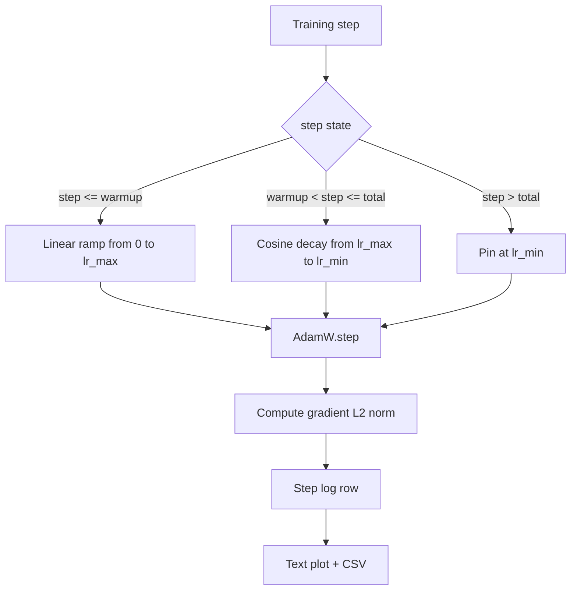

# Cosine LR with Linear Warmup

> Расписание learning rate — второе по важности решение после функции лосса. AdamW с косинусным затуханием и линейным warmup — современный дефолт обучения языковых моделей: он даёт модели маленький эффективный шаг во время хрупкой первой тысячи обновлений, разгоняется до сконфигурированного пика и плавно затухает обратно к нулю. Этот урок строит это расписание, рисует кривую по шагам обучения, логирует нормы градиентов рядом с расписанием и доказывает, что расписание чтит границы warmup, пика и затухания.

**Тип:** Практика
**Языки:** Python
**Пререквизиты:** Фаза 19, уроки 30–37
**Время:** ~90 минут

## Цели обучения

- Реализовать оптимизатор AdamW, подключённый к косинусному расписанию learning rate с линейным warmup.
- Вычислять точное значение расписания на любом шаге без floating-point-дрейфа между прогонами.
- Логировать L2-норму градиента бок о бок с learning rate, чтобы здоровье обучения было наблюдаемым.
- Отрисовать расписание текстовым графиком, читаемым глазом, и CSV, потребляемым любым инструментом.

## Проблема

Первая тысяча обучающих обновлений — самая громкая. Веса модели ещё близки к инициализации. Бегущая оценка второго момента у оптимизатора не стабилизировалась. Норма градиента большая и шумная. Если learning rate на пике во время этих обновлений, модель либо расходится сразу, либо оседает на плато лосса, с которого никогда не сходит. Два известных лечения — клиппинг градиентов, тема урока 45 Фазы 19, и расписание learning rate, стартующее с малого и разгоняющееся.

У расписания косинус-с-warmup три области. От шага ноль до шага `warmup_steps` learning rate линейно масштабируется от нуля до сконфигурированного пика `lr_max`. От `warmup_steps` до `total_steps` learning rate следует верхней половине косинусной кривой, затухая от `lr_max` до `lr_min`. После `total_steps` learning rate пришпилен к `lr_min`, чтобы неверно сконфигурированный тренер, промахнувшийся мимо конца, не вышел из расписания молча.

Строительная проблема в том, что в расписаниях легко ошибиться на единицу. Off-by-one всплывает через шесть часов обучения как learning rate, который на 1 процент выше или ниже нужного ровно в момент, когда модель начинает переобучаться, — это невидимо, пока расписание не оттестировано на границах исчерпывающе.

## Концепция



### Формула warmup

Для `step` в `[0, warmup_steps]` при `warmup_steps > 0` learning rate равен `lr_max * step / warmup_steps`. Вырожденный случай `warmup_steps = 0` трактуется как «без warmup»: расписание стартует прямо с `lr_max` на нулевом шаге и немедленно входит в косинусное затухание. Некоторые тестовые харнесы передают `warmup_steps = 0`, чтобы проверить, что расписание всё равно даёт пригодную кривую.

### Формула косинуса

Для `step` в `(warmup_steps, total_steps]` learning rate равен `lr_min + 0.5 * (lr_max - lr_min) * (1 + cos(pi * progress))`, где `progress = (step - warmup_steps) / max(1, total_steps - warmup_steps)`. На `step = warmup_steps` косинус равен `cos(0) = 1`, что даёт `lr_max` — точное совпадение с концом warmup. На `step = total_steps` косинус равен `cos(pi) = -1`, что даёт `lr_min` — точное совпадение с концом затухания.

Непрерывность на обоих концах — не случайность. Именно поэтому расписание реализовано одной функцией от `step`, а не тремя склеенными. Склеенное расписание теряет одну границу при первой же смене `lr_max`.

### Пол после total steps

Для `step > total_steps` learning rate остаётся на `lr_min`. Контракт явный: расписание не кидает ошибок и не экстраполирует; оно пришпиливается к полу и позволяет тренеру залогировать предупреждение. Тренеры, которым нужно продлить обучение, меняют `total_steps` расписания, а не цикл.

### Логирование нормы градиента рядом с rate

Расписание — половина здоровья обучения. Норма градиента — вторая половина. Цикл обучения логирует обе на каждом шаге. Расходящийся прогон показывает всплеск нормы градиента раньше лосса; хорошо настроенный warmup держит норму, растущую линейно с rate; слишком агрессивный пик проявляется нормой, остающейся высокой после warmup. Датасет на диске — `step, lr, grad_l2_norm, loss`. CSV — единственная долговечная запись.

## Соберите это

`code/main.py` реализует:

- `CosineWithWarmup` — stateless-функция `lr(step) -> float` по сконфигурированному расписанию.
- `TrainState` — оборачивает модель, оптимизатор `AdamW` и расписание в единую step-функцию.
- `TrainState.step` — гоняет один forward-проход, один backward-проход, логирует L2-норму градиента и применяет `lr(step)` к оптимизатору.
- `plot_schedule_ascii` — отрисовывает расписание текстовым графиком, читаемым глазом.
- `write_schedule_csv` — излучает по строке на шаг с learning rate.

Демо внизу файла собирает крошечную `nn.Linear`-модель, обучает 20 шагов на фиксированном входном батче и печатает пошаговый learning rate, норму градиента и лосс. Расписание также отрисовывается текстовым графиком для визуального sanity-контроля.

Запустите:

```bash
python3 code/main.py
```

Скрипт выходит с нулём и печатает пошаговый лог обучения плюс график расписания.

## Production-паттерны

Четыре паттерна поднимают расписание до продакшен-артефакта.

**Расписание живёт в конфиге, а не в коде.** Тренер читает `warmup_steps`, `total_steps`, `lr_max`, `lr_min` из YAML- или JSON-конфига, закоммиченного в git. Расписание воспроизводимо, потому что конфиг контентно-адресуем; расписание аудируемо, потому что конфиг — часть PR-диффа.

**Счётчик шагов монотонен и отвязан от эпох.** Некоторые фреймворки путают шаг и эпоху, когда датасет шардирован или dataloader перезапускается. Расписание читает `global_step` из чекпоинта тренера, а не из локального счётчика. Возобновлённый прогон продолжается на правильной позиции расписания, потому что счётчик шагов — долговечная ось.

**График расписания в директории прогона.** Каждый обучающий прогон пишет `outputs/lr_schedule.png` (в этом уроке — текстовый график) в свою директорию. Ревьюер, пролиставший директорию, может проверить расписание, ничего не перезапуская. Это ловит класс багов «неверно сконфигурированное расписание» на этапе PR.

**Схема строки лога зафиксирована.** `step, lr, grad_l2_norm, loss` — именно в этом порядке. Ноутбук или дашборд ниже по течению читают схему; переименование колонки без поднятия версии инвалидирует каждый существующий дашборд.

## Используйте это

Production-паттерны:

- **Свипайте пик раньше всего остального.** `lr_max` — самая чувствительная ручка. Сначала свипните её на маленькой модели; оптимальный `lr_max` слабо масштабируется с размером модели, так что свип на маленькой — сильный prior.
- **Warmup — доля от общих шагов, а не абсолютный счётчик.** Прогон на 200 миллионов шагов с 2 000 шагами warmup стартует с пика почти сразу; прогон на 20 000 шагов с тем же числом греется 10 процентов пути. Настраивайте warmup долей (типично 1–3 процента), чтобы расписание масштабировалось с длительностью обучения.
- **`lr_min` ненулевой намеренно.** Пол в 10 процентов от `lr_max` оставляет оптимизатор обучающимся на длинном хвосте. Расписание с `lr_min = 0` даёт кривую обучения, красивую на графике, и модель, которая на самом деле не дообучилась.

## Отгрузите это

`outputs/skill-cosine-warmup.md` в настоящем проекте описал бы, какой конфиг несёт расписание, из какого шага тренера читается глобальный счётчик и какой свип `lr_max` породил задеплоенное значение. Этот урок отгружает движок.

## Упражнения

1. Добавьте inverse-square-root-вариант расписания и сравните его на игрушечном обучении в 200 шагов. Какая кривая даёт меньший финальный лосс?
2. Добавьте флаг `--restart`, добавляющий второй warmup на `total_steps / 2`. Обоснуйте, улучшают или ухудшают warm restarts игрушечный прогон.
3. Добавьте юнит-тест непрерывности расписания: для каждого шага в `[0, total_steps]` разность `|lr(step+1) - lr(step)|` ограничена `lr_max / warmup_steps`.
4. Подключите расписание к `torch.optim.lr_scheduler.LambdaLR`, чтобы оно компоновалось с фреймворочным кодом. Урок использует обычную step-функцию; что меняет обёртка?
5. Добавьте флаг `--plot-png`, пишущий настоящий график через `matplotlib`. Обоснуйте, что лучший дефолт для CI-прогонов — текстовый график урока или PNG.

## Ключевые термины

| Термин | Как говорят | Что это на самом деле |
|------|-----------------|------------------------|
| Warmup | «Медленный старт» | Линейный разгон от нуля до `lr_max` за первые `warmup_steps` обновлений |
| Косинусное затухание | «Плавный спад» | Верхняя половина косинусной кривой от `lr_max` до `lr_min` на оставшихся шагах |
| Пол | «После обучения» | Фиксированное значение `lr_min`, к которому расписание пришпиливается после `total_steps` |
| Норма градиента | «L2 градиентов» | Евклидова норма конкатенированного вектора градиентов, логируемая каждый шаг |
| Глобальный шаг | «Ось расписания» | Монотонный счётчик шагов, переживающий рестарты и управляющий расписанием |

## Дополнительное чтение

- [Loshchilov and Hutter, SGDR: Stochastic Gradient Descent with Warm Restarts (arXiv 1608.03983)](https://arxiv.org/abs/1608.03983) — референсная статья косинусного расписания
- [Loshchilov and Hutter, Decoupled Weight Decay Regularization (arXiv 1711.05101)](https://arxiv.org/abs/1711.05101) — референсная статья AdamW
- [PyTorch torch.optim.lr_scheduler](https://docs.pytorch.org/docs/stable/optim.html#how-to-adjust-learning-rate) — как step-функции компонуются с фреймворочными планировщиками
- Фаза 19 · 42 — загрузчик, чей корпус потребляет это расписание
- Фаза 19 · 43 — dataloader, с которым расписание коэволюционирует
- Фаза 19 · 45 — клиппинг градиентов и AMP, следующий слой цикла
