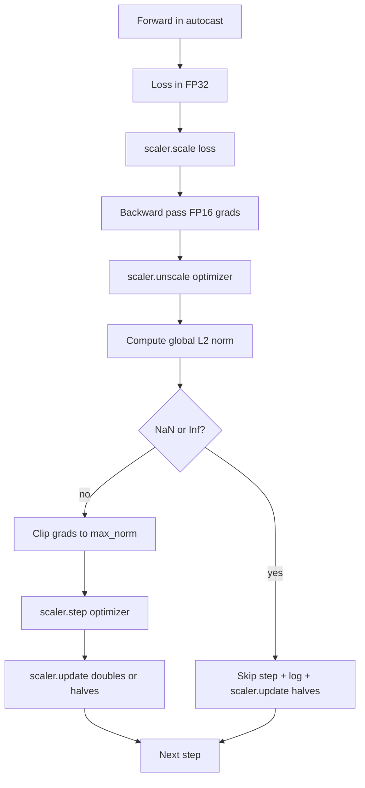

# Gradient Clipping and Mixed Precision

> Оптимизатор и расписание из предыдущего урока предполагают, что градиенты вменяемы. Обычно это не так. Один плохой батч может подбросить норму градиента на три порядка. Обучение в смешанной точности усиливает это, добавляя FP16-переполнение со стороны лосса. Этот урок строит два ремня безопасности, без которых продакшен-обучение не отгружается: клиппинг градиентов до сконфигурированной глобальной L2-нормы и mixed-precision-цикл с autocast и GradScaler, который детектит NaN и Inf, чисто пропускает шаг и логирует масштабный фактор для форензики.

**Тип:** Практика
**Языки:** Python
**Пререквизиты:** Фаза 19, уроки 30–37
**Время:** ~90 минут

## Цели обучения

- Вычислить глобальную L2-норму по всем градиентам параметров и клиппить на месте, когда она превышает сконфигурированный порог.
- Обернуть обучающий шаг в autocast плюс GradScaler, чтобы FP16 forward- и backward-проходы переживали переполнение.
- Детектить NaN и Inf в лоссе или градиенте, пропускать шаг оптимизатора и логировать пропуск.
- Репортить масштабный фактор GradScaler каждый шаг, чтобы длинная серия пропусков была видна немедленно.

## Проблема

Обучающий прогон, вчера шедший чисто, выдаёт кривую лосса, уходящую вертикально на шаге 8 217. Виновник — один батч, чья норма градиента равна 4 200, в двадцать раз выше предыдущего пика. Без клиппинга оптимизатор применяет шаг, сбрасывающий всё, что модель выучила за предыдущий час. С глобальным L2-клипом на норме 1.0 тот же батч вносит обновление единичной нормы; лосс остаётся на своей трендовой линии; прогон выживает.

Обучение в смешанной точности поднимает throughput в 2–3 раза, считая forward-проход и большую часть backward-прохода в FP16. Цена — у FP16 узкий диапазон экспоненты. Типичный градиент, переполнившийся в FP16, вычисляется в Inf, который распространяется через последующие слои как NaN, который на следующем шаге оптимизатора выставляет каждый вес в NaN. GradScaler в PyTorch решает это, умножая лосс на большой масштабный фактор до backward-прохода и деля градиенты на тот же фактор до шага оптимизатора. Если какой-либо градиент — Inf или NaN в момент unscale, скейлер пропускает шаг и половинит фактор; если предыдущие N шагов были чистыми, скейлер удваивает фактор. За время обучения фактор находит наибольшее значение, которое допускает диапазон FP16.

Строительная проблема — правильно свить эти два механизма. Клип до unscale — и порог применяется к масштабированным градиентам; клип после unscale — и важен порядок операций на GradScaler. Правильный порядок: `scaler.scale(loss).backward()`, затем `scaler.unscale_(optimizer)`, затем `clip_grad_norm_`, затем `scaler.step(optimizer)`, затем `scaler.update()`. Любой другой порядок даёт молчаливо сломанный цикл.

## Концепция



### Глобальная L2-норма

Глобальная L2-норма — евклидова норма конкатенированного вектора градиентов, а не пер-параметровая норма. PyTorch реализует это как `torch.nn.utils.clip_grad_norm_(parameters, max_norm)`. Функция возвращает норму до клипа, поэтому урок может логировать и естественное, и клипнутое значение — это необходимо для диагноза «мы клиппим на каждом шаге».

### autocast и GradScaler

`torch.amp.autocast(device_type)` — контекст-менеджер, выборочно запускающий подходящие операции (большинство операций класса matmul) в FP16. `torch.amp.GradScaler(device_type)` — хелпер, масштабирующий лосс до backward и обратно масштабирующий градиенты до шага оптимизатора. Они спроектированы вместе; использование одного без другого — конфигурационная ошибка, которую должен ловить тест.

Урок использует CPU-autocast, потому что именно он работает в CI; тот же паттерн дословно переносится на CUDA заменой `device_type="cpu"` на `device_type="cuda"`. GradScaler на CPU — заглушка (CPU-autocast и так по умолчанию работает в BF16 и не нуждается в масштабировании лосса), но урок включает места вызовов, чтобы проводка была идентична GPU-циклу.

### Детекция NaN и Inf

Детекция происходит в двух местах. Первое: сам лосс проверяется `torch.isfinite` до backward; Inf- или NaN-лосс не даёт полезных градиентов и пропускается, не входя в оптимизатор. Второе: после `scaler.unscale_(optimizer)` урок сканирует немасштабированные градиенты через `has_non_finite_grad(...)` и трактует любой Inf или NaN как пропуск. Две проверки вместе покрывают режимы отказа и forward-, и backward-прохода.

### Диагностика масштабного фактора

Масштабный фактор — внутреннее состояние GradScaler. Каждый шаг урок читает `scaler.get_scale()` и логирует его рядом с learning rate и нормой градиента. Здоровый прогон показывает фактор, растущий степенями двойки до насыщения около `2^17` или `2^18`. Неблагополучный прогон показывает фактор, осциллирующий между высокими и низкими значениями, — сигнал, что градиенты модели то в диапазоне, то нет. Без логирования эта диагностика невидима.

## Соберите это

`code/main.py` реализует:

- `clip_global_l2_norm` — обёртка над `torch.nn.utils.clip_grad_norm_`, возвращающая норму и до, и после клипа.
- `has_non_finite_grad` — хелпер, сканирующий градиенты на NaN и Inf.
- `AmpTrainState` — оборачивает модель, оптимизатор `AdamW`, GradScaler и autocast-устройство. Открывает `step(inputs, targets)`, гоняющий полный пайплайн клиппинга, масштабирования и пропуска-на-NaN.
- `StepLog` и `SkipLog` — структурные пошаговые записи.
- Демо: обучает маленькую `nn.Linear`-модель 20 шагов, инъектирует Inf в градиент на шаге 5, чтобы прогнать путь пропуска, и печатает получившийся лог.

Запустите:

```bash
python3 code/main.py
```

Скрипт выходит с нулём и печатает пошаговый лог, где каждая строка помечена `STEP` или `SKIP`; хотя бы одна строка — `SKIP`.

## Production-паттерны

Четыре паттерна поднимают цикл до продакшен-шага обучения.

**Счётчик пропусков — алерт, а не строка лога.** Горстка пропущенных шагов на прогон — здоровье. Сотни пропусков на эпоху — жёсткий алерт: модель в режиме, который FP16 не держит, и цикл молча отказывает. Урок отслеживает скользящий rate пропусков по 1 000 шагам и в продакшене поднимал бы страницу при rate выше 5 процентов.

**Порог клипа живёт в конфиге.** `max_norm = 1.0` — современный дефолт обучения языковых моделей. Сначала свипните его на маленькой модели; большие пороги позволяют модели восстанавливаться после действительно трудных батчей; меньшие ограничивают худший случай ценой более шумной кривой лосса. Порогу место в том же YAML- или JSON-конфиге, что и расписанию из урока 44.

**Лог нормы идёт в CSV вместе с расписанием.** Колонки CSV: `step, lr, grad_l2_pre_clip, grad_l2_post_clip, loss, skipped, skip_reason, scaler_scale`. Ревьюер, открывший файл, видит расписание, историю градиентов, масштабный фактор и исход пропуска (с причиной) в одной строке. Разнос колонок по файлам — рецепт рассинхронизированных анализов.

**`scaler.update()` выполняется каждый шаг, даже на пропуске.** На чистом шаге скейлер читает свой счётчик без-inf, инкрементит его и, возможно, удваивает фактор. На пропущенном — половинит фактор и сбрасывает счётчик. Забытый `update()` на пути пропуска — тот баг, который порождает «масштабный фактор никогда не менялся».

## Используйте это

Production-паттерны:

- **Устройство autocast совпадает с устройством оптимизатора.** `torch.amp.autocast(device_type="cuda")` для GPU-обучения; `torch.amp.autocast(device_type="cpu")` для CPU. Смешение устройств даёт молчаливую типовую ошибку, всплывающую как нормально выглядящая кривая лосса при модели, которая не учится.
- **Проверка лосса до backward.** `torch.isfinite(loss).all()` — одна тензорная редукция; стоимость пренебрежима, а экономия на NaN-лоссе — целый обучающий шаг. Запускайте всегда.
- **`set_to_none=True` в `zero_grad`.** Выставляет градиенты в `None` вместо нуля, что позволяет оптимизатору пропустить вычисления для незатронутых групп параметров. Настройка — бесплатное улучшение throughput и лёгкое сокращение поверхности багов.

## Отгрузите это

`outputs/skill-clip-amp.md` в настоящем проекте описал бы, какой порог клипа и autocast-устройство использует обучающий шаг, где пошаговый CSV живёт в version control и каков продакшен-порог алерта по skip rate. Этот урок отгружает движок.

## Упражнения

1. Замените синтетическую инъекцию Inf настоящим всплеском лосса (умножьте цель одного батча на 1e8) и убедитесь, что путь пропуска срабатывает.
2. Добавьте режим `--bf16`, переключающий autocast на BF16 вместо FP16. У BF16 диапазон экспоненты шире, чем у FP16, и масштабирование лосса ему редко нужно; убедитесь, что на том же демо skip rate падает до нуля.
3. Добавьте юнит-тест: обёртка клипа градиентов корректно возвращает норму до и после клипа, когда клиппинга не было.
4. Добавьте вычисление скользящего skip rate и CLI-флаг, роняющий прогон, если rate превышает сконфигурированный порог 100 шагов подряд.
5. Подключите цикл к записи канонического CSV (`step, lr, grad_l2_pre_clip, grad_l2_post_clip, loss, skipped, skip_reason, scaler_scale`) и подтвердите, что файл переживает Ctrl-C благодаря flush после каждой строки.

## Ключевые термины

| Термин | Как говорят | Что это на самом деле |
|------|-----------------|------------------------|
| Глобальная L2-норма | «Цель клипа» | Евклидова норма конкатенированного вектора градиентов по всем обучаемым параметрам |
| autocast | «Смешанная точность» | Выборочное FP16- (или BF16-) исполнение подходящих операций внутри `with`-блока |
| GradScaler | «Loss scaler» | Хелпер, умножающий лосс до backward и обратно масштабирующий градиенты до шага оптимизатора |
| Пропуск | «Плохой шаг» | Шаг оптимизатора, отклонённый из-за неконечного градиента или лосса; скейлер половинит фактор |
| Масштабный фактор | «Состояние скейлера» | Текущий множитель GradScaler; удваивается после чистых отрезков и половинится на каждом пропуске |

## Дополнительное чтение

- [Micikevicius et al., Mixed Precision Training (arXiv 1710.03740)](https://arxiv.org/abs/1710.03740) — оригинальное предложение масштабирования лосса
- [Pascanu, Mikolov, Bengio, On the difficulty of training recurrent neural networks (arXiv 1211.5063)](https://arxiv.org/abs/1211.5063) — референсная статья клиппинга градиентов
- [PyTorch torch.amp.GradScaler](https://docs.pytorch.org/docs/stable/amp.html) — API скейлера, который оборачивает этот урок
- [PyTorch torch.nn.utils.clip_grad_norm_](https://docs.pytorch.org/docs/stable/generated/torch.nn.utils.clip_grad_norm_.html) — примитив клиппинга этого урока
- Фаза 19 · 42 — загрузчик, чей корпус кормит цикл
- Фаза 19 · 43 — dataloader, который цикл потребляет
- Фаза 19 · 44 — расписание, с которым этот цикл компонуется
