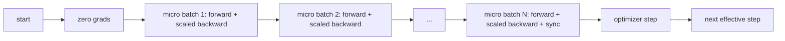
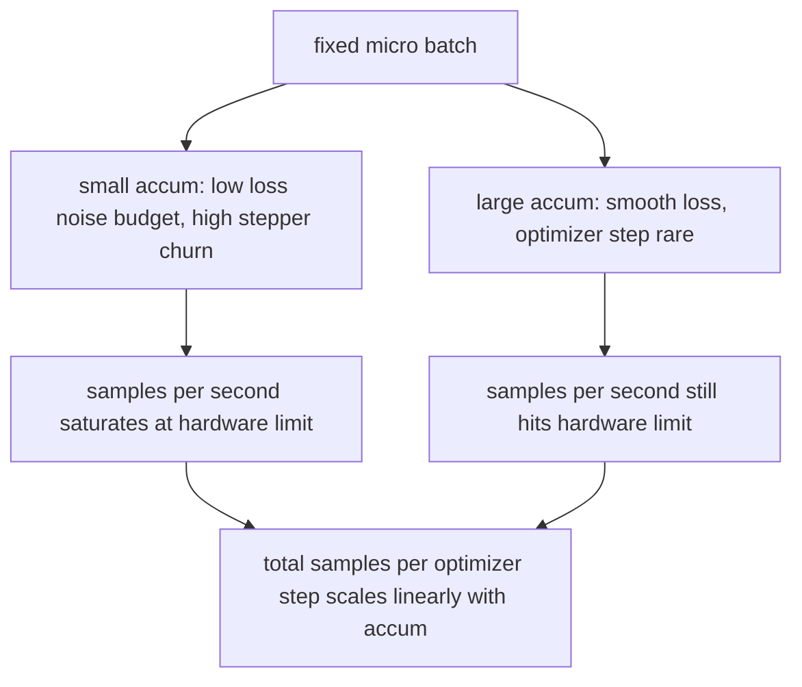

# Gradient Accumulation

> Обучайтесь на эффективном батче, который вам не по карману, — по одному микро-батчу за раз. Масштабируйте лосс, придержите шаг оптимизатора и дайте градиентам накопиться.

**Тип:** Практика
**Языки:** Python
**Пререквизиты:** Фаза 19, уроки 42–45
**Время:** ~90 минут

## Цели обучения

- Вывести тождество эффективного батча: `effective_batch = micro_batch * accum_steps`.
- Реализовать масштабирование лосса на микро-батч, чтобы накопленный градиент совпадал с одним полнобатчевым backward.
- Пропускать синхронизацию оптимизатора до последнего микро-батча (sync-on-last-step).
- Прочитать кривую throughput против эффективного батча и объяснить убывающую отдачу.

## Проблема

Вы хотите обучаться на эффективном батче 512, потому что кривая лосса глаже, а шаг оптимизатора на этом масштабе осмысленнее. Ускоритель на столе вмещает 32 примера, прежде чем кончается память. Удвоить батч — не вариант. Ополовинить модель — не вариант. Трюк, к которому область пришла в 2017 году и никогда не переставала использовать, — прогнать 16 backward-проходов, дать градиентам накопиться в буферах параметров и шагнуть оптимизатором только когда счётчик достигнет цели.

Риск в том, что лосс — больше не то число, которым он был на большем батче. Кросс-энтропия 16 мини-батчей, просуммированная наивно, — это 16 лоссов одного полного батча. Без масштабирования направление градиента верное, но величина неверна, и шаг оптимизатора в 16 раз больше нужного. Лечение — одно деление. И это деление легко забыть.

## Концепция



Контракт короткий:

- Лосс каждого микро-батча делится на `accum_steps` до `backward()`. PyTorch по умолчанию суммирует градиенты в `param.grad`; деление возвращает бегущую сумму в правильный масштаб.
- Шаг оптимизатора стреляет один раз на эффективный батч, после backward последнего микро-батча. Шаг посреди накопления перекашивает каждый параметр, от которого зависит весь остальной прогон.
- Состояние оптимизатора (буферы моментума, моменты Adam) продвигается один раз на эффективный шаг, а не на микро-батч. Иначе экспоненциальные скользящие средние видели бы неправильную частоту и прожигали бы расписание.
- На одном устройстве это бухгалтерия. На мульти-ранговом кластере тот же паттерн оборачивает нефинальные микро-батчи в `no_sync`-контекст, пропускающий all-reduce градиентов; последний микро-батч редьюсит весь накопленный градиент одним проходом, а не платит сетевую цену N раз.

### Доказательство эквивалентности в коде

```python
loss = criterion(model(x_full), y_full)
loss.backward()
opt.step()
```

эквивалентно

```python
for x, y in chunks(x_full, y_full, n):
    scaled = criterion(model(x), y) / n
    scaled.backward()
opt.step()
```

с точностью до порядка суммирования с плавающей точкой. Буфер накопленного градиента в конце цикла — тот же тензор, что породил бы один полнобатчевый backward. Код урока утверждает это в `equivalence_check` с max-abs-разностью меньше 1e-4.

### Куда уходит стоимость

Каждый микро-батч стоит один forward и один backward. С накоплением вы меняете память на время. Кривая throughput в `outputs/accum-curve.json` показывает, что происходит с ростом эффективного батча при фиксированном микро-батче:



Бесплатного обеда нет. Удвоение `accum_steps` удваивает wall time на шаг оптимизатора. Меняется дисперсия оценки градиента: при том же бюджете времени вы сделали меньше шагов оптимизатора, но каждый усреднён по большему числу сэмплов. Литература трактует большой и маленький батч как разные оптимизационные задачи; урок здесь механический, а не статистический.

## Соберите это

`code/main.py` — запускаемый артефакт. Он делает три вещи.

### Шаг 1: проверка эквивалентности

`equivalence_check()` строит две копии одной сети с одним сидом. Одна видит батч из 16 сэмплов одним forward-проходом. Другая — четыре чанка по 4 сэмпла с лоссом, делённым на четыре. Функция сравнивает буферы градиентов до шага оптимизатора и параметры после. Утверждение — `max_abs_diff < 1e-4`.

### Шаг 2: паттерн sync-on-last-step

`train_one_optimizer_step` обходит микро-батчи. Для каждого, кроме последнего, он входит в `no_sync_context(model)`. На одном процессе контекст — no-op; на DDP именно здесь пропускается all-reduce градиентов. Бухгалтерия одинакова в любом случае. `sync_counter` записывает, сколько раз мы вышли из области no_sync; для N микро-батчей счётчик — один на эффективный шаг, а не N.

### Шаг 3: кривая throughput

`sweep_effective_batches` гоняет одну и ту же модель с фиксированным микро-батчем и списком шагов накопления. Для каждой настройки логирует:

- `samples_per_sec`: всего увиденных сэмплов, делённых на wall time
- `median_step_ms`: 50-й перцентиль на эффективный шаг
- `sync_calls`: сколько раз задействованы коллективные точки
- `avg_loss`: среднее по шагам оптимизатора свипа

Выход ложится в `outputs/accum-curve.json` и переиспользуем из ноутбука.

Запустите:

```bash
python3 code/main.py
```

Скрипт печатает разность эквивалентности, затем таблицу свипа, затем путь к JSON. Код выхода — ноль.

## Используйте это

В продакшен-обучении накопление градиентов живёт за одной ручкой. Паттерн PyTorch: `accumulation_steps = effective_batch // (micro_batch * world_size)`. Фреймворки, которые здесь использовать нельзя, оборачивают тот же цикл, но шаги те же: масштабируй лосс, пропусти синк на нефинальных микро, накапливай, шагай один раз.

Три паттерна в реальной практике:

- Размер микро-батча выбирается так, чтобы насытить память устройства. Всё меньшее тратит циклы ускорителя. Всё большее падает.
- Эффективный батч выбирается из расписания learning rate. Большим эффективным батчам нужны масштабированные learning rate и warmup — это правило линейного масштабирования, обсуждаемое с 2017 года.
- Счётчик накопления — мост между этими двумя и единственная ручка, которую можно крутить в рантайме, не переписывая загрузчик данных.

## Отгрузите это

`outputs/skill-gradient-accumulation.md` фиксирует рецепт так, чтобы коллега мог перенести его в новый репозиторий: масштабируй лосс на `accum_steps`, пропускай синхронизацию оптимизатора на нефинальных микро, шагай оптимизатором один раз на эффективный батч, логируй throughput против эффективного батча в JSON, чтобы размен был видим.

## Упражнения

1. Перегоните свип с `--num-steps 100` и постройте samples per second против эффективного батча. Где кривая выполаживается?
2. Добавьте неправильный вариант масштабирования (без деления) и покажите разность параметров на шаге 1 против референса.
3. Замените SGD на AdamW и подтвердите, что состояние оптимизатора продвигается один раз на эффективный шаг, а не на микро-батч.
4. Введите настоящую обёртку `DistributedDataParallel` и направьте `no_sync_context` на её метод. Подтвердите, что sync_calls падает на N-1 на эффективный батч.
5. Модифицируйте проверку эквивалентности, сравнив два разных микро-разбиения (2 по 8 против 4 по 4), и объясните, какой допуск пришлось ослабить.

## Ключевые термины

| Термин | Как говорят | Что это на самом деле |
|------|-----------------|------------------------|
| Микро-батч | Батч, который форвардят | Срез, помещающийся в память за один forward-проход |
| Accum steps | Backward-проходов на шаг | Число backward, суммируемых до одного шага оптимизатора |
| Эффективный батч | «Батч» | Микро-батч, умноженный на accum steps и на data-parallel world size |
| Масштабирование лосса | «Дели на N» | Деление на каждый микро-батч, чтобы суммированные градиенты совпали с полным батчем |
| Sync on last | «Пропусти остальные» | Запуск коллектива градиентов только на последнем backward окна |

## Дополнительное чтение

- Документация PyTorch по `DistributedDataParallel.no_sync` — продакшен-версия трюка sync-on-last-step.
- Goyal et al., 2017, о линейном масштабировании для обучения с большим батчем — каноническая причина заботиться об эффективном батче.
- Issue-трекер PyTorch о взаимодействии накопления градиентов с unscale смешанной точности.
- Фаза 19, уроки 42–45 — модель, загрузчик данных, оптимизатор и обвязка тренера, которые этот урок предполагает.
- Фаза 19, урок 47 — чекпоинт и resume, чтобы долгий прогон с накоплением пережил потолок wallclock.
