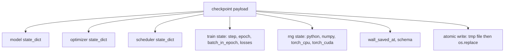
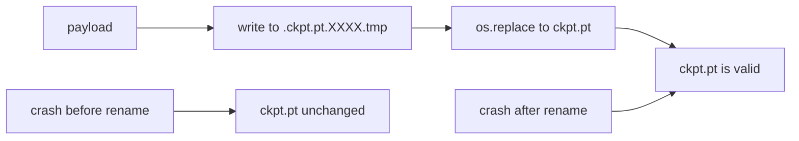
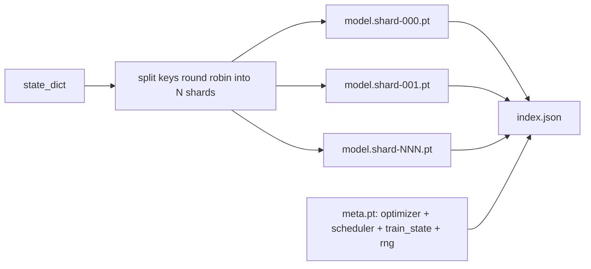

# Checkpoint Save and Resume

> Прерывания убивают прогоны; чекпоинты позволяют им продолжаться. Сохраняйте модель, оптимизатор, планировщик, историю лоссов, счетчик шагов и состояние RNG — атомарно, чтобы kill в любой момент оставлял на диске валидный файл.

**Тип:** Практика
**Языки:** Python
**Пререквизиты:** Фаза 19, уроки 42–45
**Время:** ~90 минут

## Цели обучения

- Захватить полное состояние обучения в один payload, перезагружаемый в свежий процесс.
- Реализовать атомарное сохранение через запись-во-временный-файл-затем-переименование, чтобы краш никогда не оставлял полузаписанный файл.
- Восстановить состояние RNG для Python, NumPy и PyTorch, чтобы лосс после resume совпадал с непрерванным бейзлайном.
- Построить шардированную раскладку чекпоинтов для моделей, уже не влезающих в один файл, с хеш-верифицированными шардами и JSON-индексом.

## Проблема

Вы поставили обучающую джобу на 18 часов. Потолок wallclock — 4 часа. Кластер перезагружается на одиннадцатом часу, потому что кто-то выше вашей зарплатной сетки одобрил обновление ядра. Без чекпоинтов вы начинаете заново. Без resume вы теряете и состояние оптимизатора, на выучивание которого ушли первые 11 часов, — даже если веса модели выжили, моменты AdamW пропали, и следующий шаг дергается в направлении, которое траектория обучения уже прошла.

Правильный артефакт — один файл, держащий все нужное для продолжения: параметры модели, состояние оптимизатора, состояние планировщика, историю лоссов для графиков, текущие счетчики шага, эпохи и батча-в-эпохе, а также состояние RNG для каждого источника случайности. Без состояния RNG кривая лосса после resume — другая кривая. Та же модель, те же данные, другой шаффл, другая dropout-маска, другое число на дашборде.

Атомарное сохранение — вторая половина контракта. Запись прямо в финальное имя означает, что краш посреди записи оставляет битый файл; resume читает мусор. Запись во временный файл в той же директории и затем переименование означает, что краш посреди записи оставляет предыдущий хороший файл нетронутым. Переименование атомарно на POSIX-файловых системах.

## Концепция



### Пять корзин состояния

| Корзина | Почему важна |
|--------|----------------|
| Модель | Веса и буферы; то, чем модель является. |
| Оптимизатор | Моментум и адаптивные моменты; без них следующий шаг — другая оптимизационная задача. |
| Планировщик | Где learning rate на своей кривой; косинусным расписаниям это особенно важно. |
| Счетчики обучения | Шаг, эпоха, батч-в-эпохе, плюс история лоссов, рисующая дашборд. |
| Состояние RNG | Детерминизм для dropout, шаффла данных и любого сэмплирования внутри модели. |

### Атомарное сохранение



Два правила. Первое: временный файл живет в той же директории, что и цель, чтобы переименование осталось внутри одной файловой системы; кросс-девайсные переименования не атомарны. Второе: временное имя уникально на попытку, чтобы два писателя не затоптали друг друга.

### Шардированные чекпоинты

Когда модель вырастает, однофайловый payload становится слишком большим, чтобы быстро загружаться, слишком большим для инспекции и слишком болезненным, когда сетевая шара икает посреди чтения. Лечение — разрезать состояние параметров на шарды и записать маленький индекс, связывающий их вместе.



Индекс записывает число шардов, sha256 каждого шарда и sha256 мета-файла. Загрузчик громко падает при любом несовпадении хеша. Шарды могут лежать на разных физических дисках; мета маленькая и читается первой.

### Resume продолжает посреди эпохи

Resume, прыгающий к началу следующей эпохи, тратит впустую от минут до суток. Лечение — `(epoch, batch_in_epoch)` плюс состояние RNG. После загрузки цикл обучения прокручивает генератор случайных чисел вперед, мимо батчей, уже потребленных в текущей эпохе, и продолжает с `batch_in_epoch`. Код урока делает ровно это; утверждение — траектория лосса после resume совпадает с непрерванным бейзлайном в пределах 1e-4.

## Соберите это

`code/main.py` дает четыре примитива и демо-драйвер.

### Шаг 1: захват и восстановление состояния RNG

`capture_rng_state` возвращает dict с `random.getstate` Python, `np.random.get_state` NumPy и байтами RNG PyTorch для CPU и CUDA. `restore_rng_state` разворачивает его обратно. CPU-тензор — байтовый буфер uint8, который RNG PyTorch умеет потреблять.

### Шаг 2: атомарное сохранение

`atomic_save` пишет payload во временный файл в целевой директории, затем `os.replace` подменяет его в финальное имя. `atomic_write_json` делает то же для шардированного индекса.

### Шаг 3: полный round trip чекпоинта

`save_checkpoint` упаковывает модель, оптимизатор, планировщик, состояние обучения и RNG в один dict. `load_checkpoint` разворачивает его и возвращает `TrainState`. Поле schema — крючок апгрейда: будущие изменения формата поднимают строку версии, и загрузчик диспетчеризуется по ней.

### Шаг 4: шардированный вариант

`save_sharded_checkpoint` раскидывает ключи параметров round-robin по N шардам, пишет каждый шард своим атомарным сохранением, пишет мета-файл с оптимизатором, планировщиком и состоянием обучения и пишет JSON-индекс с sha256 шардов. `load_sharded_checkpoint` верифицирует каждый шард перед слиянием.

### Шаг 5: демо resume

`run_resume_demo` обучает маленькую модель `total_steps` шагов, сохраняет чекпоинт на `interrupt_at`, затем продолжает. Второй процесс восстанавливает чекпоинт и прогоняет оставшиеся шаги. Функция возвращает максимальную абсолютную разность двух траекторий лосса после точки прерывания. С восстановленным RNG разность — ноль или шум плавающей точки.

Запустите:

```bash
python3 code/main.py
```

Однофайловое и шардированное демо оба утверждают max-diff меньше 1e-4. Сводка ложится в `outputs/resume-demo.json`.

## Используйте это

Продакшен-стеки обучения поставляют чекпоинтинг как часть тренера. Форма та же: модель + оптимизатор + планировщик + счетчики + RNG, записанные атомарно, именованные по шагу, чтобы последний было легко найти. Шардированные раскладки питают загрузку больших моделей параллельными чтениями; index.json — то, что заставляет это работать.

Три паттерна, которые нужно насаждать:

- **Schema — строка в payload'е.** Миграции ветвятся по ней. Без нее формат не эволюционирует без поломки старых прогонов.
- **Sha256 на каждый шард.** Молча обрезанная загрузка — худший сорт бага; загрузчик падает быстро — или падает поздно.
- **Честная частота чекпоинтов.** Сохраняйтесь каждые N шагов и каждую wallclock-минуту — что короче. Иначе долгий шаг, на котором случился краш, тратит впустую целое окно работы.

## Отгрузите это

`outputs/skill-checkpoint-save-resume.md` — рецепт для любого нового обучающего скрипта: форма payload, атомарная запись, захват RNG, шардированный индекс. Бросьте скилл в репозиторий, подключите `save_checkpoint` в точке периодического сохранения, подключите `load_checkpoint` на старте — и прогон переживает kill'ы.

## Упражнения

1. Замените round-robin-шардирование шардированием по группе параметров (слои, заканчивающиеся на `.weight`, против `.bias`). Когда какая раскладка предпочтительнее?
2. Расширьте цикл сохранения хранением последних K чекпоинтов с удалением более старых. Каков правильный K, когда диск маленький?
3. Добавьте флаг `--ckpt-every-seconds`, триггерящий сохранение по wallclock-интервалу, а не только по числу шагов.
4. Добавьте путь верификации чексумм, работающий на старте: сканирует каждый чекпоинт в директории и репортит, какие битые.
5. Реализуйте функцию `migrate_v1_to_v2`, добавляющую новое поле в payload и поднимающую строку schema. Сделайте загрузку толерантной к обеим версиям.

## Ключевые термины

| Термин | Как говорят | Что это на самом деле |
|------|-----------------|------------------------|
| Атомарное сохранение | «Записал и молись» | Запись во временный файл в той же директории, затем os.replace в целевое имя |
| State dict | «Веса» | Параметры и буферы модели с ключами по именам параметров |
| Шардированный чекпоинт | «Файл большой модели» | Несколько файлов, по одному на шард, плюс мета-файл и JSON-индекс с sha256 |
| Состояние RNG | «Random seed» | Захваченное состояние python random, numpy, torch CPU, torch CUDA; не просто сид |
| Resume посреди эпохи | «Перезапуск» | Прокрутить RNG вперед и продолжить со следующего батча той же эпохи |

## Дополнительное чтение

- Семантика POSIX `rename` — обоснование атомарности, на которую опирается `os.replace`.
- Документация PyTorch по `torch.save` и `torch.load`, включая `map_location` для кросс-девайсных восстановлений.
- Фаза 19, урок 46 — накопление градиентов, которое payload чекпоинта этого урока переживает.
- Фаза 19, урок 48 — распределенные обертки, чей формат state dict эта схема вмещает.
- Документация ядра Linux по `fsync` — гарантия долговечности за атомарным переименованием.
