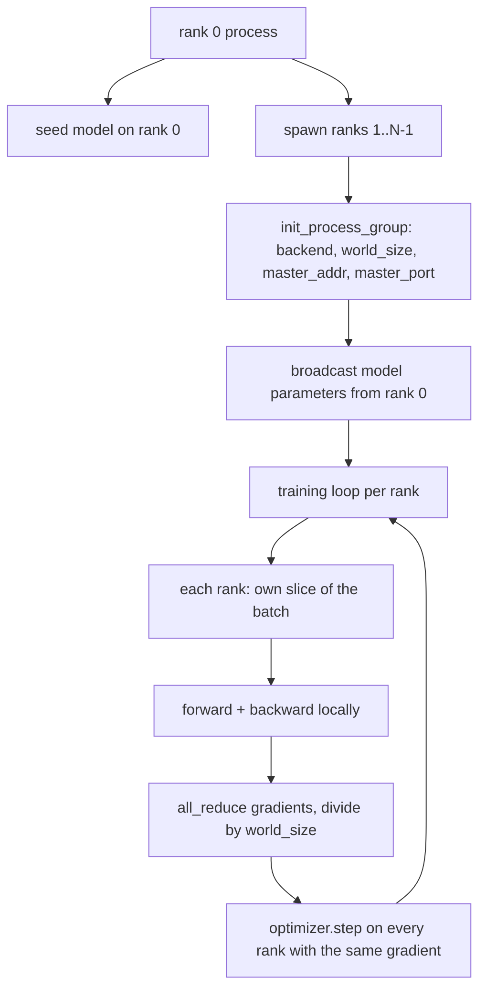
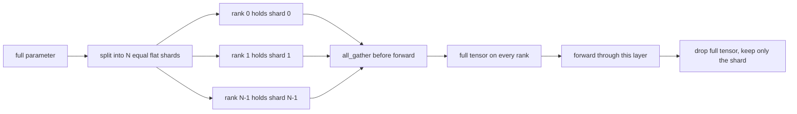

# Distributed Data Parallel and FSDP from Scratch

> Мульти-ранговое обучение — это два коллектива и одно правило. Забродкасти параметры на старте, усредни градиенты после backward и никогда не позволяй рангам разойтись во мнении, на каком они шаге.

**Тип:** Практика
**Языки:** Python
**Пререквизиты:** Фаза 19, уроки 42–45
**Время:** ~90 минут

## Цели обучения

- Поднять process group на N рангов с бэкендом `gloo`, без специального железа.
- Реализовать минимальную DDP-обертку, бродкастящую параметры при конструировании и делающую all-reduce градиентов после backward.
- Доказать, что all-reduce пер-ранговых градиентов совпадает с однопроцессным градиентом на конкатенированном входе.
- Набросать FSDP-шардирование параметров: каждый ранг держит срез, полный тензор собирается для forward-прохода и сбрасывается после.

## Проблема

Модель помещается на одно устройство. Датасет — нет. Бюджет оптимизации говорит, что вы хотите видеть в N раз больше примеров на wallclock-секунду. Первый рычаг — data parallel: каждый ранг гоняет ту же модель на своем срезе батча, затем градиенты усредняются перед шагом оптимизатора. Второй рычаг — FSDP: модель тоже не помещается на одно устройство, поэтому каждый ранг держит долю каждого параметра и восстанавливает полные тензоры слой за слоем во время forward-прохода.

Боль — в бухгалтерии. Если параметры дрейфуют между рангами, прогон молча поврежден. Если усреднять градиенты, но не лосс, дашборд лжет. Если коллективный бэкенд не может согласовать топологию, прогон висит вечно. Лечение — написать коллективы руками один раз и никогда не доверять обертке, которую вы не можете воспроизвести.

Этот урок работает на CPU. CUDA не предполагается. Бэкенд `gloo` поставляется с каждой сборкой PyTorch и принимает воркеров `torch.multiprocessing`; тот же код переключается на `nccl` на multi-GPU-ноде без изменения структуры.

## Концепция



### Два коллектива, которые важны

| Коллектив | Что делает | Когда |
|------------|--------------|------|
| `broadcast` | Копирует тензор с одного ранга на все остальные | Инициализация параметров, состояние планировщика, любая синхронизация один-ко-всем |
| `all_reduce` | Суммирует (или усредняет, или берет max) тензор по всем рангам, результат получает каждый ранг | Усреднение градиентов после backward |
| `all_gather` | Каждый ранг вносит тензор, каждый получает конкатенацию | Сбор логитов, unshard параметров в FSDP |

DDP-контракт — `broadcast` при конструировании и `all_reduce` после backward. FSDP-набросок добавляет `all_gather` перед forward каждого слоя.

### Усреднение градиентов совпадает с однопроцессным градиентом

Модель, обученная на батче из B примеров на N рангах, обязана дать тот же градиент, что один процесс, обучающийся на батче N*B. Трюк в том, что сумма пер-ранговых градиентов, деленная на N, дает градиент среднего лосса — ровно то, что кросс-энтропия с mean-редукцией дала бы на полном батче. Код урока утверждает это с `max-abs-diff < 1e-3` между ручным all-reduce-градиентом и референсным однопроцессным градиентом.

### Набросок FSDP



Выигрыш по памяти точный: пер-ранговая память под параметры падает до 1/N. Цена — gather, оплачиваемый на каждом forward-проходе. Продакшен-FSDP перекрывает gather с вычислениями предыдущего слоя, так что wallclock-стоимость сильно меньше, чем предсказывает наивная арифметика. Урок делает round trip по каждому параметру и утверждает, что реконструкция бит-в-бит равна оригиналу.

### CPU и бэкенд gloo

Продакшен-цель — CUDA, но те же код-пути существуют на CPU. `gloo` — CPU-бэкенд коллективов. Он медленнее `nccl` на GPU на порядки, но поверхность API идентична. Process group урока инициализируется с `backend="gloo"`, а ранги порождаются через `torch.multiprocessing`, а не `torchrun`; оба заканчиваются одними и теми же вызовами `torch.distributed`. На multi-GPU-ноде меняются только `backend="nccl"`, device-тензоры и запуск через `torchrun`.

## Соберите это

`code/main.py` — запускаемый артефакт.

### Шаг 1: поднять process group

```python
os.environ["MASTER_ADDR"] = "127.0.0.1"
os.environ["MASTER_PORT"] = str(port)
dist.init_process_group(backend="gloo", rank=rank, world_size=world_size)
```

`MASTER_ADDR` и `MASTER_PORT` — точка встречи: каждый ранг набирает один и тот же порт на одном хосте. Урок выбирает свободный порт трюком bind-и-close, чтобы избежать коллизий, когда несколько прогонов делят машину.

### Шаг 2: broadcast при конструировании

`MinimalDDP.__init__` обходит каждый параметр и буфер и вызывает `dist.broadcast(tensor, src=0)`. Значения ранга 0 становятся канонической инициализацией. Без этого каждый ранг инициализируется своим сидом, и ранги расходятся с первого шага.

### Шаг 3: all-reduce градиентов после backward

```python
def all_reduce_grads_(module, world_size):
    for p in module.parameters():
        if p.grad is None:
            p.grad = torch.zeros_like(p.data)
        dist.all_reduce(p.grad.data, op=dist.ReduceOp.SUM)
        p.grad.data.div_(world_size)
```

Каждый ранг заканчивает с одинаковым усредненным градиентом. Шаг оптимизатора теперь — функция от одного и того же входа на каждом ранге, поэтому параметры остаются синхронными весь прогон.

### Шаг 4: доказать эквивалентность

`manual_all_reduce_matches_single_process` строит ту же модель на ранге 0 и сравнивает градиент после all-reduce с градиентом, который один процесс посчитал бы на конкатенированном входе. Max-abs-diff — около 1e-8.

### Шаг 5: round trip FSDP

`fsdp_round_trip_sketch` уплощает каждый параметр, паддит до кратного `world_size`, режет, делает all_gather и снимает паддинг. Реконструкция каждого ранга равна оригиналу. Это шаг unshard; обратный (re-shard после forward) — один срез собранного тензора.

Запустите:

```bash
python3 code/main.py
```

Дефолтный world size — 2. Два CPU-процесса порождаются, разговаривают через `gloo` и выходят с нулем. Выход `outputs/ddp-demo.json` захватывает суммы параметров по рангам, норму градиента после all-reduce, результат FSDP round trip и разность ручного градиента против референсного.

## Используйте это

Продакшен-стеки обучения вызывают те же примитивы. `DistributedDataParallel` PyTorch добавляет: post-backward-хуки градиентов, перекрывающие all-reduce с backward; бакетированный all-reduce, объединяющий несколько маленьких градиентов в один коллектив; и `no_sync`-контекст, который использовал урок 46.

FSDP PyTorch добавляет: плоское представление параметров на слой, чтобы каждый ранг держал один непрерывный буфер; перекрытие unshard следующего слоя с вычислениями текущего; опциональный CPU-offload шардов.

Форма не меняется: broadcast на старте, reduce после backward, шардируй параметры, когда они перестают помещаться.

## Отгрузите это

`outputs/skill-distributed-fsdp-ddp.md` несет рецепт для нового обучающего скрипта: поднимите process group с `gloo` для CPU и `nccl` для GPU, оберните модель в DDP-оболочку, бродкастящую при конструировании и редьюсящую после backward, опционально шардируйте параметры паттерном all_gather из FSDP-наброска.

## Упражнения

1. Запустите с `--world-size 4` и подтвердите, что разброс параметров остается меньше 1e-3 весь прогон.
2. Замените ручное усреднение на `dist.all_reduce(op=dist.ReduceOp.AVG)` и замерьте разницу по времени.
3. Добавьте post-backward-хук в DDP-обертку, чтобы all-reduce перекрывался с остатком backward; измерьте выигрыш по wallclock.
4. Реализуйте шаг re-shard FSDP: после forward-прохода замените полный тензор обратно локальным шардом. Подтвердите падение пер-ранговой памяти.
5. Переключите бэкенд на `nccl` на CUDA-машине. Отметьте, какие переменные окружения меняются, а какие остаются.

## Ключевые термины

| Термин | Как говорят | Что это на самом деле |
|------|-----------------|------------------------|
| Бэкенд | «gloo или nccl» | Библиотека, реализующая коллективные операции; gloo — CPU, nccl — GPU |
| World size | «Всего рангов» | Число процессов в группе; группа — единица, над которой работают коллективы |
| Ранг | «Id воркера» | Идентификатор процесса внутри группы, с нуля |
| All-reduce | «Просуммируй градиенты» | Суммирование тензора по всем рангам; каждый ранг заканчивает с одним результатом |
| Unshard | «Собери параметры» | Реконструкция полного тензора из пер-ранговых срезов через all_gather |

## Дополнительное чтение

- Документация PyTorch `torch.distributed` — семантика коллективов, на которую опирается урок.
- Список коллективов библиотеки `gloo`, идентичный по форме CUDA-примитивам `nccl`.
- Фаза 19, урок 46 — паттерн накопления градиентов, оборачивающий DDP all-reduce в `no_sync`.
- Фаза 19, урок 47 — раскладка чекпоинтов, переживающая DDP- и FSDP-прогоны.
- Документация PyTorch FSDP — продакшен-реализация шардирования параметров, набросанного здесь.
