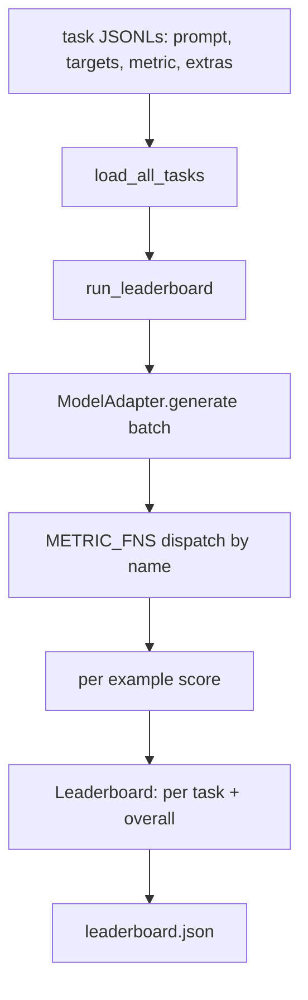
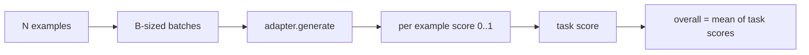

# Language Model Evaluation Harness

> Модель, которая хорошо справляется с задачей, которую вы не можете определить, — это модель, которая справляется случайно. Харнес — это определение задачи, метрика, раннер и лидерборд в одной короткой, заменяемой форме.

**Тип:** Практика
**Языки:** Python
**Пререквизиты:** Фаза 19, уроки 42–45
**Время:** ~90 минут

## Цели обучения

- Определить задачу как JSONL-файл с полями `prompt`, `targets`, `metric` и опциональным `extras` на пример.
- Реализовать пять метрик: exact match, rouge-l F1, исполняемая проверка, multiple choice и вхождение подстроки.
- Построить раннер, батчирующий примеры по задачам и диспетчеризующий в заменяемый адаптер модели.
- Излучить JSON лидерборда с пер-задачными скорами, задержкой и воспроизводимым общим средним.

## Проблема

Новая языковая модель выходит каждую неделю. Маркетинговое утверждение — «она хороша». Честный вопрос: хороша в чем? Честный ответ — лидерборд, который вы написали сами, потому что лидерборд вендора — тот, под который вендор тюнился.

Без харнеса в репозитории вы сравниваете две модели по вайбам. С харнесом — по скору на фиксированном наборе задач с фиксированной метрикой, на JSON-выходе, который можно диффать. Харнес — контракт между вчерашним прогоном и сегодняшним. Без него регрессии уезжают в прод.

Ловушка — переобучить харнес под одну модель. Лечение — та же ловушка наоборот: харнес достаточно мал, чтобы прочитать за пятнадцать минут, задачи достаточно малы, чтобы лежать в репозитории, метрики написаны с нуля, чтобы коллега мог их проаудировать, а адаптер — единственное место, где живет модельно-специфичный код. Замените адаптер — лидерборд сдвинется; замените задачи — лидерборд сдвинется. Ничто другое сдвигаться не должно.

## Концепция



### Спецификация задачи

Каждый пример — одна JSONL-строка:

```json
{"id": "arith-00", "prompt": "compute: 2 + 2", "targets": ["4"], "metric": "exact_match"}
```

Для метрик, которым нужны вспомогательные данные, `extras` несет побочный payload:

```json
{
  "id": "code-00",
  "prompt": "python: write a function f that doubles its input",
  "targets": ["ok"],
  "metric": "code_exec",
  "extras": {"io_pairs": [[1, 2], [3, 6]]}
}
```

Задача — это `.jsonl`-файл в `outputs/tasks/`. Имя файла — имя задачи. Все примеры файла делят одну метрику.

### Пять fixture-задач

| Задача | Метрика | Что тестирует |
|------|--------|---------------|
| arithmetic | exact_match | Токенную корректность на детерминированном ответе |
| summary | rouge_l | F1 по наибольшей общей подпоследовательности против однострочного референсного саммари |
| code-exec | code_exec | Исполняемый тест: предсказанная функция обязана удовлетворить список пар вход-выход |
| multiple-choice | multiple_choice | Первая буква предсказания обязана совпасть с допустимой |
| generation | substring_contains | Свободный текст обязан содержать хотя бы одну целевую подстроку |

### Контракт метрики

Каждая метрика — функция `(prediction, targets, extras) -> float в [0.0, 1.0]`. Харнес усредняет пер-примерные скоры в скор задачи, затем усредняет скоры задач в общий. Функции-метрики крошечные:

- `exact_match`: нижний регистр, схлопывание пробелов, равенство.
- `substring_contains`: та же нормализация, проверка подстроки.
- `multiple_choice`: первый символ в верхнем регистре.
- `rouge_l`: длина LCS, деленная на длины предсказания и референса, F1 из precision и recall.
- `code_exec`: исполнить предсказание в ограниченном namespace, вызвать `f(x)` на каждой паре вход-выход, посчитать совпадения.

Метрика code_exec гоняет предсказание в namespace с урезанными builtins. Тест урока утверждает, что `import os` взрывается, потому что `os` в namespace нет; из код-предсказания нельзя дотянуться до файловой системы.

### Адаптер модели

```python
class ModelAdapter(Protocol):
    def generate(self, prompts: Sequence[str]) -> List[str]: ...
    @property
    def name(self) -> str: ...
```

Адаптер — это шов. Урок поставляет `ToyAdapter` — детерминированный паттерн-матчер, возвращающий правильный ответ на каждый промпт пяти fixture-задач. Настоящий адаптер вызывает модель и возвращает ее выход. Харнесу все равно.

### Раннер

`run_task` батчирует по `batch_size` промптов и диспетчеризует в функцию метрики. `run_leaderboard` обходит каждую задачу и усредняет. `write_leaderboard` излучает JSON со строкой schema, чтобы будущие изменения формата не ломали дашборды молча.



```figure
eval-harness-matrix
```

## Соберите это

`code/main.py` — запускаемый артефакт.

### Шаг 1: засеять fixture-задачи

`seed_fixture_tasks(target_dir)` пишет пять `.jsonl`-файлов. Первый запуск `main.py` засевает их, когда директория пуста.

### Шаг 2: загрузить задачи

`load_all_tasks(task_dir)` читает каждый `.jsonl` и возвращает dict из имени задачи в список записей `Example`. Строки-комментарии, начинающиеся с `#`, и пустые строки пропускаются, чтобы контрибьюторы могли аннотировать файлы.

### Шаг 3: реализовать метрики

Каждая метрика — маленькая функция с юнит-тестом. Тестовый набор урока включает 13 кейсов, покрывающих нормализацию, частичное пересечение, исполнение кода и отклонение небезопасного кода.

### Шаг 4: написать раннер

`run_task` итерирует батчи и порождает `TaskResult` со скором, счетчиком правильных, общим счетчиком и задержкой. `run_leaderboard` обходит все задачи и порождает `Leaderboard` с общим средним.

### Шаг 5: излучить JSON

`write_leaderboard` сериализует доску. Флаг `--include-per-example` выгружает пер-примерные записи, чтобы при сдвиге скоров можно было диффать предсказания против предыдущего прогона.

Запустите:

```bash
python3 code/main.py
```

Скрипт засевает фикстуры на первом запуске, оценивает их toy-адаптером (который отвечает на каждую фикстуру правильно) и пишет `outputs/leaderboard.json`. Общий скор с toy-адаптером — 1.0; тест стуб-адаптера в `test_main.py` показывает, что тот же харнес дает 0.0, когда адаптер отвечать не умеет.

## Используйте это

Чтобы подключить настоящую модель, напишите адаптер. Форма:

```python
class HttpAdapter:
    name = "vendor.v1"

    def __init__(self, endpoint, api_key):
        self.endpoint = endpoint
        self.api_key = api_key

    def generate(self, prompts):
        out = []
        for prompt in prompts:
            response = http_post(self.endpoint, prompt, self.api_key)
            out.append(response["text"])
        return out
```

Замените `ToyAdapter` на `HttpAdapter` в начале `main()`. Харнес, задачи, метрики и формат лидерборда не меняются.

Три паттерна, которые нужно насаждать при отгрузке харнеса в настоящем проекте:

- **Пиньте файлы задач.** leaderboard.json несет хеш-запиненное содержимое задач или несет JSONL'ы рядом; иначе скор сдвигается вместе с файлом задачи, и непонятно, что именно сдвинулось.
- **Диффайте предсказания, а не только скоры.** Флаг `--include-per-example` позволяет увидеть, что сказала модель в день, когда скор упал.
- **Ограничьте размер батча.** У настоящих адаптеров есть rate limits. Маленький батч держит харнес совместимым между вендорами.

## Отгрузите это

`outputs/skill-lm-eval-harness.md` несет рецепт: JSONL-спецификация задачи, пять метрик, заменяемый адаптер, батчированный раннер, JSON лидерборда со строкой schema. Файлы задач в `outputs/tasks/` — фикстуры; скопируйте их в настоящий проект как стартеры.

## Упражнения

1. Добавьте шестую задачу с кастомной метрикой, написанной с нуля (BLEU-подобное пересечение, BLEURT-подобное референсное оценивание — что угодно с ясным контрактом).
2. Расширьте `code_exec` захватом stdout и приемом списка ожидаемых stdout как целей.
3. Добавьте команду диффа лидербордов: по двум `leaderboard.json` печатать, какие задачи сдвинулись и на сколько.
4. Ограничьте задержку на пример. Оберните вызов адаптера в таймаут; выведите отдельную колонку `timeouts` в лидерборде.
5. Запиньте содержимое задач sha256-хешем в лидерборде, чтобы будущий читатель мог проверить, что оценивал те же задачи.

## Ключевые термины

| Термин | Как говорят | Что это на самом деле |
|------|-----------------|------------------------|
| Спецификация задачи | «Формат eval» | JSONL-файл с prompt, targets, metric и опциональным extras на пример |
| Метрика | «Как считаем» | Функция из (prediction, targets, extras) во float в [0, 1] |
| Адаптер | «Клиент модели» | Объект с методом generate(prompts) -> list[str]; единственный модельно-специфичный код |
| Лидерборд | «Табло» | JSON с пер-задачными скорами, счетчиками, задержкой и общим средним |
| Метрика code exec | «Запусти и проверь» | Исполнить предсказание в ограниченном namespace, сравнить с парами вход-выход |

## Дополнительное чтение

- Оригинальный lm-evaluation-harness — продакшен-референс, куда больше, но той же формы.
- lighteval от HuggingFace — альтернативная реализация того же контракта.
- Фаза 19, урок 46 — паттерны накопления градиентов в обучающем стеке, который оценивает харнес.
- Фаза 19, урок 47 — формат чекпоинта, против которого вы оцениваете; пиньте хеш чекпоинта в лидерборде.
- Фаза 19, урок 48 — распределенный обучающий стек, породивший модель под тестом.
