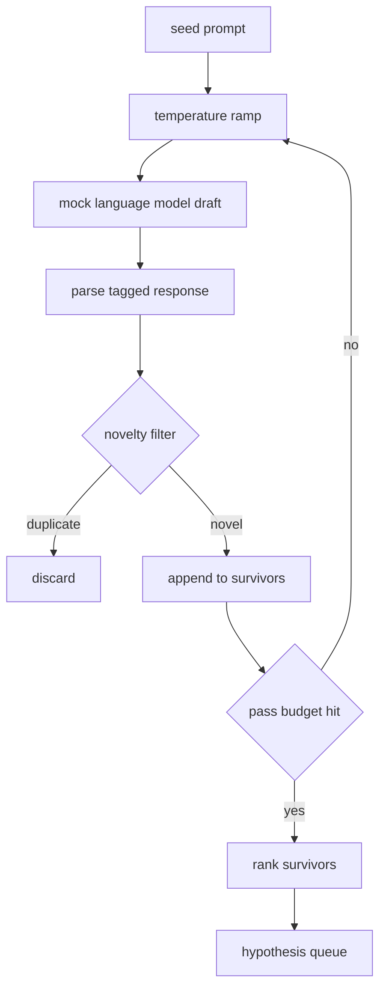

# Hypothesis Generator

> Research-агент, задающий один и тот же вопрос дважды, тратит токены впустую. Трюк — заставить каждый черновик приземляться в новом месте.

**Тип:** Практика
**Языки:** Python
**Пререквизиты:** Фаза 19, трек A, уроки 20–29
**Время:** ~90 минут

## Цели обучения
- Гонять сэмплер от seed-промпта и превращать его выходы в типизированные записи гипотез.
- Наращивать температуру сэмплера на каждом проходе, чтобы следующий черновик уплывал дальше предыдущего.
- Фильтровать почти-дубликаты маленькой эмбеддинг-моделью и порогом косинусного расстояния.
- Ранжировать выживших скоринг-функцией, смешивающей новизну, конкретность и проверяемость.
- Держать каждый шаг детерминированным, чтобы один сид всегда давал одну очередь.

## Почему сгенерировать, а потом отфильтровать

Планировщик, спрашивающий одну модель один раз, получает одну гипотезу. Для разобранного примера это нормально. Для research-цикла это неправильная форма. Циклу нужна ранжированная очередь с глубиной, чтобы, когда первая гипотеза провалится, у раннера была готова следующая — без оплаты ещё одного полного прохода сэмплирования.

Такую очередь дают две идеи вместе. Первая — температурная рампа: каждый проход через сэмплер поднимает температуру на ступеньку, и поздние черновики поощряются блуждать. Вторая — фильтр новизны: после каждого черновика генератор меряет эмбеддинг-расстояние до каждого предыдущего выжившего и отклоняет всё внутри кластера.

Урок поставляет mock-языковую модель, возвращающую заскриптованные последовательности токенов на фиксированные промпты. Mock'а достаточно, чтобы прогнать весь путь: seed-промпт на входе, применённая температурная рампа, распарсенные кандидаты, прогнанный фильтр новизны, ранжированная очередь на выходе.

## Форма Hypothesis

```text
Hypothesis
  id             : int           (monotonic within a run)
  text           : str           (the claim)
  variables      : list[str]     (what changes between conditions)
  metric         : str           (what the runner will measure)
  baseline_ref   : str | None    (which paper or run the comparison cites)
  draft_pass     : int           (which sampler pass produced this)
  temperature    : float         (the sampler setting at draft time)
  novelty_score  : float         (distance from prior survivors, 0..1)
  rank_score     : float         (weighted sum used for ordering)
```

`variables` и `metric` — не свободный текст. Парсер вытягивает их из тегированного ответа. Раннер из урока пятьдесят два читает эти поля напрямую, когда строит конфиг эксперимента.

`baseline_ref` опционален, но рекомендуем. Оценщику из урока пятьдесят три нужен бейзлайн для сравнения. Если гипотеза его опускает, оценщик откатывается к предыдущему прогону на той же метрике.

## Архитектура



Цикл прямолинеен. Интересно то, что у каждой коробки жёсткий контракт.

## Температурная рампа

Старт с `t_min`, конец на `t_max`, шаг `(t_max - t_min) / (n_passes - 1)`. Каждый проход вызывает сэмплер на текущей температуре, порождая `n_passes` равномерно расставленных значений из `GeneratorConfig.schedule()`. Mock-модель чтит температуру, переключаясь между небольшим набором заскриптованных ответов с ключом `(prompt, temp_bucket)`. Бакеты — открытые интервалы, поэтому маленькое изменение температуры выбирает другой бакет и даёт другой черновик. В продакшене сэмплером была бы настоящая модель с проброшенным `temperature=t`.

Дефолтное расписание — шесть проходов от `0.2` до `1.2`. Шести достаточно, чтобы заполнить очередь, не платя за сэмплы, которые фильтр новизны всё равно отклонит. Ниже `0.2` модель попугайничает seed обратно. Выше `1.2` ответы уплывают от темы и валят парсер.

## Фильтр новизны

После парсинга каждого черновика генератор эмбеддит текст и сравнивает с каждой принятой гипотезой. Эмбеддинг — маленький хешированный мешок словных токенов, нормализованный к единичной длине. Косинусное расстояние между двумя единичными векторами — `1 - dot(a, b)`. Черновик проходит, если его минимальное расстояние до любого предыдущего выжившего выше `novelty_threshold`. Дефолт — `0.25`.

Хешированный эмбеддинг не изыскан. Он детерминирован, имеет ноль зависимостей и достаточен, чтобы ловить очевидный случай: два черновика, делящие большинство существительных. Продакшен-деплой подставил бы маленькую sentence-модель. Интерфейс не меняется.

## Ранговый скор

```text
rank_score = w_novelty * novelty_score
           + w_specificity * specificity_score
           + w_testability * testability_score
```

Три подскора. `novelty_score` — минимальное эмбеддинг-расстояние до предыдущих выживших. `specificity_score` — число конкретных переменных гипотезы, делённое на целевой счётчик. `testability_score` — единица, если гипотеза задаёт и метрику, и бейзлайн; половина, если только метрику; ноль иначе.

Дефолтные веса — `0.4`, `0.3`, `0.3`. Веса живут в конфиге генератора, поэтому последующий урок может их сдвинуть, не форкая код.

## Mock-языковая модель

```python
class MockLLM:
    def sample(self, prompt: str, temperature: float, seed: int) -> str:
        ...
```

Сэмплер детерминирован при заданной тройке `(prompt, temperature, seed)`. Mock держит таблицу заскриптованных ответов с ключом `(prompt_signature, temperature_bucket)`. Если в таблице нет записи для ключа, сэмплер возвращает fallback, валящий парсер. Fallback-путь прогоняется одним из тестов.

Сид подмешивается в ответ, поэтому одна пара `(prompt, temperature)` с разными сидами даёт разные черновики. В тестах мы пиним сид ради воспроизводимости. В настоящем деплое сид пришёл бы из системных часов или счётчика.

## Выходная очередь

Выход — список записей `Hypothesis`, отсортированный по убыванию `rank_score`. Раннер из урока пятьдесят два снимает голову, гоняет эксперимент, а оценщик из урока пятьдесят три пишет вердикт обратно. Если вердикт говорит, что гипотеза неверна, раннер снимает следующую.

Очередь конечна. Когда она пуста, оркестратор может либо расширить seed-промпт и запустить генератор снова, либо остановиться и отчитаться об исчерпании бюджета.

## Как читать код

`code/main.py` определяет `Hypothesis`, `MockLLM`, `HypothesisGenerator` и детерминированное демо. Генератор открывает единственный метод `run(seed_prompt)`, возвращающий отсортированную очередь; число проходов читается из `GeneratorConfig.n_passes`, а не передаётся аргументом. Эмбеддинг — хешированный мешок токенов. Фильтр новизны — одна функция. Ранговый скор — одна функция. Ничто не зависит от `numpy`; математика эмбеддингов — чистый stdlib, и урок остаётся портируемым.

`code/tests/test_generator.py` покрывает линейный путь, путь отклонения дубликатов, путь провала парсера, границы температурной рампы и порядок ранжирования.

## Куда это встраивается

Урок пятьдесят порождает очередь. Урок пятьдесят один берёт голову очереди и гоняет поиск литературы, чтобы подтвердить или опровергнуть её. Урок пятьдесят два берёт ту же голову и гоняет настоящий эксперимент. Урок пятьдесят три читает оба выхода и пишет вердикт. Четыре урока складываются в research-цикл без человека внутри; человек может вмешаться на любой границе.
