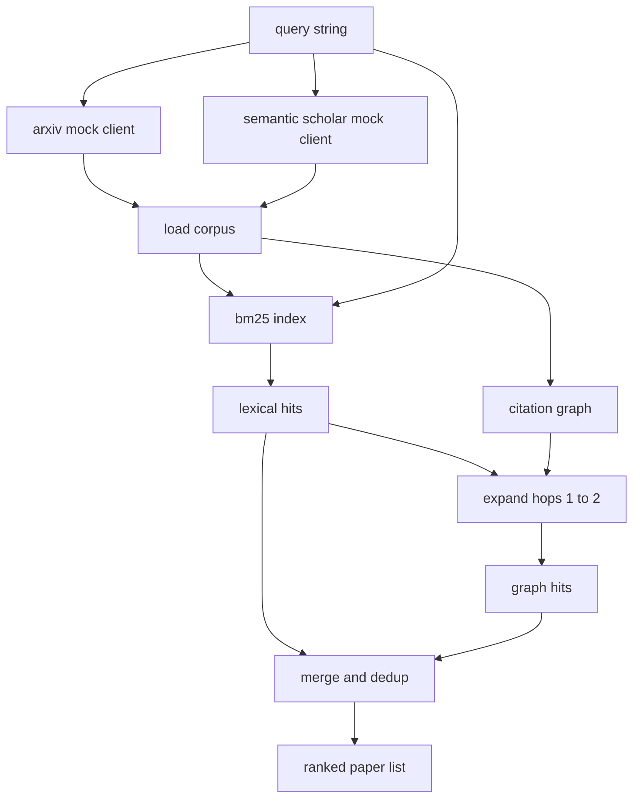

# Literature Retrieval

> Гипотеза дёшева. Дорогое — знать, не доказал ли её уже кто-то. Постройте слой retrieval, отвечающий на этот вопрос до того, как раннер поднимет sandbox.

**Тип:** Практика
**Языки:** Python
**Пререквизиты:** Фаза 19, трек A, уроки 20–29
**Время:** ~90 минут

## Цели обучения
- Смоделировать маленькую запись статьи с полями, которые цикл прочитает ниже по течению.
- Построить BM25-индекс по абстрактам на одних stdlib-структурах данных.
- Обойти граф цитирований, чтобы поднять статьи, пропущенные лексическим поиском.
- Дедуплицировать попадания двух проходов по стабильному id статьи.
- Обернуть два mock-внешних API одним клиентом, чтобы точка вызова сверху не изменилась, когда приедут настоящие endpoint'ы.

## Почему два прохода retrieval

Поиск по ключевым словам в абстрактах возвращает статьи, делящие словарь с запросом. Это покрывает большую часть поверхности. Он упускает два случая. Первый — когда основополагающая статья использует другой словарь; например, запрос «sparse attention» пропускает статью с названием «block selection in transformer routing». Второй — когда релевантная статья — это follow-up, цитирующий известный якорь; эффективнее найти якорь и пойти вперёд по графу, чем брутфорсить пул абстрактов.

Урок строит оба прохода. BM25 по абстрактам ловит лексические попадания. Обход графа цитирований расширяет seed-множество вперёд и назад на один-два прыжка. Объединение дедуплицируется по id статьи и ранжируется небольшим комбинированным скором.

## Форма Paper

```text
Paper
  id          : str           (stable identifier, "p001" for the mock corpus)
  title       : str
  abstract    : str
  year        : int
  authors     : list[str]
  references  : list[str]     (paper ids this paper cites)
  citations   : list[str]     (paper ids that cite this paper)
  source      : str           (which mock api supplied it, "arxiv" or "s2")
```

Поля references и citations образуют направленный граф цитирований. Два mock-API возвращают пересекающиеся, но не идентичные поля, поэтому загрузчик корпуса объединяет их по `id`.

## Архитектура



Retrieval-клиент владеет обоими проходами и слиянием. Вызывающий отдаёт ему запрос и получает ранжированный список, где каждая запись несёт пер-статейные поля скоров (`bm25_score`, `graph_distance`, `recency_score`, `final_score`), объясняющие ранжирование.

## BM25 с нуля

Реализация — стандартный Okapi BM25 с дефолтными параметрами `k1=1.5`, `b=0.75`. Индекс — два словаря: `term -> doc_frequency` и `term -> список (doc_id, term_count)`. Длина документа — число токенов абстракта. Средняя длина документа считается один раз при сборке индекса. Скоринг запроса — сумма по термам запроса от `idf * tf_norm`, где `tf_norm` — стандартная BM25-нормализованная по длине частота терма.

Токенизатор — `lower`, затем разрез по неалфавитно-цифровым символам. Без стемминга. Продакшен-система подставила бы маленький стеммер. Интерфейс не меняется.

```text
idf(t)      = log((N - df + 0.5) / (df + 0.5) + 1.0)
tf_norm(t)  = (f * (k1 + 1)) / (f + k1 * (1 - b + b * dl / avgdl))
score(d, q) = sum over t in q of idf(t) * tf_norm(t)
```

## Обход графа цитирований

Граф строится один раз из корпуса. Прямые рёбра идут от статьи к её ссылкам. Обратные — от статьи к её цитированиям. Обход — поиск в ширину, засеянный топ-попаданиями BM25, с потолком в два прыжка.

Два прыжка — намеренный потолок. Один прыжок мелковат; агенту часто нужен непосредственный предок или потомок. Три прыжка взрывают размер результата на связном графе и обычно уводят от темы. Урок открывает лимит прыжков конфиг-ручкой, чтобы последующий цикл мог его поджать.

## Дедупликация и ранжирование

Два прохода возвращают пересекающиеся множества. Слияние ключуется по id статьи. Финальный скор каждой статьи — взвешенная смесь.

```text
final_score = w_bm25 * bm25_score_norm
            + w_graph * graph_score
            + w_recency * recency_score
```

`bm25_score_norm` — BM25-скор, делённый на максимальный BM25-скор в слитом множестве (поле живёт от нуля до единицы). `graph_score` — единица для прямых лексических попаданий, затем `0.6` за один прыжок, `0.3` за два, ноль иначе. `recency_score` — линейная рампа от нуля на минимальном годе корпуса до единицы на максимальном.

Дефолтные веса — `0.5`, `0.3`, `0.2`. Веса — конфиг; для застоявшейся темы recency прикручивают, для быстро движущейся — поднимают.

## Mock-корпус

Корпус — сто статей, порождённых `build_corpus()`. У каждой рукописный заголовок и абстракт по одной из пяти тем: разреженность внимания, retrieval augmentation, low-rank-адаптеры, дистилляция датасетов и eval-харнесы. Ссылки и цитирования свиты так, что каждая тема образует связный подграф с несколькими межтемными рёбрами.

Два mock-API-клиента (`ArxivMockClient`, `SemanticScholarMockClient`) читают из одного корпуса, но открывают разные поля. Arxiv возвращает title, abstract, year, authors. Semantic Scholar добавляет references и citations. Retrieval-клиент объединяет по id; обработка расхождений полей между клиентами отложена до последующего урока.

## Что читают уроки 52 и 53

Раннер из урока пятьдесят два читает `paper.id`, `paper.title` и первые три предложения абстракта как контекст эксперимента. Оценщик из урока пятьдесят три читает `paper.year` и `paper.references`, чтобы атрибутировать бейзлайн конкретной статье.

Retrieval-клиент возвращает `RetrievalResult` с ранжированным списком и пер-запросными метриками: число попаданий, средний скор, топ-скор, общее wall time. Раннер их логирует, чтобы последующий observability-проход мог строить качество во времени.

## Как читать код

`code/main.py` определяет `Paper`, `ArxivMockClient`, `SemanticScholarMockClient`, `BM25Index`, `CitationGraph`, `RetrievalClient` и детерминированное демо. Mock-клиенты и корпус — в том же файле, чтобы урок оставался портируемым. Реализация BM25 — один класс, шестьдесят строк. Обход графа — один метод.

`code/tests/test_retrieval.py` покрывает лексический путь, графовый путь, слияние, дедупликацию и пустой запрос.

## Куда это встраивается

Урок пятьдесят порождает гипотезу. Урок пятьдесят один ищет в литературе, не решена ли эта гипотеза уже. Урок пятьдесят два гоняет эксперимент, если нет. Урок пятьдесят три читает и результат retrieval, и метрики эксперимента, чтобы написать вердикт. Retrieval-клиент — самая дешёвая из четырёх стадий и в оркестраторе работает первой.

## Дополнительное чтение

- Robertson, Walker et al., «Okapi at TREC-3» — оригинальная формулировка BM25.
- Фаза 19, урок 65 — гибридный retrieval BM25 + dense, уроки 50 и 52 — генератор и раннер вокруг этой стадии.
