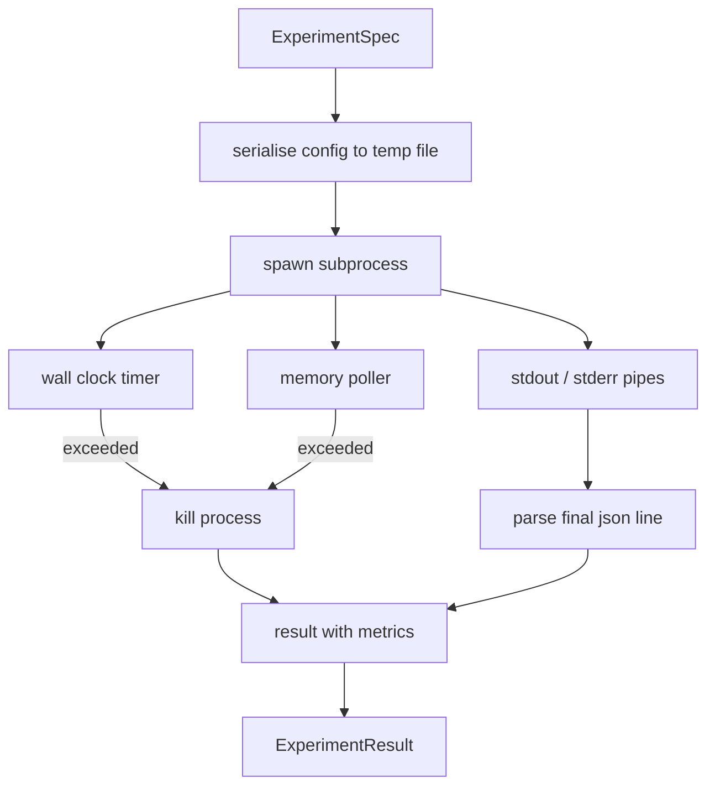

# Experiment Runner

> Цикл честен ровно настолько, насколько честны его измерения. Постройте раннер, который берёт спецификацию, исполняет её в изолированном subprocess и излучает json-блоб метрик, которому оценщик может доверять.

**Тип:** Практика
**Языки:** Python
**Пререквизиты:** Фаза 19, трек A, уроки 20–29
**Время:** ~90 минут

## Цели обучения
- Закодировать эксперимент типизированной спецификацией, которую раннер может сериализовать в subprocess.
- Запускать subprocess с жёстким wall-clock-таймаутом и мягким потолком памяти, поднимая оба как терминальные условия.
- Захватывать stdout, stderr и структурный блоб метрик в одну запись результата.
- Построить таблицу абляций, свипающую по одной конфигурационной ручке за раз над фиксированной базовой спецификацией.
- Держать каждый результат детерминированным при заданном сиде, чтобы оценщик видел одни числа между прогонами.

## Почему subprocess

Research-цикл гоняет недоверенный код. Гипотеза пришла из сэмплера, скрипт эксперимента — тем же путём; считать любой из них безопасным in-process — напрашиваться на краш, роняющий оркестратор. Subprocess — простейшая изоляция, поставляемая языком: отдельный процесс, независимое адресное пространство, ручка сигналов на стороне родителя.

Раннер здесь не реализует полный sandboxing. Ни cgroup, ни seccomp-фильтра, ни ремаппинга namespace. Что у него есть — wall-clock-таймаут, поллинг роста памяти и kill-путь, завершающий процесс на любом из лимитов. Это тот рантайм-контракт, который расширяет любой более изощрённый sandbox. Урок держит контракт достаточно маленьким, чтобы прочитать за один присест.

## Форма ExperimentSpec

```text
ExperimentSpec
  spec_id        : str            (stable id, "exp_001")
  hypothesis_id  : int            (link back to the queue from lesson 50)
  script_path    : str            (path to the python script to run)
  config         : dict           (passed to the script as one json arg)
  seed           : int            (deterministic seed for the experiment)
  wall_timeout_s : float          (hard timeout, killed on exceed)
  memory_cap_mb  : int            (soft cap, polled; killed on exceed)
  metric_keys    : list[str]      (which fields the evaluator will read)
```

Скрипт живёт на диске; раннер пишет конфиг во временный файл, путь к которому читает скрипт. От скрипта ожидается печать одной json-строки в stdout, чьи ключи — надмножество `metric_keys`. Всё остальное в stdout захватывается, но игнорируется парсером метрик.

## Архитектура



Раннер — один класс с одним главным методом. Поллер — маленький тред, просыпающийся раз в интервал поллинга и читающий `psutil`-эквивалент subprocess из proc-файловой системы, где она доступна, с откатом в no-op, когда платформа её не открывает.

## Почему потолок памяти мягкий

Жёсткие потолки памяти требуют `resource.setrlimit` и работают только на POSIX. Урок поставляет портируемый подход: поллить resident set size с платформы и убивать subprocess при превышении. Потолок мягкий, потому что у поллера ненулевой интервал; процесс может подскочить над потолком между поллами и опуститься обратно. Раннер записывает максимальный наблюдённый RSS, чтобы оценщик видел, насколько близко прогон подошёл к лимиту.

На системах без поддержки инспекции процессов поллер логирует одноразовое предупреждение и выключает себя. Wall-clock-таймаут продолжает действовать. Тесты урока покрывают оба пути.

## Захват stdout и stderr

Раннер вычитывает оба пайпа при завершении. Stdout сканируется построчно; последняя строка, парсящаяся как json со всеми обязательными `metric_keys`, берётся как блоб метрик. Более ранние json-строки сохраняются в результате как `intermediate_metrics`; оценщик может использовать их для кривых обучения.

Stderr захватывается дословно в результат. Раннер никогда не кидает исключений на ненулевом коде выхода; вместо этого он записывает код в результат. Любой ненулевой выход помечается `"crash"`, даже когда скрипт напечатал метрики, — оценщик по умолчанию трактует частичные прогоны как провалы.

## Таблица абляций

```python
def ablate(base: ExperimentSpec, knob: str, values: list[Any]) -> list[ExperimentSpec]:
    ...
```

По базовой спецификации и имени ручки хелпер возвращает по спецификации на значение с перекрытым `config[knob]`. Каждая спецификация получает производный `spec_id` (`f"{base.spec_id}_{knob}_{value}"`). Раннер поставляет `AblationRunner`, гоняющий их по порядку и возвращающий `AblationTable` с ключами по значениям ручки.

Почему по одной ручке за раз. Полнофакторные свипы взрываются экспоненциально и дают результаты, которые оценщик не может интерпретировать. Одна ручка за раз даёт чистую ось, которую оценщик может построить на графике. Мульти-ручечные свипы урок поддерживает только как повторные одноручечные абляции, компонуемые вызывающей стороной.

## Детерминизм

Каждая спецификация несёт сид. Раннер пробрасывает его в скрипт через конфиг (`config["__seed"] = spec.seed`). Mock-скрипты экспериментов в `code/experiments/` чтят сид и выдают идентичные метрики между прогонами. Оценщик из урока пятьдесят три на это опирается; без детерминизма «регрессия» могла бы оказаться другой случайной инициализацией.

## Mock-скрипт эксперимента

Урок поставляет один скрипт эксперимента: `code/experiments/sparsity_experiment.py`. Это настоящий скрипт, читающий свой конфиг-файл, симулирующий маленький обучающий прогон numpy-проходом и печатающий json-блоб метрик. Скрипт чтит ручку `sleep_s` для тестирования таймаутов и ручку `allocate_mb` для тестирования поллера памяти.

Симуляция ничего реального не обучает. Это численное вычисление, имитирующее форму обучающего цикла: кривая лосса, финальная перплексия, wall time. Суть урока — раннер, а не симуляция. Настоящий скрипт эксперимента импортировал бы модель.

## Форма результата

```text
ExperimentResult
  spec_id              : str
  hypothesis_id        : int
  exit_code            : int
  terminal             : "ok" | "timeout" | "oom" | "crash"
  wall_time_s          : float
  peak_rss_mb          : float | None
  metrics              : dict
  intermediate_metrics : list[dict]
  stdout_tail          : str
  stderr_tail          : str
```

Оценщик читает сначала `metrics` и `terminal`. Если terminal — что угодно, кроме `"ok"`, эксперимент считается провалившимся, и вердикт оценщика автоматичен. Иначе метрики проходят через тест значимости.

## Как читать код

`code/main.py` определяет `ExperimentSpec`, `ExperimentResult`, `ExperimentRunner`, `AblationRunner` и детерминированное демо. Управление subprocess — один класс. Поллер памяти — маленький тред. Хелпер абляций — одна функция.

`code/experiments/sparsity_experiment.py` — mock-эксперимент, используемый в тестах. Он читает путь к конфиг-файлу из argv и пишет одну json-строку метрик при завершении.

`code/tests/test_runner.py` покрывает путь успеха, путь таймаута, путь краша, таблицу абляций и проверку детерминизма на двух прогонах.

## Куда это встраивается

Урок пятьдесят генерирует гипотезу. Урок пятьдесят один отфильтровывает то, что литература уже решила. Урок пятьдесят два гоняет эксперимент для оставшегося. Урок пятьдесят три читает результат, гоняет тест значимости и пишет вердикт, который оркестратор сохраняет под id гипотезы.
