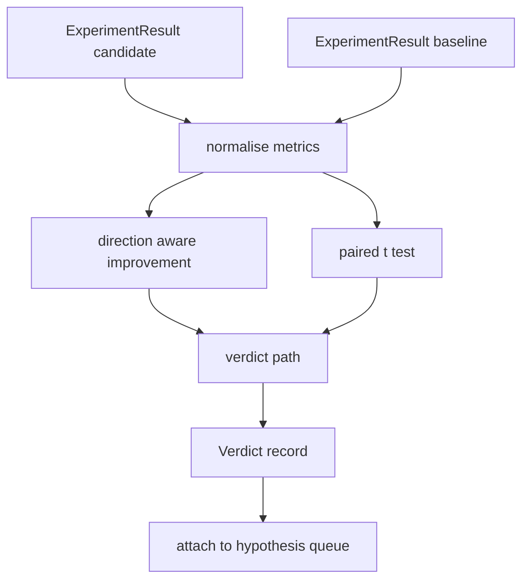

# Result Evaluator

> Раннер породил числа. Оценщик решает, что это — улучшение, регрессия или шум. Постройте путь вердикта, превращающий метрики в однострочный вывод.

**Тип:** Практика
**Языки:** Python
**Пререквизиты:** Фаза 19, трек A, уроки 20–29
**Время:** ~90 минут

## Цели обучения
- Сравнить прогон-кандидат с бейзлайном через направленное улучшение и фиксированный порог.
- Прогнать парный t-тест с нуля по пер-сидовым метрикам и прочитать получившийся p-value.
- Нормализовать метрики в лог-шкале, чтобы отчёт ниже по течению мог смешивать их с линейными.
- Излучить пер-гипотезный вердикт, который оркестратор прикрепит к очереди из урока пятьдесят.
- Держать каждый шаг чистым, чтобы одни входы всегда давали один вердикт.

## Почему парный тест

Одно число от раннера не говорит, реально ли изменение. Та же конфигурация с другим сидом даёт другую перплексию. Изменение может быть шумом. Правильное сравнение — парное: одни сиды на одних данных, прогнанные один раз с кандидатом и один раз с бейзлайном. Каждый сид вносит разность. Среднее разностей — эффект. Стандартная ошибка разностей — уровень шума.

Урок реализует тест с нуля. Никакого `scipy.stats`. Математика умещается на один экран.

```text
diffs    = [a_i - b_i for i in seeds]
mean     = sum(diffs) / n
variance = sum((d - mean) ** 2 for d in diffs) / (n - 1)
t_stat   = mean / sqrt(variance / n)
df       = n - 1
p_value  = two_sided_p(t_stat, df)
```

Двусторонний p-value использует регуляризованную неполную бета-функцию. Урок поставляет маленькую реализацию на непрерывной дроби Ленца. Всё вместе — шестьдесят строк stdlib-математики.

## Направленное улучшение

Одни метрики улучшаются ростом (accuracy, throughput). Другие — падением (лосс, перплексия, wall time). Оценщик несёт поле `direction` на каждой метрике.

```text
if direction == "higher_is_better":
    improvement = (candidate - baseline) / abs(baseline)
elif direction == "lower_is_better":
    improvement = (baseline - candidate) / abs(baseline)
```

Улучшение знаковое. Отрицательное улучшение на метрике higher-is-better означает, что кандидат хуже. Путь вердикта читает знак и величину вместе.

Плоский порог (`improvement_threshold=0.02`, два процента) решает, достаточно ли изменение велико, чтобы его засчитать. Ниже порога вердикт — «noise» независимо от p-value; цикл не интересуется изменениями, которые пользователь не смог бы измерить.

## Архитектура



Оценщик гоняет три независимых вычисления и соединяет их в пути вердикта. Каждое вычисление — чистая функция без общего состояния.

## Лог-нормализация

Перплексия экспоненциальна по лоссу. Падение лосса на 0.1 — куда большее падение перплексии. Сравнивать перплексию напрямую между двумя конфигурациями можно, но смешивание её с линейными метриками в одном отчёте требует нормализации.

Урок нормализует любую метрику с полем `scale`, равным `"log"`, беря натуральный логарифм до вычисления улучшения. Порог тогда применяется в лог-пространстве. Падение перплексии с 32 до 28 — это `log(28) - log(32) = -0.133` на метрике lower-is-better, что заметно выше двухпроцентного порога.

```text
if scale == "log":
    a = log(candidate)
    b = log(baseline)
else:
    a = candidate
    b = baseline
```

Метрики со `scale="linear"` (по умолчанию) пропускают преобразование. Один код-путь обслуживает оба случая.

## Пер-сидовый парный тест

Раннер из урока пятьдесят два излучает один финальный блоб метрик на прогон. Для парного теста оценщику нужен блоб на сид для кандидата и блоб на сид для бейзлайна. Оркестратор гоняет один эксперимент под обеими конфигурациями по списку сидов и отдаёт оценщику два списка записей `ExperimentResult`.

Оценщик спаривает их по сиду (сид живёт в `result.metrics["seed"]`) и обходит запрошенную метрику. Если сиды двух списков не совпадают, оценщик кидает `PairingError`. Оркестратор должен перегнать.

## Форма Verdict

```text
Verdict
  hypothesis_id          : int
  metric                 : str
  direction              : "higher_is_better" | "lower_is_better"
  scale                  : "linear" | "log"
  candidate_mean         : float
  baseline_mean          : float
  improvement            : float       (signed, fraction; see direction rules)
  p_value                : float | None  (None if n < 2)
  significance_threshold : float
  improvement_threshold  : float
  verdict                : "improved" | "regressed" | "noise" | "failed"
  rationale              : str
```

Путь вердикта — маленькая таблица решений:

```text
1. If any candidate result has terminal != "ok": verdict = "failed"
2. else if |improvement| < improvement_threshold:  verdict = "noise"
3. else if p_value is None or p_value > significance: verdict = "noise"
4. else if improvement > 0:                          verdict = "improved"
5. else:                                             verdict = "regressed"
```

Rationale — однострочное человекочитаемое предложение, которое оркестратор может залогировать под id гипотезы.

## Как читать код

`code/main.py` определяет `MetricSpec`, `Verdict`, `Evaluator`, хелперы t-статистики и неполной беты и детерминированное демо. T-тест реализован чистой stdlib-математикой; numpy используется только для чтения списка метрик и подсчёта средних и дисперсий.

`code/tests/test_evaluator.py` покрывает путь improved, путь regressed, путь noise (маленькое улучшение), путь noise (малое n), путь failed terminal, лог-нормализованный путь, t-тест против известного референсного значения и ошибку спаривания.

## Куда это встраивается

Урок пятьдесят породил очередь гипотез. Урок пятьдесят один отфильтровал то, что решила литература. Урок пятьдесят два прогнал эксперимент под конфигурациями кандидата и бейзлайна по сидам. Урок пятьдесят три читает эти прогоны и пишет вердикт. Оркестратор сшивает четвёрку:

```text
for hypothesis in queue:
    literature = retrieval.search(hypothesis.text)
    if literature_settles(hypothesis, literature):
        attach(hypothesis, verdict="settled")
        continue
    candidates = runner.run_all(specs_for(hypothesis))
    baselines  = runner.run_all(baseline_specs_for(hypothesis))
    metric_spec = MetricSpec("perplexity", direction=LOWER, scale=LOG)
    verdict = evaluator.evaluate(hypothesis.id, metric_spec, candidates, baselines)
    attach(hypothesis, verdict)
```

Этого оркестратора в уроке нет; четыре урока складываются в него без всякого клея, кроме датаклассов, которые каждый из них определяет.

## Дополнительное чтение

- Efron & Tibshirani, *An Introduction to the Bootstrap* — ресэмплинг за тестами значимости.
- Фаза 19, урок 52 — раннер, порождающий эти метрики, урок 74 — значимость на уровне лидерборда.
