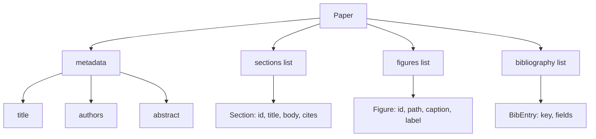
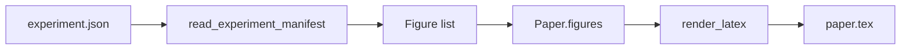
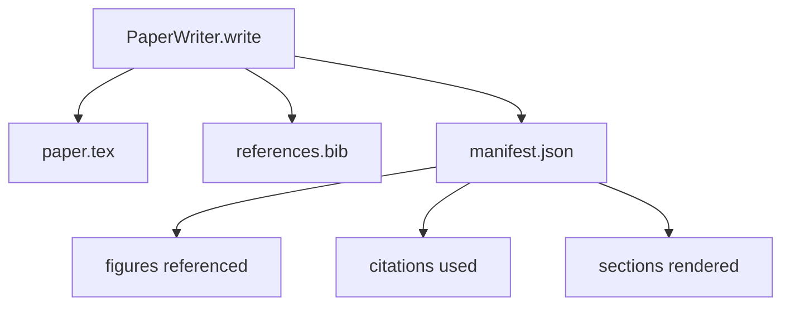

# Paper Writer

> LaTeX-скелет — контракт между исследователем и вёрсткой. Если контракт нарушен, документ не компилируется, и отказ громкий. Сначала постройте скелет, потом заполняйте.

**Тип:** Практика
**Языки:** Python
**Пререквизиты:** Фаза 19, уроки 50–53
**Время:** ~90 минут

## Цели обучения

- Трактовать научную статью как структурный артефакт с известным графом секций, а не как документ вольной формы.
- Генерировать LaTeX-скелет, объявляющий абстракт, секции, слоты фигур и ключи библиографии до того, как написана хоть строчка прозы.
- Инъектировать фигуры из выходов экспериментов (пути и подписи) в скелет через детерминированный механизм слотов.
- Подключить mock-генератор прозы, заполняющий каждую секцию из структурного плана, чтобы харнес был тестируем без модели.
- Излучить единый `paper.tex` плюс `references.bib` плюс манифест, перечисляющий каждую упомянутую фигуру и каждую использованную цитату.

## Почему сначала скелет

Черновик, начинающийся с прозы, накапливает структурный долг. Введение обрастает тремя абзацами, которым место в related work. Фигура упоминается раньше, чем определена. Библиография оказывается с тремя ключами на одну статью. К моменту, когда автор это замечает, стоимость переписывания выше стоимости написания.

Скелет переворачивает это. Структура объявляется заранее как данные. Секции — слоты с именами и порядком. Фигуры — слоты с id и подписями. Ключи библиографии объявлены наверху вместе с записями, на которые они указывают. Проза генерируется в эти слоты по одному. Харнес может провалидировать — до того как написана проза, — что у каждой фигуры есть слот, у каждой цитаты есть запись и каждая секция появляется в оглавлении.

Это та же дисциплина, которую более ранние уроки применяли к планам, tool calls и трейсам. Структура и есть контракт.

## Форма Paper

Каждое поле — обычные Python-данные. Рендерер — чистая функция из `Paper` в LaTeX-строку. Харнес может интроспектировать статью до рендера: посчитать секции, выписать отсутствующие файлы фигур, проверить, что у каждого `\cite{key}` есть соответствующий `BibEntry`.

## Контракт рендера

Рендерер гарантирует три свойства. Первое: каждый слот фигуры в скелете излучает блок `\begin{figure}` со стабильной меткой вида `fig:<id>`. Второе: каждая секция излучает `\section{}` со стабильной меткой вида `sec:<id>`, чтобы работали перекрёстные ссылки. Третье: библиография излучает блок `\bibliography`, чей `references.bib` содержит ровно записи, объявленные на статье, — не больше и не меньше.

Нарушение любого из них — ошибка рендера, а не предупреждение. Скелет — контракт; рендер, молча выбросивший фигуру, — разрыв контракта.

## Инъекция фигур из экспериментов

Более ранние уроки трека порождали выходы экспериментов JSON-манифестами. Каждый манифест несёт список артефактов с путями и короткими подписями. Paper writer читает этот манифест и порождает записи `Figure`.

Инъекция детерминирована. Id фигур выводятся из имени эксперимента плюс монотонного счётчика. Подписи приходят из манифеста. Пути нормализуются относительно выходной директории статьи, чтобы LaTeX компилировался, даже когда выходы эксперимента лежат в другом месте диска.

## Mock-генератор прозы

Урок не вызывает модель. `MockProseGenerator` читает форму плана и излучает прозу детерминированно. Форма плана — одна короткая строка на секцию. Генератор разворачивает её в два коротких абзаца с вплетённым заголовком секции. Сгенерированная проза упоминает фигуры и цитаты ровно там, где их объявляет план.

Этого достаточно, чтобы протестировать каждое поведение writer'а. Настоящая реализация заменила бы генератор вызовом модели. Харнес вокруг него не меняется. В этом ценность объявления генератора прозы callable'ом: тест подставляет детерминированный, продакшен — модельный, остальной пайплайн идентичен.

## Выходной манифест

Writer излучает три файла в выходную директорию.

Манифест — то, что читает оценщик или critic-цикл ниже по течению. Он не парсит LaTeX; он читает манифест. Следующий урок — critic-цикл — берёт этот манифест на вход и порождает список замечаний. Поэтому манифест — часть контракта, а LaTeX — нет.

## Валидационные gates

Writer гоняет четыре gate до записи какого-либо файла.

1. Каждый id фигуры уникален внутри статьи.
2. Поле `cites` каждой секции ссылается на ключ библиографии, объявленный на статье.
3. Абстракт непуст.
4. Заголовок непуст.

Провалившийся gate кидает `PaperValidationError` с точной причиной. Харнес поднимает причину как режим отказа. Частичной записи нет: либо излучаются все три файла, либо ни одного.

## Как читать код

`code/main.py` определяет `Paper`, `Section`, `Figure`, `BibEntry`, `PaperValidationError`, `MockProseGenerator`, `PaperWriter` и функцию `render_latex`. Метод `write` принимает выходную директорию и излучает `paper.tex`, `references.bib` и `manifest.json`. Хелпер `read_experiment_manifest` конвертирует список манифестов экспериментов в записи `Figure`.

`code/tests/test_paper_writer.py` покрывает: рендер скелета без секций, полный рендер с двумя секциями и двумя фигурами, gate отсутствующей цитаты, gate дублирующегося id фигуры, содержимое манифеста и контракт LaTeX-строки (каждая секция излучает `\section{}`, каждая фигура — `\begin{figure}`).

## Куда двигаться дальше

Два расширения, которые захочет настоящая реализация. Первое — мультиформатный рендер: та же форма `Paper` компилируется в Markdown для блог-постов и HTML для превью. Рендерер становится стратегией на `Paper`. Второе — обогащение цитат: writer подтягивает BibTeX-записи по ключу цитаты из локального кэша DOI. Оба добавляют ценность, оба добавляются, не трогая контракт скелета.

Скелет — это ставка. Секции, фигуры и цитаты, объявленные данными, проза, генерируемая в слоты, манифест, излучаемый рядом с LaTeX. Любое другое улучшение компонуется сверху.

## Дополнительное чтение

- Фаза 14, урок 12 — паттерны workflow Anthropic.
- Фаза 19, урок 55 — critic-цикл, ревизующий этот черновик, урок 57 — end-to-end-демо.
