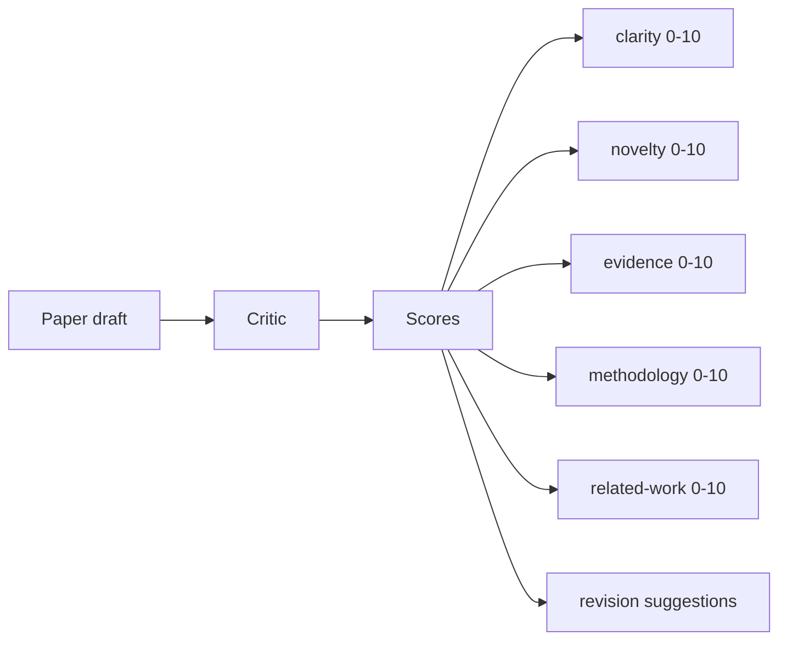
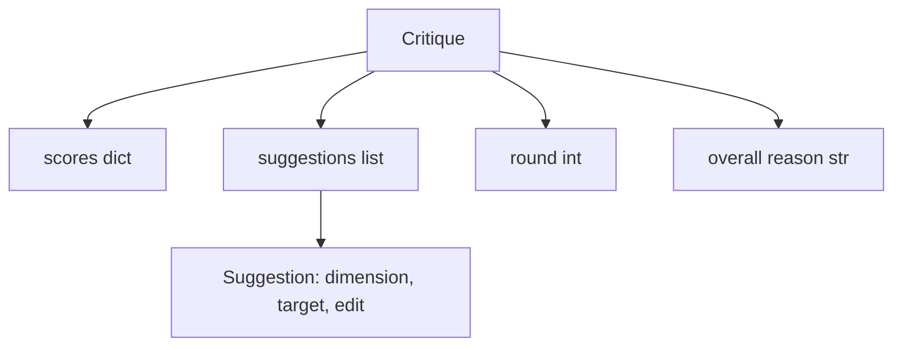
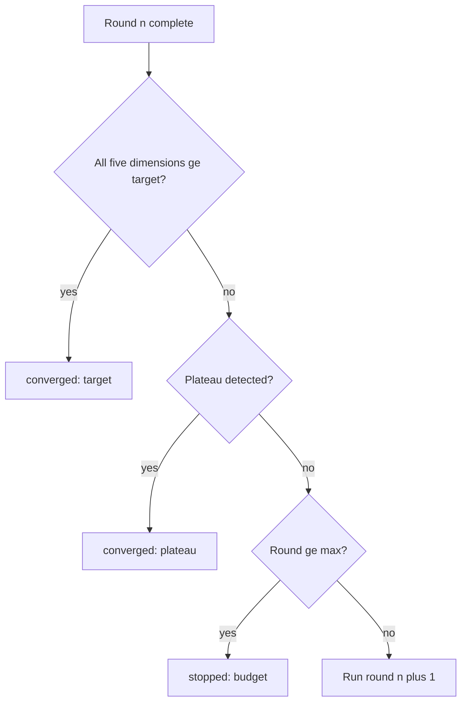
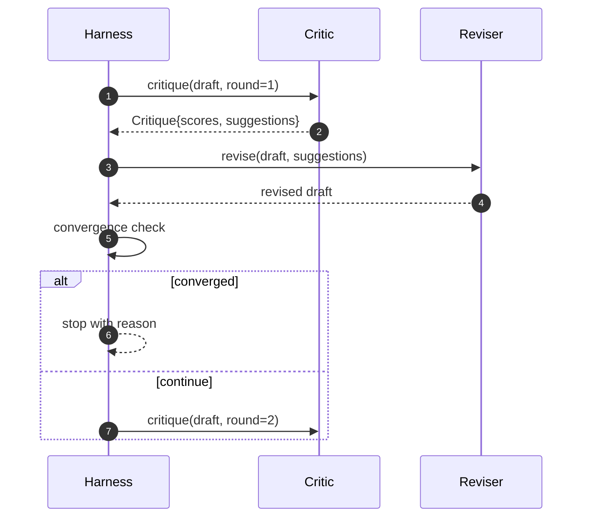

# Critic Loop

> Критик, возвращающий «выглядит хорошо» с первого раза, сломан. Критик, всегда возвращающий «нужно доработать», сломан. Интересный критик — тот, что сходится, и сходимость приходится инженерить.

**Тип:** Практика
**Языки:** Python
**Пререквизиты:** Фаза 19, уроки 50–53
**Время:** ~90 минут

## Цели обучения

- Оценивать черновик статьи по пяти фиксированным измерениям: ясность, новизна, доказательность, методология, related work.
- Применять критику каждого раунда как структурный revision-diff, а не как переписывание вольной формы.
- Детектить сходимость сравнением скоров между раундами; останавливаться на плато, достижении цели или исчерпании бюджета.
- Ограничивать раунды бюджетом максимума итераций, чтобы несходящийся критик не крутился вечно.
- Излучать по-раундовый трейс, чтобы дашборд или следующая стадия могли отрисовать траекторию скоров.

## Почему пять фиксированных измерений

Критик вольной формы — это модель, возвращающая абзац предложений. Ревизия следующего раунда трактует абзац как фоновый контекст. Адресует ли переписывание критику — непроверяемо, потому что у критики никогда не было структуры.

Пять измерений дают харнесу контракт.



Скор — вектор. Харнес следит за каждым измерением между раундами. Ревизия, поднявшая ясность, но обрушившая доказательность, — регрессия по доказательности, и проверка сходимости её видит. Критик-только-модель такой гарантии предложить не может.

## Форма Critique



Каждое предложение несёт измерение, которое оно улучшает, целевую секцию и инструкцию `edit`, которую ревизор может применить. Ревизор тоже callable. Урок поставляет детерминированный ревизор, интерпретирующий edit-инструкцию как операцию дописывания в секцию. Модельный ревизор интерпретировал бы то же поле как промпт. Контракт не меняется.

## Правила сходимости, по порядку

Цикл критика завершается, когда срабатывает любое из трёх условий.



Цель — строжайший случай: каждое из пяти измерений (clarity, novelty, evidence, methodology, related_work) обязано достичь `>= target_score` (по умолчанию `8.0`), прежде чем цикл вернёт успех. Высокое среднее с одним слабым измерением не считается. Детекция плато сравнивает среднее текущего раунда со средним предыдущего. Если улучшение ниже `plateau_epsilon` (по умолчанию `0.1`) два раунда подряд, цикл выходит с `plateau`. Бюджет — жёсткий потолок раундов (по умолчанию `5`), выход с `budget`.

Порядок важен. Цель побеждает плато, плато побеждает бюджет. Если раунд три достигает цели на той же итерации, которая триггернула бы и плато, результат — `target`, а не `plateau`.

## Почему детекция плато работает на двух раундах

Одно-раундовое плато — шум. Настоящий критик возвращает чуть разный скор на каждой итерации даже на фиксированном черновике, потому что детерминированный скоринг всё равно зависит от того, какие предложения были применены и в каком порядке. Требование двух плато-раундов подряд отфильтровывает этот шум. Если харнес репортит плато, черновик действительно перестал улучшаться.

## Детерминированный критик этого урока

Урок не вызывает модель. Поставляемый критик — callable, оценивающий черновик по трём сигналам: средняя длина тела секции (ясность), число фигур и цитат (доказательность) и поле `originality_tag` в метаданных статьи (новизна). Ревизор знает, как толкнуть каждый скор вверх.

```text
clarity      grows when the average section body length increases
novelty      grows when originality_tag is set to "high"
evidence     grows when a section's figure_refs is non-empty
methodology  grows when a section titled "Method" exists with body
related-work grows when a section titled "Related Work" exists with body
```

Ревизор интерпретирует каждое предложение как целевое дописывание. После первого раунда харнес может наблюдать рост скора. Тесты используют это свойство, чтобы утверждать, что цикл сокращает разрыв.

## Полный контракт цикла



Харнес владеет счётчиком раундов, трейсом и проверкой сходимости. Критик владеет скором. Ревизор владеет diff'ом. Никто из троих не трогает состояние остальных.

## Выход Trace

Каждый раунд излучает одно событие трейса с номером раунда, вектором скоров, числом предложений и вердиктом сходимости. Полный трейс возвращается вместе с финальным черновиком. Дашборд ниже по течению может отрисовать график скор-по-раундам. Следующий урок — планировщик итераций — читает трейс, решая, стоит ли ветку сохранять.

## Бюджеты, защищающие от плохих критиков

Критик, порождающий предложения, никогда не улучшающие скор, запрёт цикл в потолок максимума итераций. Трейс делает это видимым: пять раундов, скоры плоские, вердикт `budget`. Пользователь читает это как баг критика, а не черновика. Альтернатива — показывать только финальный черновик — прячет диагноз. Trace-first-дизайн его поднимает.

## Как читать код

`code/main.py` определяет `Critique`, `Suggestion`, протокол `Critic`, протокол `Reviser`, `CriticLoop` и фабрику `make_deterministic_critic_pair`, возвращающую детерминированного критика и парный ревизор. Минимальная форма `Paper` включена, чтобы урок был самостоятельным.

`code/tests/test_critic_loop.py` покрывает: монотонное улучшение после первого раунда, сходимость к цели на подстроенном черновике, детекцию плато после двух плоских раундов, исчерпание бюджета, когда ни одно предложение не улучшает, применение предложений ревизором и форму трейса.

## Куда двигаться дальше

Два расширения, которые захочет настоящая реализация. Первое — веса измерений: статья для воркшопа взвешивает новизну выше методологии; журнал — наоборот. Проверка сходимости становится взвешенным средним. Второе — парные критики: один критик оценивает, второй арбитрирует предложения до того, как их увидит ревизор. Оба добавляют ценность, оба компонуются на той же форме `Critique`.

Ставка — вектор скоров. Как только критика структурирована, любое другое улучшение — правило сходимости, дашборд, парный критик — встаёт на место, не меняя цикл.

## Дополнительное чтение

- Фаза 14, уроки 03–05 — Reflexion, Self-Refine и CRITIC.
- Фаза 19, урок 54 — paper writer, который он критикует, урок 56 — планировщик итераций.
