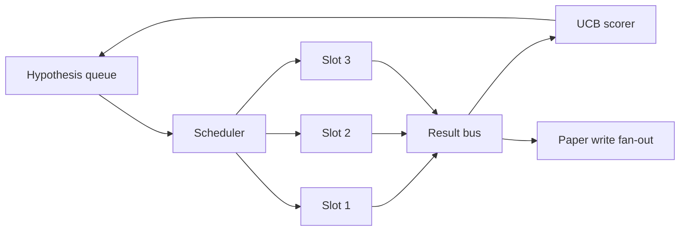
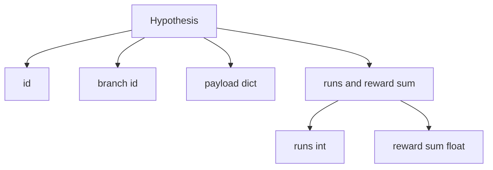
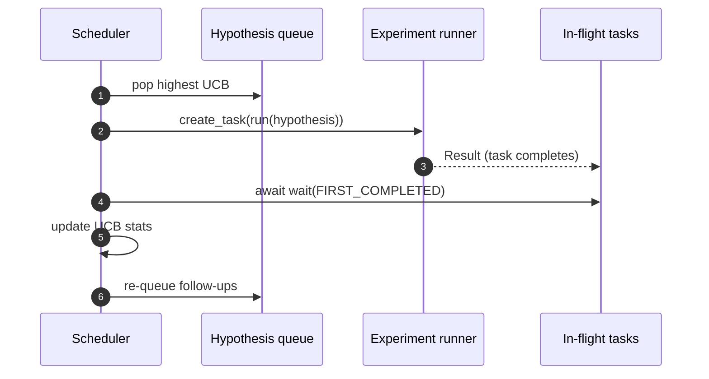

# Iteration Scheduler

> Research-цикл без планировщика — это очередь с манией величия. Планировщик — то место, где цикл решает, что перестать исследовать, и это решение — вся игра.

**Тип:** Практика
**Языки:** Python
**Пререквизиты:** Фаза 19, уроки 50–53
**Время:** ~90 минут

## Цели обучения

- Смоделировать research-воркфлоу как очередь гипотез, кормящую параллельные слоты экспериментов, чьи результаты стекаются обратно.
- Гонять несколько экспериментов конкурентно на asyncio, чтобы планировщик держал все слоты занятыми.
- Оценивать каждую ветку гипотез через UCB, чтобы планировщик мог обрезать малодоходные ветки, не бросая исследование.
- Разветвлять готовые результаты в стадию написания статьи и стадию перепостановки, чтобы высокодоходная ветка порождала follow-up-гипотезы.
- Показывать по-итерационный трейс со скорами веток, занятостью слотов и решениями об обрезке.

## Почему планировщик, а не worklist

Плоский worklist гоняет джобы в порядке поступления. Это нормально, когда джобы независимы. Research не независим: находка из эксперимента три меняет приоритет экспериментов четыре и пять. Планировщик, читающий стекающиеся результаты и переупорядочивающий очередь, делает больше полезной работы на единицу compute.

Интересное дизайн-решение — правило скоринга. Жадный скорер всегда выбирает текущего лидера и никогда не исследует. Равномерный никогда не эксплуатирует. UCB (upper confidence bound) — средний путь: эксплуатировать лидера, резервируя емкость под ветки, которые пробовали меньше.

## Форма системы



Очередь держит гипотезы. Планировщик выбирает гипотезу с наивысшим UCB, когда освобождается слот. Каждый слот гоняет эксперимент асинхронно. Завершенные эксперименты выкладывают результат на шину. Шина обновляет UCB-статистику породившей ветки и разветвляет в стадию написания статьи, когда доходность ветки пересекает порог.

## Форма Hypothesis



`branch` — ключ UCB-статистики. Несколько гипотез могут делить ветку (ветка — направление исследования; гипотеза — один трайал внутри него). `runs` — счетчик завершенных экспериментов ветки, `reward_sum` — накопленная награда. UCB читает оба.

## UCB-скоринг

Формула UCB этого урока — классический UCB1.

```text
ucb(branch) = mean_reward(branch) + c * sqrt( ln(total_runs) / runs(branch) )
```

`total_runs` — счетчик всех завершенных экспериментов по всем веткам. `c` — вес исследования; дефолт урока — `sqrt(2)`. Ветка с нулем прогонов получает `+inf`, поэтому непробованные ветки всегда планируются первыми. Ветка с высокой средней наградой держит высокий скор, пока другие не догонят; ветка, гоняемая много раз без особой награды, затмевается менее гонявшимися альтернативами.

Gate обрезки отделен от выбирателя. Обрезка убирает ветку из будущего планирования, когда ее средняя награда падает ниже абсолютного пола (по умолчанию `0.2`) после как минимум `prune_after_runs` трайалов (по умолчанию `3`). Это держит очередь ограниченной.

## Параллельные слоты на asyncio

Планировщик гоняет эксперименты через `asyncio.create_task`. Каждая задача запускает раннер эксперимента (`async def` callable), возвращающий `Result`. Главный цикл ждет множество задач в полете через `asyncio.wait(..., return_when=asyncio.FIRST_COMPLETED)` и запускает обновление скоринга на каждом завершении.



Три слота работают конкурентно. Главный цикл никогда не блокируется на одном эксперименте. Планировщик стартует новые задачи, как только слот освобождается, — пока очередь не пуста и задачи в полете есть.

## Fan-out: триггеры статей

Когда средняя награда ветки пересекает `paper_threshold` (по умолчанию `0.7`) и ветка еще не породила статью, планировщик выкладывает событие `paper.trigger` в выходной список. Ниже по течению его подхватил бы paper writer из урока пятьдесят четыре. В этом уроке триггер захватывается списком, чтобы тесты могли его утверждать.

## Fan-out: follow-up-гипотезы

Когда приземляется высокодоходный результат, планировщик может вызвать пользовательский `expander`, порождающий одну или больше follow-up-гипотез на той же ветке. Expander — чистая функция из `Result` в `list[Hypothesis]`. Урок поставляет детерминированный expander, порождающий два follow-up'а для любого результата, чья награда превышает порог статьи.

## Бюджеты

Два бюджета защищают планировщик от циклов-беглецов.

```text
max_experiments    : total count of experiments run across all branches
max_seconds        : wall-clock cap (asyncio time)
```

Когда любой срабатывает, планировщик перестает планировать новые задачи, дожидается тех, что в полете, и возвращает финальный трейс. Трейс включает `stop_reason`.

## Трейс и финальный отчет

Каждое решение планирования (pick, dispatch, result, prune, fan-out) излучает одно событие. Финальный отчет суммирует пер-веточную статистику, общее число прогонов, общий wall-clock и сработавшие триггеры статей. Следующий урок — end-to-end-демо — читает этот отчет, чтобы вести paper writer.

## Как читать код

`code/main.py` определяет `Hypothesis`, `Result`, `BranchStats`, `IterationScheduler` и фабрику `make_deterministic_runner`, возвращающую asyncio-раннер экспериментов с предсказуемыми наградами. Раннер спит фиксированные `delay_ms` (по умолчанию `5ms`), чтобы конкурентность была наблюдаемой.

`code/tests/test_scheduler.py` покрывает: UCB выбирает непробованные ветки первыми, параллельную занятость слотов, триггеры статей при пересечении порога, обрезку веток после малодоходных трайалов, fan-out follow-up-гипотез и выход по бюджету (и по числу экспериментов, и по wall clock).

## Куда двигаться дальше

Три расширения, которые захочет настоящая реализация. Первое — персистентная UCB-статистика между сессиями: текущая живет в памяти; настоящий планировщик чекпоинтил бы ее, чтобы рестарт сохранял уже потраченный бюджет исследования. Второе — многокритериальный скоринг: вместо скалярной награды каждый результат излучает вектор, и UCB становится Pareto-выбирателем. Третье — контекстные бандиты: выбиратель обуславливается на фичи гипотезы (длина, сложность), чтобы похожие гипотезы делили исследование.

Планировщик — то место, где research становится чем-то большим, чем worklist. Как только UCB подключен и слоты работают параллельно, любое другое улучшение компонуется сверху.

## Дополнительное чтение

- Auer, Cesa-Bianchi, Fischer, «Finite-time Analysis of the Multiarmed Bandit Problem» (2002) — правило UCB1.
- Фаза 19, урок 55 — critic-цикл, урок 57 — end-to-end research-демо.
