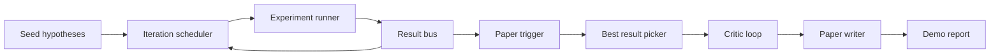
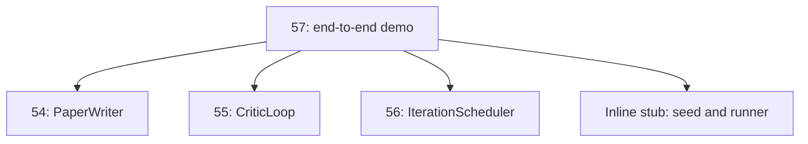
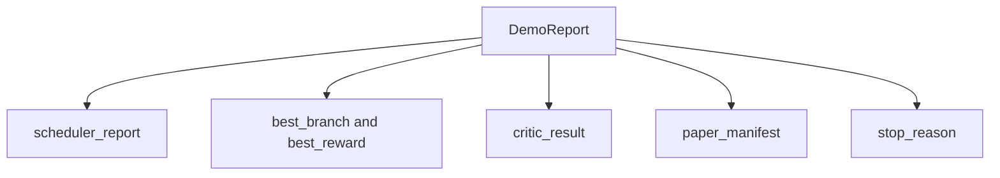

# End-to-End Research Demo

> Демо — то место, где каждый написанный ранее контракт обязан скомпоноваться. Если любой из них протекает, демо — тот урок, который это ловит.

**Тип:** Практика
**Языки:** Python
**Пререквизиты:** Фаза 19, уроки 50–53
**Время:** ~90 минут

## Цели обучения

- Свить auto-research-цикл end to end: seed гипотез, раннер экспериментов, планировщик, critic-цикл, paper writer.
- Скомпоновать примитивы четырёх предыдущих уроков трека D обычными Python-импортами, а не фреймворком.
- Прогнать цикл до самозавершения и излучить единый демо-отчёт, перечисляющий выход каждой стадии.
- Держать демо детерминированным, чтобы тестовый набор мог утверждать финальную форму.
- Поднимать ясный режим отказа при разрыве контракта любой стадии, чтобы следующая стадия не работала со сломанным входом.

## Что здесь компонуется



Пять стадий. Seed — список из трёх гипотез. Планировщик гоняет по ним шесть экспериментов в трёх параллельных слотах. Шина репортит один или больше триггеров статей. Выбиратель отбирает единственный лучший результат. Critic-цикл итерирует черновик, построенный из этого результата. Paper writer излучает финальные LaTeX, BibTeX и манифест.

## Почему импорт, а не копирование

Каждый предыдущий урок поставляет `main.py` с публичными датаклассами и функциями. Демо импортирует их, подправив `sys.path` на родительскую директорию каждого урока. Это не фреймворочная проводка; это тот же импорт, который уже используют тестовые файлы предыдущих уроков.



Инлайн-стуб замещает уроки с пятидесятого по пятьдесят третий: маленький генератор seed-гипотез и синхронная функция награды. Пользователь может заменить инлайн-стуб настоящими примитивами тех уроков, подправив два импорта.

## Гарантии детерминизма

Демо детерминировано по построению. Раннер экспериментов — сидированный numpy. Ревизор critic-цикла обходит фиксированные измерения в фиксированном порядке. Генератор прозы paper writer'а — mock из урока пятьдесят четыре. UCB-выбиратель планировщика разрешает ничьи порядком итерации, а не случайным выбором.

При одном сиде демо излучает один отчёт. Тест утверждает это свойство, прогоняя демо дважды и сравнивая манифест.

## Форма демо-отчёта



Каждое поле приходит дословно из вышестоящей стадии. Демо не трансформирует никакой выход; оно их компонует. В этом и состоит тест, которым демо является.

## Обработка режимов отказа

Каждая стадия либо успешна, либо кидает типизированную ошибку.

```text
Scheduler ........ returns SchedulerReport with stop_reason
                   in {queue_empty, max_experiments, deadline}
Best-result pick . raises NoTriggerError if no paper trigger fired
Critic loop ...... returns LoopResult with status converged or stopped
Paper writer ..... raises PaperValidationError on contract break
```

Отказ любой стадии обрывает демо типизированным исключением. Тесты фиксируют этот контракт: `test_no_triggers_raises_typed_error` и `test_best_picker_raises_when_no_triggers` утверждают, что выбиратель кидает `NoTriggerError` / `BestResultError`, когда ни одна ветка не выстрелила триггером, и writer никогда не вызывается.

## Выбиратель лучшего результата

Планировщик излучает триггеры статей по веткам. Выбиратель отбирает ветку с наивысшей средней наградой среди всех триггеров. Ничьи разрешаются алфавитно по id ветки, чтобы демо было детерминированным. Выбиратель — маленькая чистая функция; тест фиксирует её на фиксированном отчёте планировщика.

## Проводка critic-цикла

Critic-цикл урока пятьдесят пять работает над `MiniPaper`. Демо строит `MiniPaper` из выбранной ветки, заполняя абстракт id ветки, засевая две секции (Introduction и Results) и выставляя `originality_tag` из средней награды ветки (high при `>= 0.8`, medium при `>= 0.6`, low иначе).

Ревизор затем итерирует черновик до сходимости. Выход уходит в paper writer.

## Проводка paper writer

Paper writer урока пятьдесят четыре работает над полной формой `Paper` с фигурами и библиографией. Демо апгрейдит сошедшийся `MiniPaper` через `mini_to_full_paper`, прикрепляя одну фигуру выбранной ветки и маленькую синтетическую библиографию, собранную из объединения cite-ключей, предложенных критиком. Каждый cite, который демо добавляет, добавляется и в список библиографии — валидация проходит.

## Как читать код

`code/main.py` определяет `BestResultError`, `NoTriggerError`, `DemoReport`, `pick_best_branch`, `build_mini_paper`, `mini_to_full_paper` и `run_demo`. Импорты наверху один раз подправляют `sys.path` и тянут `PaperWriter`, `CriticLoop` и `IterationScheduler` из их уроков.

`code/tests/test_e2e.py` покрывает: демо проходит end to end и излучает отчёт со всеми пятью заполненными полями, детерминизм на двух прогонах, NoTriggerError, когда ни одна ветка не пересекла порог, PaperValidationError при разрыве контракта writer'а, манифест статьи содержит фигуру выбранной ветки, и причина остановки планировщика — одна из ожидаемых.

## Куда двигаться дальше

Три расширения, которые стоит подключить, когда демо зелёное. Первое — персистентное состояние: результат каждой стадии пишется в маленький JSON-store, чтобы рестарт мог возобновиться, не перегоняя дешёвые стадии. Второе — дашборд: события трейсов планировщика и critic-цикла рисуются единым таймлайном. Третье — настоящие вызовы моделей: замените mock-генератор прозы и детерминированного критика модельными; проводка не меняется.

Работа демо — доказать, что композиция и есть архитектура. Пять уроков, четыре импорта, один отчёт. В следующий раз, когда вы добавите стадию, проводка вырастет ровно на одну строку.
