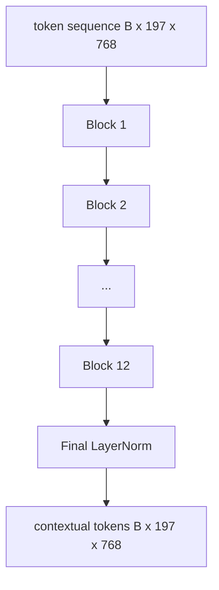
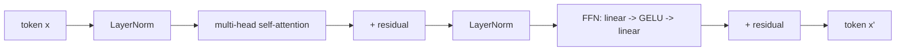

# Vision Transformer Encoder

> Патчи сами по себе не видят. 12-слойный pre-LN-трансформер с 12 головами внимания превращает последовательность patch-токенов в последовательность контекстных токенов, а CLS-токен собирает фичи всего изображения в своем финальном скрытом состоянии. Этот урок — машинное отделение каждой современной vision-language-модели.

**Тип:** Практика
**Языки:** Python
**Пререквизиты:** Фаза 19, уроки 30–37 (фундамент трека B)
**Время:** ~90 минут

## Цели обучения

- Реализовать pre-LN-блок трансформера с multi-head self-attention и feed-forward-подслоем.
- Стековать 12 блоков с 12 головами в энкодер ViT-Base.
- Подключить patch-фронтенд из урока 58 к энкодеру и прогнать forward-проход.
- Убедиться, что CLS-токен агрегирует информацию с каждого патча.

## Проблема

Patch embedding дает последовательность из 197 токенов, каждый — вектор, не знающий ни об одном другом патче. Картинке с котом нужно, чтобы каждый патч знал, в каких патчах усы, в каких фон, а в каких глаз. Трансформер — механизм, строящий это знание, по одному слою внимания за раз. Без него patch-фронтенд — умный токенизатор без понимания.

Стандартный рецепт — двенадцать блоков в глубину, двенадцать голов в ширину, pre-LayerNorm-размещение, активация GELU и feed-forward-расширение 4x. Этот рецепт — хребет CLIP ViT-L, SigLIP, DINOv2, семейства Qwen-VL, InternVL и любого другого open-weights vision-энкодера 2025–2026. Рецепт настолько стабилен, что можно читать любую из этих статей, предполагая эту форму блока, если явно не сказано иное.

## Концепция





### Pre-LN против post-LN

Оригинальный Transformer ставил LayerNorm после residual. Pre-LN (LayerNorm перед каждым подслоем) — версия, которую использует каждая современная vision-language-модель, потому что она обучается стабильно без трюков с warmup learning rate. Разница — одна строка в forward-проходе, а течение градиентов на глубине 12+ отличается как день и ночь.

### Multi-head self-attention

Каждая голова проецирует вектор токена в свою тройку `(query, key, value)` размерности `head_dim = hidden / num_heads`. При `hidden = 768` и `heads = 12` у каждой головы `dim = 64`. 12 голов внимают параллельно, затем их выходы конкатенируются обратно в размерность 768 и проходят через выходную проекцию. Смысл multi-head в том, что одна голова может выучить «смотри на глаз кота», а другая — «смотри на градиент фона» без взаимных помех.

### Почему feed-forward-расширение 4x

FFN идет `hidden -> 4 * hidden -> hidden` с GELU посередине. Множитель 4 эмпирический и держится в языковых и vision-трансформерах с 2017 года. Меньше (2x) — недообучение; больше (8x) — переобучение при фиксированном бюджете данных. MLP — то место, где модель хранит большинство выученных фактов, и широкая середина — где они сидят.

| Компонент | Параметры на масштабе ViT-Base |
|-----------|------------------------------|
| qkv-проекция на блок | `3 * 768 * 768 = 1.77M` |
| Выходная проекция на блок | `768 * 768 = 590K` |
| FFN на блок (расширение 4x) | `2 * 768 * 4 * 768 = 4.72M` |
| LayerNorm на блок | `4 * 768 = 3K` |
| Всего на блок | около 7.1M |
| 12 блоков | около 85M |
| Плюс фронтенд | около 86M всего |

ViT-Base — энкодер на 86M параметров. По меркам 2026 года это мало (SigLIP-So400M — 400M, ViT в Qwen-VL — 675M), но архитектура идентична с точностью до ширины и глубины.

### Каузальная маска или нет?

Vision Transformer'ы — encoder-only и двунаправленны: токен `i` может смотреть на токен `j` для любой пары. Никакой маски. Cross-attention на стороне декодера в уроке 61 будет использовать каузальную маску, но внутри vision-энкодера внимание полносвязно.

### Что выучивает CLS-токен

CLS-токен стартует обучаемым параметром, не имеет собственного patch-содержимого и накапливает информацию через внимание в каждом блоке. К финальному слою строка CLS — векторная сводка всего изображения; головы ниже по течению проецируют этот единственный вектор в классовые логиты, контрастивные эмбеддинги или cross-attention-ключи текстового декодера.

## Соберите это

`code/main.py` реализует:

- `MultiHeadSelfAttention` с `qkv`- и выходной проекциями, математикой scaled-dot-product-внимания и утверждениями о формах.
- `FeedForward` — GELU-MLP с расширением 4x.
- `Block` — pre-LN-блок, компонующий подслои внимания и feed-forward с residual'ами.
- `ViT` — стек из 12 блоков с финальным LayerNorm.
- `VisionEncoder` — соединяет `VisionFrontEnd` из урока 58 со стеком `ViT` и открывает `forward()`, возвращающий контекстную последовательность и спуленный CLS-вектор.
- Демо: прогоняет синтезированную фикстуру 224x224 через полный энкодер и печатает форму входа, форму выхода, число параметров и норму CLS через каждый второй слой.

Запустите:

```bash
python3 code/main.py
```

Вывод: фикстура кодируется в тензор `(1, 197, 768)`. Норма CLS дрейфует вверх по мере композиции слоев, затем стабилизируется на финальном LayerNorm. Всего параметров — около 86M.

## Используйте это

Определенный здесь энкодер — с точностью до ширины и глубины — тот же стек блоков, что поставляется внутри каждого open-weights VLM 2025–2026. Различия живут в:

- **Ширине и глубине.** ViT-Large — `hidden=1024, depth=24, heads=16`; SigLIP So400M — `hidden=1152, depth=27, heads=16`. Тот же блок.
- **Пулинговой голове.** CLS-пулинг (этот урок) против среднего пулинга (SigLIP) против attention-пулинга (более поздние VLM).
- **Обращении с позициями.** Фиксированные синусоидальные (урок 58) против обучаемых 1D против ALiBi против 2D RoPE. Математика блока не меняется.
- **Register-токенах.** DINOv2 приклеивает 4 дополнительных обучаемых токена. Одна строка кода.

Этот стек блоков — субстрат. Следующие уроки (60–63) стоят на нем.

## Тесты

`code/test_main.py` покрывает:

- одиночный блок сохраняет форму и инвариантен к размеру батча
- скоры внимания суммируются в единицу вдоль оси ключей (sanity softmax)
- residual-пути подключены (нулевой вход все равно дает ненулевой выход через CLS-токен)
- стек из 4 слоев дает правильную форму
- градиенты текут к проекции патчей от выхода CLS

Запустите их:

```bash
python3 -m unittest code/test_main.py
```

## Упражнения

1. Добавьте register-токены (4 обучаемых вектора, приклеенных после CLS) и перегоните. Сравните гладкость карт внимания через энтропию softmax-распределения на последнем слое.

2. Замените pre-LN на post-LN и обучите одну эпоху на синтетическом классификаторе форм. Понаблюдайте, какой из них обучается стабильно без LR warmup.

3. Реализуйте каузальное маскирование аргументом `attn_mask`, чтобы тот же блок переиспользовался как decoder-блок. Форма маски — `(seq, seq)`, нижнетреугольная.

4. Отпрофилируйте forward-проход при размерах батча 1, 8, 64 через `torch.profiler`. По wall time доминирует слой MLP, а не внимание.

5. Замените q-k-v-проекции одной головы внимания низкоранговым LoRA-адаптером, заморозьте остальное и убедитесь, что градиент течет только там, где ожидаете.

## Ключевые термины

| Термин | Что означает |
|------|---------------|
| Pre-LN | LayerNorm применяется перед каждым подслоем, а не после |
| Self-attention | Каждый токен смотрит на каждый другой токен той же последовательности |
| Multi-head | Скрытая размерность делится между `H` независимыми головами внимания |
| FFN-расширение | Feed-forward-слой расширяется до `4 * hidden` перед сжатием |
| CLS-пулинг | Использовать финальное скрытое состояние первого токена как сводку изображения |

## Дополнительное чтение

- An Image is Worth 16x16 Words (ViT, 2021) — рецепт энкодера.
- DINOv2 (2023) — register-токены и self-supervised-цель предобучения.
- SigLIP (2023) — вариант со средним пулингом и сигмоидный контрастивный лосс, используемый в уроке 62.
