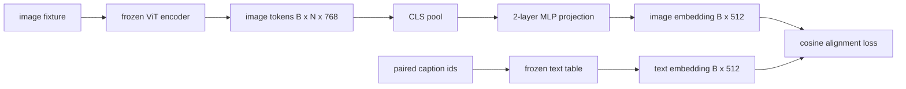

# Projection Layer for Modality Alignment

> Vision-энкодер порождает токены изображения. Текстовый декодер потребляет текстовые токены. Эти двое живут в разных векторных пространствах. Маленький двухслойный MLP проецирует токены изображения в текстовое пространство эмбеддингов, а косинусный лосс выравнивания против парной подписи стягивает два пространства к согласию. Эта проекция — наименьшая часть vision-language-модели и та, что важнее всего для переноса.

**Тип:** Практика
**Языки:** Python
**Пререквизиты:** Фаза 19, уроки 30–37 (фундамент трека B)
**Время:** ~90 минут

## Цели обучения

- Построить двухслойную MLP-проекцию, маппящую фичи изображения в текстовое пространство эмбеддингов.
- Сконструировать mock-таблицу текстовых эмбеддингов (без предобученного токенизатора, без настоящего корпуса).
- Вычислить косинусный лосс выравнивания между спроецированными токенами изображения и эмбеддингом парной подписи.
- Обучить одну проекцию при замороженном vision-энкодере и замороженной текстовой таблице.

## Проблема

У вас есть vision-энкодер (уроки 58–59), порождающий токены размерности `vision_hidden = 768`. Есть текстовый декодер, который вы хотите прикрутить сверху, с размерностью эмбеддингов `text_hidden = 512` (любое другое число столь же правдоподобно). Декодер ждёт токены текстовой формы. Токены изображения — не текстовой формы: они живут в базисе, который энкодер выучил при vision-only-предобучении, без всякой связи со словными векторами декодера.

Двухслойная MLP-проекция (linear, GELU, linear) наводит мост. Она достаточно мала (около `768 * 1024 + 1024 * 512 = 1.3M` параметров), чтобы обучиться за минуты на одной GPU, и это единственная часть, которой нужно учиться на фазе выравнивания. Vision-энкодер остаётся замороженным. Таблица текстовых эмбеддингов остаётся замороженной. Двигается только проекция. Это рецепт, который LLaVA отгрузила в 2023-м, который BLIP-2 переосмыслил как Q-Former и который с тех пор в той или иной форме принял каждый open-weights VLM.

## Концепция



### Пулинг до проекции

Vision-энкодер излучает 197 токенов. У текстовой стороны — один эмбеддинг уровня подписи. Чтобы их выровнять, нужен один вектор уровня изображения на сэмпл. CLS-пулинг проще всего: взять первый токен энкодера и спроецировать его. Средний пулинг по всем 197 токенам — другой вариант, его использует SigLIP. Любой из двух сворачивает 197 векторов в один.

### Почему два слоя, а не один

Одиночная линейная проекция может повернуть и перемасштабировать, но не может починить базис, если у двух пространств не совпадает кривизна. GELU между двумя линейными слоями даёт проекции один нелинейный изгиб, чего эмпирически достаточно, чтобы выровнять CLIP-подобные фичи с эмбеддингами языковой модели. Более глубокие проекции (LLaVA-NeXT использовал GLU; Qwen-VL — стек attention-слоёв) — расширения; двухслойный MLP — канонический бейзлайн, и именно он под капотом у проекционной головы Q-Former в BLIP-2.

| Слой | Форма | Параметры |
|-------|-------|------------|
| fc1 | `(vision_hidden, projection_hidden)` | `768 * 1024 + 1024` |
| активация | GELU | 0 |
| fc2 | `(projection_hidden, text_hidden)` | `1024 * 512 + 512` |

Около 1.3M параметров на голову `768 -> 1024 -> 512`.

### Косинусный лосс выравнивания

Выравнивание не означает `image_emb == text_emb`. Оно означает, что `image_emb` указывает в ту же сторону, что `text_emb`, в совместном пространстве. Косинусный лосс — `1 - cos_sim(image, text)`, от 0 (идеально выровнены) до 2 (противоположны). Обучение гонит его к нулю на пару. Урок 62 обобщает до контрастивного батча (InfoNCE), где каждое изображение обязано быть ближе к своей подписи, чем к любой другой в батче; этот урок использует пер-парную версию, чтобы динамика была видна.

### Замороженный энкодер — и есть трюк

У vision-энкодера 86M параметров. У текстовой таблицы — ещё несколько миллионов. Обучать их все на mock-корпусе — не вариант. Заморозка обоих означает, что 1.3M параметров проекции — единственное, что меняется, и нескольких сотен шагов на синтетических парах хватает, чтобы прогнать лосс вниз. Это в точности операционная форма каждого адаптерного VLM: тяжёлые части остаются замороженными, лёгкий мост обучается.

## Соберите это

`code/main.py` реализует:

- `MLPProjector(in_dim, hidden_dim, out_dim)` — двухслойный линейный MLP с активацией GELU.
- `MockTextEmbedding(vocab_size, dim)` — замороженную таблицу эмбеддингов с детерминированной инициализацией от сида.
- `make_pair(seed, vocab_size)` — синтезирует один парный сэмпл (изображение, подпись). Подписи — короткие последовательности id; эмбеддинг подписи — средний пулинг по токенным эмбеддингам.
- `cosine_alignment_loss(image_emb, text_emb)` — пер-парную цель `1 - cos_sim`.
- Обучающий цикл: гоняет проекцию 200 шагов по 32 синтетическим парам (по кругу) при замороженных vision-энкодере и текстовой таблице, печатая лосс каждые 25 шагов.

Запустите:

```bash
python3 code/main.py
```

Вывод: обучение показывает падение с начального лосса около 1.07 до примерно 0.80 за 200 шагов, демонстрируя, что одна проекция способна подтянуть токены изображения к текстовому пространству. Финальное косинусное сходство на пару тоже печатается.

## Используйте это

Тот же паттерн встречается в каждом open-weights VLM:

- **LLaVA 1.5.** Двухслойная GELU-MLP-проекция из hidden CLIP-ViT-L в размерность эмбеддингов LLaMA. Замороженный vision-энкодер, замороженный LLM, обучается только проекция (затем LLM размораживается на второй стадии).
- **BLIP-2.** Q-Former проводит 32 обучаемых query-токена через cross-attention против токенов изображения, затем проецирует в размерность эмбеддингов LLM. Проекционная голова в самом конце Q-Former — аналог MLP этого урока.
- **MiniGPT-4.** Одиночная линейная проекция из выхода Q-Former BLIP-2 в размерность эмбеддингов Vicuna.
- **Qwen-VL.** Cross-attention-адаптер из нескольких слоёв, но финальная часть — снова проекция в размерность эмбеддингов LM.

Форма варьируется, роль идентична: спулить токены изображения, спроецировать в текстовую размерность, обучить отдельно.

## Тесты

`code/test_main.py` покрывает:

- форма выхода проектора совпадает со сконфигурированным `out_dim`
- у замороженной таблицы текстовых эмбеддингов ноль параметров с `requires_grad`
- косинусный лосс равен нулю на идентичных векторах и 2 на антипараллельных
- градиент проектора течёт после одного backward-прохода
- обучающий цикл уменьшает лосс между шагом 0 и шагом 200

Запустите их:

```bash
python3 -m unittest code/test_main.py
```

## Упражнения

1. Замените CLS-пулинг средним пулингом по 196 patch-токенам и сравните финальный лосс после 200 шагов. Средний пулинг обычно обучается быстрее на синтетике; CLS более sample-эффективен на естественных изображениях.

2. Добавьте косинусному лоссу обучаемую скалярную температуру (`cos / tau`) и понаблюдайте, что происходит при слишком маленькой `tau` (шум градиента) и слишком большой (лосс застревает высоко).

3. Замените двухслойный MLP одиночным линейным слоем и оцените разрыв в лоссе. Нелинейность важнее на естественных фичах и меньше — на синтетических.

4. Добавьте маленький L2-штраф на веса проектора и посмотрите, как он взаимодействует с косинусным выравниванием (косинус масштабо-инвариантен, поэтому штраф в основном сжимает неиспользуемые направления).

5. Сохраните веса проектора, затем перезагрузите и прогоните инференс без backward-прохода vision-энкодера, убедившись, что на деплое нужен только проектор.

## Ключевые термины

| Термин | Что означает |
|------|---------------|
| Выравнивание модальностей | Действие, делающее эмбеддинги изображения и текста сравнимыми в одном общем пространстве |
| Проекционная голова | Маленький модуль, маппящий одно пространство в другое, обычно двухслойный MLP |
| Косинусное сходство | Скалярное произведение, делённое на произведение L2-норм |
| Замороженный энкодер | У vision- (или текстовой) модели все параметры с `requires_grad=False` |
| Mock-корпус | Синтетические пары, чтобы обучение не зависело от скачивания датасета |

## Дополнительное чтение

- Статья LLaVA — двухстадийное обучение (проекция, затем разморозка LM).
- Статья BLIP-2 — Q-Former как обучаемая альтернатива проекции.
- Технический отчёт Qwen-VL — cross-attention-адаптеры как более глубокие проекционные головы.
