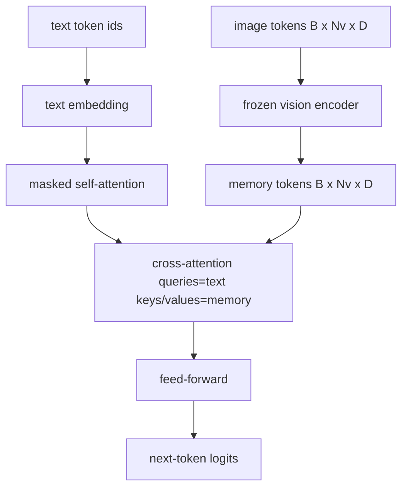
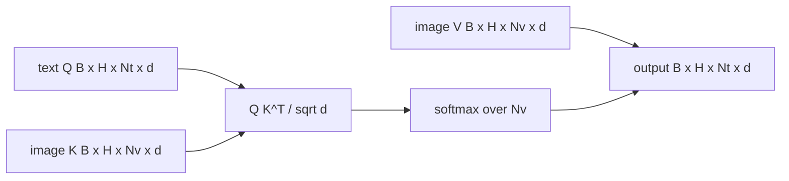

# Cross-Attention Fusion

> Слой проекции выравнивает один вектор изображения с одним вектором подписи. Настоящему vision-language-декодеру нужно, чтобы каждый текстовый токен смотрел на каждый patch-токен, — тогда модель может заземлить каждое слово в области изображения. Cross-attention — то, как это заземление происходит. Текст спрашивает; vision-ключи и значения отвечают. Этот урок строит блок cross-attention, каузальное текстовое self-attention и формы масок, держащие обоих в законе.

**Тип:** Практика
**Языки:** Python
**Пререквизиты:** Фаза 19, уроки 30–37 (фундамент трека B)
**Время:** ~90 минут

## Цели обучения

- Реализовать multi-head cross-attention, где query-поток — текст, а key/value-поток — vision.
- Скомпоновать decoder-блок: каузальное self-attention + cross-attention + feed-forward.
- Правильно выставить формы масок: каузальная для self-attention, никакой для cross-attention.
- Прогнать forward-проход с батчированными текстовыми токенами и фиксированным пулом токенов изображения.

## Проблема

Конкатенация токенов изображения и текста в одну последовательность — один вариант слияния (раннее слияние, путь Chameleon и Emu3). Cross-attention — другой (позднее слияние, путь, введенный Flamingo и скопированный каждым Flamingo-образным декодером с тех пор). При позднем слиянии текстовый декодер работает на чисто текстовых токенах и тянется в поток изображения через cross-attention на каждом слое.

У позднего слияния два преимущества. Первое: текстовый поток остается чистым, и модель сохраняет text-only-способности. Второе: поток изображения вычисляется один раз на изображение и переиспользуется на каждом шаге декодирования, поэтому генерация дешева даже для длинных подписей. Цена — один дополнительный attention-подслой на блок.

## Концепция





### Формы масок

Двум вниманиям внутри decoder-блока нужны разные маски:

| Внимание | Длина query | Длина key | Маска | Почему |
|-----------|--------------|------------|------|-----|
| Self-attention | `Nt` (текст) | `Nt` (текст) | Каузальная: нижнетреугольная `(Nt, Nt)` | Текстовые токены не могут заглядывать вперед при авторегрессии |
| Cross-attention | `Nt` (текст) | `Nv` (vision) | Без маски | Все изображение видно каждой текстовой позиции |

Урок включает одну функцию валидации форм, чтобы ошибка их перепутывания всплывала как `ValueError`, а не как молча сломанная кривая лосса.

### Почему на cross-attention нет маски

Изображение полностью наблюдаемо до генерации какого-либо текста. Токен `t` подписи может смотреть на любой патч изображения; на патчах нет временного порядка. Некоторые варианты Flamingo добавляют пер-сэмпловый паттерн маскирования при чередовании нескольких изображений и текстовых сегментов, но для одного изображения плюс подписи cross-attention видит все.

### Кэширование key/value

Ключи и значения изображения вычисляются один раз в начале декодирования и держатся в кэше. Каждый новый текстовый токен использует кэш без перевычисления. Именно это делает captioning быстрым на инференсе: тяжелый ViT работает один раз; cross-attention переиспользует его ключи и значения на каждом шаге. Урок открывает кэш и тестирует путь cache-hit.

### Композиция блока

Decoder-блок выполняет: pre-LN -> self-attention -> residual -> pre-LN -> cross-attention -> residual -> pre-LN -> feed-forward -> residual. Три подслоя, у каждого свой LayerNorm. Статья Flamingo добавила обучаемый gate на cross-attention, чтобы модель могла отказываться от пути изображения ради стабильности обучения; канонический бейзлайн (используемый здесь) без gate.

```python
class DecoderBlock:
  def forward(self, text_tokens, image_tokens, text_mask, cross_mask):
      text_tokens = text_tokens + self.self_attn(self.ln1(text_tokens),
                                                 mask=text_mask)
      text_tokens = text_tokens + self.cross_attn(self.ln2(text_tokens),
                                                  image_tokens,
                                                  mask=cross_mask)
      text_tokens = text_tokens + self.ffn(self.ln3(text_tokens))
      return text_tokens
```

## Соберите это

`code/main.py` реализует:

- `CrossAttention(hidden, heads)` — multi-head cross-attention с раздельными проекциями `q` и `kv`.
- `CausalSelfAttention(hidden, heads)` — маскированное self-attention стандартного декодера.
- `DecoderBlock` — компонует три подслоя с pre-LN-residual'ами.
- `VisionLanguageDecoder` — четырехслойный декодер, питаемый выходом mock-vision-энкодера и маленькой таблицей текстовых эмбеддингов.
- `causal_mask(length)` — возвращает нижнетреугольный булев тензор `(length, length)`.
- Демо: подает батч из двух текстовых последовательностей длины 10 с image memory длины 197 и печатает форму выхода, форму маски self-attention и норму выхода cross-attention по позициям.

Запустите:

```bash
python3 code/main.py
```

Вывод: декодер порождает тензор логитов `(2, 10, text_vocab)`. Форма маски — `(10, 10)`. Проверка переиспользования KV-кэша подтверждает идентичные логиты кэшированного и некэшированного путей.

## Используйте это

Cross-attention встречается в двух продакшен-семействах:

- **Flamingo и IDEFICS.** Вставляют cross-attention-подслой каждые K блоков языковой модели, LM заморожена. Vision-language-адаптер — cross-attention-блок плюс его gate.
- **BLIP-2.** Q-Former использует cross-attention из фиксированного набора 32 query-токенов в фичи изображения, затем проецирует queries в пространство эмбеддингов LM.

Форма блока этого урока маппится прямо на оба. Дисциплина масок (каузальная на self, никакой на cross) та же.

## Тесты

`code/test_main.py` покрывает:

- каузальная маска нижнетреугольна и совпадает с ожидаемой булевой формой
- форма выхода cross-attention — `(B, Nt, hidden)` независимо от длины ключей
- путь KV-кэша совпадает с некэшированным в пределах float-допуска
- несовпадение форм текстового и image-потоков кидает ясный `ValueError`
- полный forward-проход декодера дает правильные формы батча и последовательности

Запустите их:

```bash
python3 -m unittest code/test_main.py
```

## Упражнения

1. Добавьте обучаемый tanh-gate на residual cross-attention (трюк Flamingo) и убедитесь, что обучение сходится с почти нулевого начального gate. Gate стартует с 0; модель восстанавливает text-only-поведение до подмешивания потока изображения.

2. Реализуйте чередующееся внимание, где один декодер потребляет несколько изображений плюс несколько текстовых сегментов. Постройте пер-сэмпловую cross-attention-маску, не дающую текстовому сегменту 2 смотреть на изображение 1.

3. Отпрофилируйте cross-attention против self-attention при `Nt=64, Nv=576` (сетка 24x24 на большем разрешении). Стоимость cross-attention — `Nt * Nv`, и она доминирует на высоком разрешении изображения.

4. Добавьте dropout на query-стороне карты cross-attention и измерьте разнообразие подписей на демо (дисперсия сэмплов подписей растет с dropout в cross-карте).

5. Замените слой cross-attention на блок в стиле Q-Former, где фиксированный пул из 32 query-токенов смотрит на фичи изображения один раз на слой.

## Ключевые термины

| Термин | Что означает |
|------|---------------|
| Позднее слияние | Текст и vision остаются в раздельных потоках; cross-attention мостит их на каждом блоке |
| Cross-attention | Q приходит из одного потока, K и V — из другого |
| Каузальная маска | Нижнетреугольная булева маска, запрещающая заглядывать вперед при авторегрессии |
| KV-кэш | Ключи и значения изображения, сохраненные один раз и переиспользуемые на каждом шаге декодирования |
| Memory-токены | Замороженные токены изображения, в которые тянется декодер |

## Дополнительное чтение

- Flamingo (2022) — канонический дизайн позднего слияния с gated cross-attention.
- BLIP-2 (2023) — Q-Former, то есть cross-attention-блок, переодетый в обучаемый пул запросов.
- IDEFICS (2023) — open-weights-воспроизведение рецепта Flamingo.
