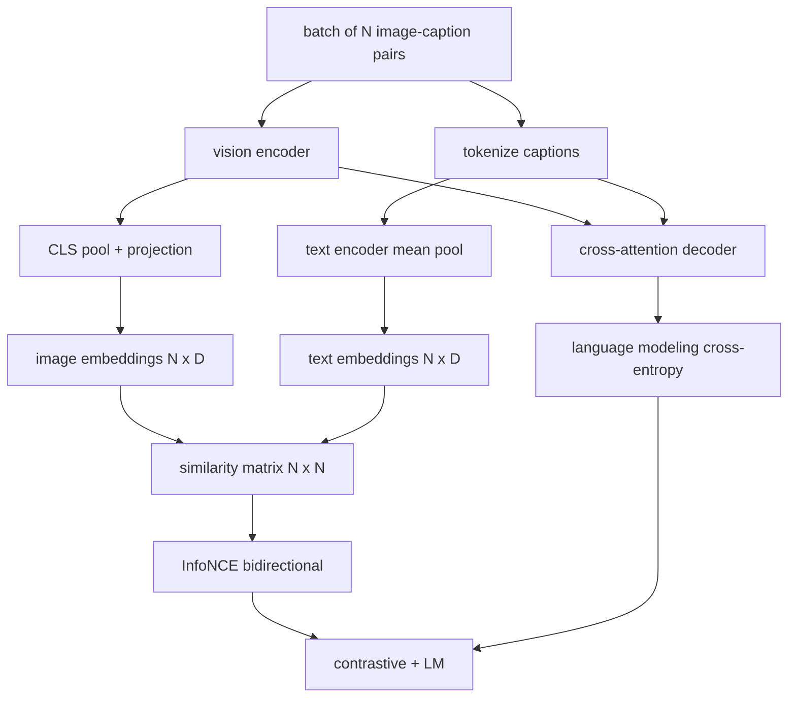

# Vision-Language Pretraining

> Энкодер, проекция и декодер соединены. Теперь обучите их вместе. Обучение ведут две цели: контрастивный image-text-лосс (InfoNCE), стягивающий совпадающие пары в совместном пространстве эмбеддингов, и лосс языкового моделирования, просящий декодер подписать каждое изображение. Вместе они учат сеть и находить правильное изображение для подписи, и писать подпись к изображению.

**Тип:** Практика
**Языки:** Python
**Пререквизиты:** Фаза 19, уроки 30–37 (фундамент трека B)
**Время:** ~90 минут

## Цели обучения

- Реализовать контрастивный лосс InfoNCE по батчу пар изображение-подпись.
- Скомпоновать контрастивный лосс с авторегрессивным лоссом языкового моделирования.
- Синтезировать mock-корпус из 200 пар изображение-подпись без скачивания настоящего датасета.
- Прогнать демо-цикл обучения на 50 шагов и увидеть падение обоих лоссов.

## Проблема

Vision-language-модели нужны два навыка. Она должна ранжировать: по подписи найти правильное изображение среди многих. И должна генерировать: по изображению написать подпись. Предобучение только на одном навыке дает полсистемы. CLIP отточил ранжирование, но не умеет подписывать. GPT-4V умеет подписывать, но использует отдельную retrieval-голову для ранжирования. Многоцелевое предобучение получает оба за один проход.

InfoNCE обслуживает ранжирующую половину. Для батча из N пар модель трактует N совпадающих пар как положительные, а `N^2 - N` несовпадающих — как отрицательные, и гоняет кросс-энтропийный лосс по получившейся матрице сходств `(N, N)`. LM-лосс обслуживает генеративную половину: стандартное предсказание следующего токена, обусловленное изображением. Оба лосса дифференцируемы и могут делить веса энкодера, проектора и декодера.

## Концепция



### InfoNCE одним абзацем

Сложите N эмбеддингов изображений строками и N текстовых эмбеддингов строками. L2-нормализуйте оба. Вычислите матрицу `N x N` `S = I T^T / tau`, где `tau` — обучаемая температура. Диагональные элементы — совпадающие пары; внедиагональные — отрицательные. Примените кросс-энтропию с целью по диагонали: у строки `i` наибольший элемент должен стоять в столбце `i`. Сделайте то же симметрично по столбцам. Итог — среднее двух. Это CLIP-лосс в восемь строк.

### Температура важна

Температура `tau` управляет остротой softmax. Слишком маленькая (например, `tau = 0.01`) — градиент приходит только от самого трудного негатива, обучение шумное. Слишком большая — softmax уплощается и градиент исчезает. CLIP обучает `tau` как параметр; демо здесь делает то же.

### Лосс языкового моделирования

Декодер потребляет memory-токены изображения через cross-attention и предсказывает следующий текстовый токен в каждой позиции. Лосс — стандартная кросс-энтропия с целью следующей позиции. Позиции паддинга замаскированы из лосса.

### Сочетание лоссов

`total = contrastive + lm_weight * lm`, где `lm_weight` — скаляр (часто 1.0). Оба лосса делят градиенты в энкодер и проекцию; только декодер получает градиент LM-лосса. Это многозадачный рецепт, который используют CoCa, BLIP и SigLIP-подобные модели с разными весами.

| Компонент | Поверхность лосса | Затрагивает |
|-----------|--------------|---------|
| InfoNCE | Ранжирование пар в совместном пространстве | Энкодер + проекция + текстовая голова |
| LM | Предсказание токенов, обусловленное изображением | Энкодер + проекция + декодер |
| Вместе | Multi-task | Весь стек |

### Почему 50 шагов достаточно для демо

Mock-корпус — синтетический набор из 200 пар со случайными изображениями и случайными id подписей. После 50 SGD-шагов с батчем 16 оба лосса видимо падают, даже если абсолютные значения остаются выше, чем достигла бы модель на настоящих данных. Смысл демо — подтвердить, что градиентная обвязка работает end to end и что добавление LM-лосса не дестабилизирует контрастивную цель.

## Соберите это

`code/main.py` реализует:

- `MultimodalModel` — сочетает маленький ViT-энкодер, MLP-проектор, крошечный текстовый энкодер (средний пулинг по эмбеддированным id) и cross-attention-декодер из урока 61.
- `info_nce_loss(image_emb, text_emb, temperature)` — двунаправленный контрастивный лосс в стиле CLIP.
- `lm_loss(logits, target_ids, padding_id)` — маскированную кросс-энтропию следующего токена.
- `make_mock_corpus(seed, n_pairs)` — возвращает 200 детерминированных пар (изображение, caption_ids).
- Обучающий цикл: 50 шагов с батчем 16, оптимизатор Adam и обучаемый параметр log-температуры. Оба лосса печатаются каждые 5 шагов.

Запустите:

```bash
python3 code/main.py
```

Вывод: контрастивный лосс падает с примерно `ln(16) = 2.77` к 2.4; LM-лосс — с равномерно-случайного бейзлайна `ln(512) ≈ 6.24` к примерно 4.7. Оба падения доказывают, что градиент подключен правильно. Настоящие модели обучаются миллионы шагов; динамика та же.

## Используйте это

Тот же рецепт лоссов отгружен в:

- **CLIP (2021).** Только image-text-контрастив, с отдельным caption-зондом на замороженном энкодере.
- **CoCa (2022).** Image-text-контрастив плюс LM-лосс подписывания в одной модели. Ровно тот паттерн, что строит этот урок.
- **BLIP (2022) и BLIP-2.** Контрастив плюс LM плюс голова image-text-matching. Три лосса вместе.
- **SigLIP (2023).** Меняет InfoNCE на сигмоидный парный лосс; та же контрастивная роль, другая функциональная форма.
- **Семейство LLaVA.** Двухстадийное обучение: первая стадия — выравнивание (косинус на замороженной LM), вторая добавляет LM-лосс с размороженной LM. Урок 60 соответствует первой стадии; этот — второй.

## Тесты

`code/test_main.py` покрывает:

- InfoNCE-лосс симметричен по строкам изображение/текст
- InfoNCE-лосс возвращает 0, когда матрица сходств — идеальная диагональ больших положительных чисел
- LM-лосс корректно маскирует позиции паддинга
- forward-проход модели порождает оба лосса без ошибок
- 5-шаговый обучающий цикл уменьшает объединенный лосс

Запустите их:

```bash
python3 -m unittest code/test_main.py
```

## Упражнения

1. Замените InfoNCE сигмоидным парным лоссом в стиле SigLIP и сравните сходимость на mock-корпусе.

2. Добавьте шаг hard-negative mining: каждый второй батч выбирайте самую трудную внедиагональную пару предыдущего батча и добавляйте ее. Обучите и посмотрите, падает ли контрастивный лосс быстрее.

3. Добавьте бинарную голову image-text-matching поверх совместного эмбеддинга (true/false: совпадают ли эти двое?) третьим лоссом, воспроизведя трехголовую схему BLIP.

4. Замените mock-корпус последовательностями caption-id из марковской цепи, чья матрица переходов обусловлена хешем изображения. Лосс подписывания должен упасть сильнее, потому что появился реально выучиваемый сигнал.

5. Обучите ту же модель с `lm_weight = 0` и еще раз с `lm_weight = 1`. Сравните контрастивный лосс; LM-лосс не должен регрессировать ранжирующую цель.

## Ключевые термины

| Термин | Что означает |
|------|---------------|
| InfoNCE | Noise contrastive estimation: кросс-энтропия по матрице сходств |
| Температура | Скаляр, управляющий остротой контрастивного softmax |
| Hard negative | Внедиагональная пара, которую модель путает; полезна для сэмплирования |
| LM-лосс | Стандартная кросс-энтропия следующего токена на стороне подписывания |
| Совместное пространство эмбеддингов | Общее пространство, где векторы изображения и текста живут после проекции |

## Дополнительное чтение

- Статья CLIP — оригинальный контрастивный рецепт.
- Статья CoCa — контрастив плюс подписывание в одной модели.
- Статья SigLIP — вариант с сигмоидным парным лоссом и почему он лучше масштабируется.
