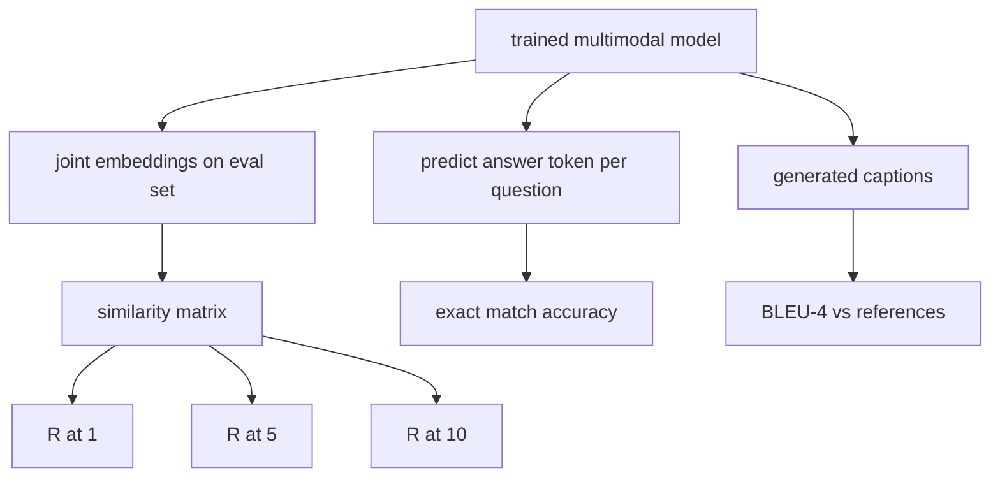

# Multimodal Evaluation

> Обучение — половина цикла. Вторая половина — измерение. Этот урок строит из примитивов три поверхности оценки: image-caption retrieval с отчётом R@1, R@5, R@10; visual question answering с точностью exact match; и подписывание изображений с BLEU-4. Каждая метрика — функция над выходами модели и синтетическим eval-набором, работающим за секунды.

**Тип:** Практика
**Языки:** Python
**Пререквизиты:** Фаза 19, уроки 58–62 (фундамент трека E: энкодер, трансформер, проекция, cross-attention-слияние, предобучение)
**Время:** ~90 минут

## Цели обучения

- Вычислить Recall@K из матрицы сходств между эмбеддингами изображений и подписей.
- Вычислить exact-match-точность VQA у модели, маппящей пары (изображение, вопрос) в фиксированный словарь ответов.
- Вычислить BLEU-4 из сгенерированных и референсных последовательностей токенов без внешних библиотек.
- Прогнать все три eval'а на синтетическом наборе поверх обученной модели из урока 62.

## Проблема

Соблазн — объявить мультимодальную модель готовой, когда обучающий лосс выходит на плато. Обучающий лосс меряет подгонку к обучающему распределению; он не меряет, умеет ли модель ранжировать пары в отложенном батче, отвечать на вопрос или писать подпись, которую примет человек. Стандартны три поверхности оценки:

- **Retrieval (R@1, R@5, R@10).** Построить совместный эмбеддинг для подписи-запроса; отранжировать каждое изображение eval-пула по косинусу; отчитаться, попало ли совпадающее изображение в топ-1, топ-5, топ-10. Симметричная форма (изображение-к-тексту) работает так же.
- **Visual question answering (exact match).** По (изображение, вопрос) модель выдаёт токен ответа. Exact match — один бит на сэмпл: равен ли предсказанный ответ референсному? Среднее по eval-набору.
- **Подписывание (BLEU-4).** Сгенерировать подпись. Посчитать геометрическое среднее точностей от 1-грамм до 4-грамм против референсных подписей с штрафом за краткость. Стандартная форма — мультиреференсная (одно изображение, несколько референсных подписей).

Каждая метрика — тонкая функция. Урок строит их все в коде, чтобы математика была осязаемой, а поверхность оставалась под вашим контролем. Настоящие бенчмарк-наборы (MS-COCO, VQA v2, GQA, OK-VQA) втыкаются в те же формы функций.

## Концепция



### Recall@K из матрицы сходств

Постройте косинусную матрицу сходств `(N, N)` между эмбеддингами изображений и подписей. Для каждой строки отсортируйте столбцы по убыванию сходства. Recall@K — доля строк, где индекс диагонального столбца лежит в топ-K позициях. Симметричный Recall@K (подпись-к-изображению) считается на транспонированной матрице. Отчитываются оба числа. Для eval с N=100 R@1 = 0.6 означает: 60 из 100 подписей вытащили своё правильное изображение первым совпадением.

### VQA exact match

Для каждой тройки (изображение, вопрос, ответ) закодируйте изображение, эмбеддите вопрос, слейте через декодер и считайте следующий токен. Предсказанный id токена сравнивается с референсным; верно при равенстве. Среднее по eval-набору. Настоящие VQA-датасеты поставляются с несколькими человеческими ответами на вопрос и используют формулу мягкой точности (1.0, если согласны хотя бы 3 из 10 аннотаторов, с масштабированием ниже); урок ради ясности использует одноответный exact match.

### BLEU-4

```text
BLEU-4 = BP * exp(mean(log p1, log p2, log p3, log p4))
```

Где `p_n` — модифицированная точность n-грамм (клипнутый счётчик сгенерированных n-грамм, встречающихся в любом референсе, делённый на общее число сгенерированных n-грамм), а `BP` — штраф за краткость:

```text
BP = 1                if generated length > reference length
   = exp(1 - r/g)     otherwise, where r is reference length and g is generated
```

На маленьких сэмплах, где какой-то `p_n` равен нулю, нужно сглаживание. Реализация использует «метод 1» Чена и Черри (добавить 1 к числителю и знаменателю при любом нулевом счётчике) — самый безопасный дефолт в режиме малых счётчиков.

### Синтетический eval-набор

50-сэмпловый eval-набор строится в памяти по тому же паттерну mock-корпуса, что в уроке 62, с отложенным сидом. Набор составляют три списка:

- `pairs`: 50 пар (изображение, caption_ids) для retrieval.
- `vqa`: 50 троек (изображение, question_ids, answer_id).
- `caps`: 50 записей (изображение, [референсные caption_ids, ...]) — до 3 референсов на изображение.

Набор детерминирован от сида и отложен от обучающего корпуса, поэтому метрики считаются на данных, которых модель не видела. Персист набора в JSON оставлен упражнением (см. ниже).

| Метрика | Диапазон | Случайный бейзлайн (N=50) |
|--------|-------|------------------------|
| R@1 | от 0 до 1 | 0.02 (1 / N) |
| R@5 | от 0 до 1 | 0.10 |
| R@10 | от 0 до 1 | 0.20 |
| VQA EM | от 0 до 1 | 1 / словарь |
| BLEU-4 | от 0 до 1 | маленький, но ненулевой |

Для 50-шагового обучения на синтетике метрики не обязаны быть высокими; они обязаны быть выше случайного бейзлайна — именно это проверяет демо.

## Соберите это

`code/main.py` реализует:

- `recall_at_k(sim_matrix, k)` — возвращает float в `[0, 1]` для обоих направлений.
- `vqa_exact_match(predictions, references)` — возвращает среднее по `int`-равенству.
- `bleu4(generated, references, smoothing=True)` — с поддержкой мультиреференсов.
- `build_eval_suite(seed, n_samples, vocab_size, max_len)` — возвращает три детерминированных eval-списка.
- `evaluate(model, suite)` — гоняет все три метрики и возвращает `dict` чисел.
- Демо: загружает свежеинициализированную мультимодальную модель из урока 62, оценивает её, затем обучает 50 шагов и оценивает снова, печатая метрики до/после.

Запустите:

```bash
python3 code/main.py
```

Вывод: таблица метрик до/после показывает улучшение retrieval от почти случайного к выученному сигналу модели, рост VQA выше случайного и рост BLEU-4 (синтетической структуры достаточно для подъёма 4-граммной точности).

## Используйте это

Каждая метрика маппится прямо на продакшен-бенчмарк:

- **Retrieval.** MS-COCO 5K val, Flickr30K, zero-shot ImageNet — всё это R@K-задачи на той же матрице сходств. Замените синтетический eval настоящими файлами — сигнатура функции не меняется.
- **VQA.** VQA v2, GQA, OK-VQA используют ту же exact-match-форму (с soft-acc вместо одноответного EM для VQA v2).
- **BLEU-4.** Подписывание MS-COCO, NoCaps, Flickr30K используют BLEU-4 плюс CIDEr и METEOR. Добавить CIDEr — ещё одна функция.

Для настоящих бенчмарков замените `build_eval_suite` настоящим загрузчиком и оставьте тела функций. Математика бенчмарк-агностична.

## Тесты

`code/test_main.py` покрывает:

- recall@k возвращает 1.0 на идеальной единичной матрице сходств и 0.0 на перевёрнутой при k < N
- recall@k чтит верхнюю границу `k <= N`
- bleu4 возвращает 1.0, когда сгенерированное в точности равно одному из референсов
- bleu4 возвращает 0.0 на непересекающемся словаре
- vqa exact match равен доле равных пар
- build_eval_suite возвращает ожидаемое число пар, vqa-элементов и caption-записей

Запустите их:

```bash
python3 -m unittest code/test_main.py
```

## Упражнения

1. Добавьте CIDEr в метрики подписывания. CIDEr использует TF-IDF-взвешивание n-грамм, вознаграждая информативные токены.

2. Реализуйте VQA с мягкой точностью: несколько человеческих ответов на вопрос, точность — `min(human_count / 3, 1)` при совпадении с любым. Воспроизводит VQA v2.

3. Добавьте NaN-безопасный вариант `bleu4`, обрабатывающий пустые сгенерированные последовательности без краша.

4. Посчитайте mean reciprocal rank (MRR) рядом с R@K. MRR чувствителен к тому, где правильный элемент оказался за пределами топ-K; R@K — к тому, попал ли он в топ-K.

5. Прогоните eval на модели в пяти чекпоинтах обучения (шаги 0, 10, 20, 30, 40, 50) и постройте кривую обучения. Подтвердите, что траектории метрик следуют траектории лосса.

## Ключевые термины

| Термин | Что означает |
|------|---------------|
| R@K | Доля запросов, где правильное совпадение попадает в топ-K результатов |
| Exact match | Простейший VQA-скоринг: предсказанный ответ равен референсному |
| BLEU-4 | Геометрическое среднее точностей 1–4-грамм со штрафом за краткость |
| Мультиреференс | Метрика подписывания принимает несколько референсных подписей на изображение |
| Held-out | Eval-набор сэмплируется от сида, не пересекающегося с обучающим корпусом |

## Дополнительное чтение

- Статья VQA v2 — формула мягкой точности и статистика датасета.
- Статья CIDEr — TF-IDF-взвешенное n-граммное подписывание.
- Оригинальный BLEU (Papineni et al., 2002) — варианты сглаживания.
- Скрипты оценки подписывания MS-COCO — каноническая референсная реализация.
