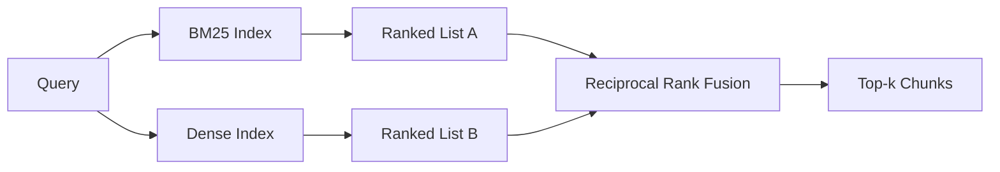

# Hybrid Retrieval with BM25 and Dense Embeddings

> Лексический и семантический retrieval отказывают на противоположных распределениях запросов. Гибридный retrieval с reciprocal rank fusion не интерполирует — он голосует, и голос побеждает на каждом классе запросов.

**Тип:** Практика
**Языки:** Python
**Пререквизиты:** Фаза 11, уроки 04 (эмбеддинги), 06 (RAG); Фаза 19, фундамент трека B (уроки 20–29); Фаза 19, урок 64 (стратегии chunking)
**Время:** ~90 минут

## Цели обучения
- Реализовать BM25 с нуля по формулировке Робертсона и Спарк-Джонс, с взвешиванием полей, нормализацией длины документа и настраиваемыми k1 и b.
- Построить dense-ретривер поверх детерминированного mock-эмбеддинга, чтобы цикл работал офлайн.
- Реализовать reciprocal rank fusion ровно так, как Кормак, Кларк и Бютчер опубликовали в 2009-м, и объяснить, почему он доминирует над скор-взвешенной интерполяцией.
- Настроить константу k RRF и пер-модальные веса и прочитать компромиссы на маленьком фикстурном корпусе.

## Проблема

Лексический поиск побеждает, когда запрос несёт буквальный идентификатор, содержащийся в корпусе дословно. Запрос `AbortMultipartOnFail` возвращает правильную Go-функцию через BM25 за микросекунды. Тот же запрос, заэмбеженный, сидит на границе трёх кластеров сходства, и dense-ретривер первым ранжирует не тот файл.

Dense-поиск побеждает, когда запрос перефразирован прочь от буквальных токенов корпуса. Пользователь, спрашивающий «как мы обрабатываем отменённые загрузки», никогда не печатал слов abort или multipart. BM25 возвращает документационный чанк «загрузка больших файлов», потому что та страница содержит слово «загрузка». Dense-retrieval находит abort-функцию, в чьём summary упомянута отмена.

Выбор между двумя не статичен. Переменная — распределение запросов. Продакшен-RAG обслуживает оба класса с одного endpoint'а, поэтому retrieval обязан обслуживать оба сразу. Это и есть гибридный retrieval. Шаг слияния — та часть, которая обязана быть правильной.

## Концепция



### BM25 одним абзацем

BM25 оценивает пару запрос-документ, суммируя по термам запроса фактор обратной документной частоты, умноженный на насыщающийся фактор частоты терма с поправкой нормализации длины. Две ручки. `k1` управляет насыщением частоты терма; дефолт 1.5 — опубликованная рекомендация, и двигать его без бенчмарка не стоит. `b` управляет тем, насколько важна длина документа; дефолт 0.75 говорит: длинные документы штрафуются, но не линейно.

Формула IDF использует сглаженное определение Робертсона и Спарк-Джонс: `log((N - df + 0.5) / (df + 0.5) + 1)`. Плюс-один внутри логарифма держит IDF положительным, когда терм встречается в больше чем половине корпуса. Это важно в маленьких корпусах, где стоп-слова технически редки.

Взвешивание полей позволяет сказать BM25, что совпадение по имени символа стоит больше совпадения в теле. Реализация — множитель на счётчики термов при индексации, а не при скоринге. Так математика остаётся идентичной и не нужен отдельный скор на поле.

### Dense retrieval одним абзацем

Заэмбеддите каждый чанк в вектор фиксированной размерности эмбеддинг-моделью. На запросе заэмбеддите запрос, отранжируйте каждый чанк по косинусу и верните топ-k. Модель — та переменная, которая решает качество. Сам алгоритм retrieval — две строки: скалярное произведение и сортировка.

Этот урок использует детерминированный хеш-эмбеддинг, чтобы читать математику слияния без сетевого вызова. Хеш суммирует токен-ключевые смещения в 96-мерный вектор и нормализует. Косинусные ранги детерминированы между прогонами — этого требует тестовый набор.

### Reciprocal rank fusion, опубликованная формула

Два ранжированных списка. Для каждого кандидата, появившегося в любом списке, просуммируйте его вклады обратных рангов. Статья 2009 года использовала `1 / (k + rank)` с k, равным 60, по умолчанию. Отсортируйте по суммарному скору. Это весь алгоритм.

Опубликованная константа k = 60 не произвольна. При k = 60 вклад ранга 1 — это 1 / 61, а вклад ранга 10 — 1 / 70. Вклад затухает медленно, поэтому глубокие кандидаты всё ещё голосуют. Меньший k заставляет топ-результаты доминировать. Больший — уплощает кривую вкладов.

Две настраиваемые ручки в нашей реализации. Константа `k`. Пара пер-модальных весов, чтобы бустить BM25 или dense, когда есть предварительные свидетельства, что одна из модальностей лучше на вашем корпусе. Умножение рангового вклада на вес — простейшая принципиальная реализация; она сохраняет форму рангового затухания и остаётся безмасштабной.

### Почему слияние бьёт скор-взвешенную интерполяцию

BM25-скоры неограничены и зависят от корпуса. Косинусные сходства ограничены от -1 до 1. Линейная комбинация `alpha * bm25 + (1 - alpha) * cosine` требует пер-корпусной настройки alpha и ломается при каждой переиндексации. Ранговое слияние — нет. Два ранга сравнимы между модальностями. Опубликованный RRF-бейзлайн бьёт скор-интерполяцию на каждом публичном TREC-треке с 2010 года.

Тот же аргумент вы слышите про RankFusion против RRF в документации Vespa и Weaviate. Они пришли к тому же выводу: оставайтесь ранговыми, пока нет очень сильных свидетельств в пользу интерполяции скоров.

## Соберите это

`code/main.py` реализует:

- `tokenize(text)` — быстрый regex-токенизатор.
- `BM25Index` — с взвешиванием полей, `add` и `search`, настраиваемыми k1, b.
- `mock_embed`, `DenseIndex` — тот же детерминированный эмбеддинг, что в уроке 64, чтобы чанки были сравнимы.
- `rrf(rankings, k, weights)` — опубликованное слияние с мультимодальными весами.
- `HybridRetriever` — сочетает BM25 и dense.
- Демо `main()` — загружает маленький фикстурный корпус, гоняет три запроса, целящих в силу и слабость каждого ретривера, и печатает ранжирования каждой модальности плюс слитый список.

Запустите:

```bash
python3 code/main.py
```

Читайте вывод демо бок о бок. Запрос с буквальным идентификатором приземляется на BM25-ранг 1, dense-ранг 4, RRF-ранг 1. Перефразированный запрос — BM25-ранг 6, dense-ранг 1, RRF-ранг 1. Неоднозначный запрос — BM25-ранг 3, dense-ранг 3, RRF-ранг 1. Слияние — не разрешатель ничьих; это система, побеждающая на каждом классе запросов.

## Настройка ручек

| Ручка | Дефолт | Двигайте вверх, когда | Двигайте вниз, когда |
|------|---------|----------------|------------------|
| BM25 k1 | 1.5 | Термы повторяются в документах, и частота должна значить больше | Документы короткие, и повторение термов — шум |
| BM25 b | 0.75 | Длинные документы реально говорят меньше на слово | Длина документа не коррелирует с темой |
| RRF k | 60 | Глубокие кандидаты должны продолжать голосовать | Топ-1 должен доминировать |
| Вес BM25 | 1.0 | Корпус содержит буквальные идентификаторы, и запросы их матчат | Запросы перефразированы пользователями |
| Вес dense | 1.0 | Запросы перефразированы | Запросы буквальны |

Настраивайте перегоном eval-харнеса урока 68 на отложенном наборе запросов, а не интуицией.

## Режимы отказа, которые демо спрячет

**Токены вне словаря.** IDF BM25 считается из корпуса, поэтому термы только из запроса вносят ноль. Dense-эмбеддинги галлюцинируют вектор для того же терма. На идентификаторах вне корпуса dense-модальность возвращает правдоподобно выглядящих, но неправильных соседей. Слияние это поглощает, потому что BM25 не возвращает ничего и ранговый вклад выпадает, — но только если вы дедуплицируете по документу, а не по чанку.

**Доминирование стоп-токенов.** BM25 по слову «the» даёт равномерное ранжирование по корпусу. Фильтруйте стоп-токены в индексаторе или примите, что высоко-IDF-термы доминируют естественно.

**Идентичное содержимое между модальностями.** Если корпус настолько мал, что топ-1 BM25 — это и топ-1 dense, RRF даёт тот же топ-1 с теми же соседями. Это корректное поведение, а не отказ, но слияние выглядит невидимым. Добавьте в eval враждебную пару запросов, чтобы проверить, что слияние действительно работает.

## Используйте это

Production-паттерны:

- Индексируйте BM25 in-process; узкое место — словарь частот термов, а не векторы.
- Индексируйте dense-векторы в отдельном хранилище (в уроке — плоский список; в продакшене — HNSW).
- Гоняйте оба запроса параллельно; слияние — merge за константное время по объединению.
- Персистите модальность каждого извлечённого попадания, чтобы reranker ниже по течению видел, какая модальность за него голосовала.

## Отгрузите это

Урок 66 берёт слитый топ-k этого урока и реранжирует cross-encoder'ом. Урок 68 оценивает весь пайплайн через precision, recall, MRR и nDCG. Гибридный ретривер этого урока — первая стадия end-to-end-системы урока 69.

## Упражнения

1. Замените `mock_embed` настоящей моделью вашего провайдера. Перегоните демо и доложите, как меняется dense-only-ранжирование на перефразированном запросе.
2. Добавьте третью модальность: summary чанков, индексируемые отдельно и сливаемые третьим ранжированным списком. Измерьте прирост.
3. Просвипайте RRF k по 10, 30, 60, 100, 200. Постройте кривую recall@k из урока 68. Доложите значение k, где кривая пикует на вашем корпусе.
4. Реализуйте BM25F как следует (пер-полевая нормализация длины вместо трюка с множителем) и сравните на корпусе, где совпадения по символам важнее всего.

## Ключевые термины

| Термин | Как говорят | Что это на самом деле |
|------|-----------------|------------------------|
| BM25 | «Лексический поиск» | Вероятностное ранжирование: idf x насыщающийся tf x нормализация длины |
| RRF | «Слияние рангов» | Сумма 1 / (k + rank) по ранжированным спискам; дефолт k = 60 |
| k1 | «Насыщение TF» | Управляет тем, как быстро повторяющийся терм перестаёт добавлять скор |
| b | «Штраф за длину» | 0 — игнорировать длину документа, 1 — полная нормализация |
| Взвешивание полей | «Буст символов» | Повторять токены при индексации, бустя совпадения в этом поле |
| Ранговое против скорового слияние | «Почему RRF бьёт линейное» | Ранги сравнимы между модальностями; скоры — нет |

## Дополнительное чтение

- Cormack, Clarke, Buettcher, "Reciprocal Rank Fusion outperforms Condorcet and individual rank learning methods", SIGIR 2009
- Robertson, Walker, Beaulieu, Gatford, Payne, "Okapi at TREC-3" (оригинальная статья BM25)
- [Vespa: Hybrid Retrieval with BM25 and Embeddings](https://docs.vespa.ai/en/tutorials/hybrid-search.html)
- [Weaviate: Hybrid Search](https://weaviate.io/developers/weaviate/search/hybrid)
- Фаза 11, урок 06 — основы RAG
- Фаза 19, урок 64 — чанкеры, чей выход здесь индексируется
- Фаза 19, урок 66 — cross-encoder-reranker, потребляющий слитый топ-k
