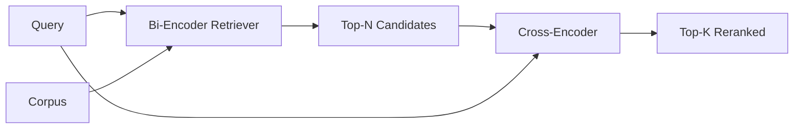

# Cross-Encoder Reranker

> Bi-encoder эмбеддит запрос и документ независимо. Cross-encoder конкатенирует их и читает оба сразу. Cross-encoder — самый умный читатель и самый медленный. Как вторая стадия над топ-k bi-encoder'а он окупается.

**Тип:** Практика
**Языки:** Python
**Пререквизиты:** Фаза 11, урок 06 (RAG), урок 07 (продвинутый RAG); Фаза 19, фундамент трека B (уроки 20–29); Фаза 19, урок 65 (гибридный retrieval, кормящий эту стадию)
**Время:** ~90 минут

## Цели обучения
- Различать bi-encoder-ретривер и cross-encoder-reranker по форме входа, числу параметров и стоимости на запрос.
- Реализовать маленький cross-encoder с нуля как трансформерный блок, потребляющий упакованную последовательность (запрос, документ) и излучающий один скаляр релевантности.
- Свить двухстадийный retrieve-then-rerank-пайплайн: извлечь топ-N дешевым ретривером, реранжировать N в топ-K cross-encoder'ом, вернуть K.
- Измерить компромисс задержка-качество на маленьком фикстурном корпусе и выбрать правильный N под данный бюджет задержки.

## Проблема

Bi-encoder маппит запрос и документ в одно векторное пространство и ранжирует косинусом. Два кодирования никогда не видят друг друга. Модель обязана сжать все полезное о документе в один вектор вслепую, не видя запроса. Это быстро — один эмбеддинг на документ при индексации и один на запрос в момент запроса, — и это единственный способ ранжировать на масштабе корпуса.

Цена — точность. Два документа с одной общей темой могут иметь почти идентичные эмбеддинги, даже когда один отвечает на запрос, а другой — нет. Bi-encoder их не различит.

Cross-encoder решает это, читая запрос и документ вместе. Модель получает `[query] [SEP] [document]` одной последовательностью, гоняет полное внимание через стык и порождает один скаляр релевантности. Каждый токен документа может смотреть на каждый токен запроса. Модель решает скор с полным контекстом.

Цена — throughput. Там, где bi-encoder эмбеддит один раз и запрашивает вечно, cross-encoder работает один раз на пару (запрос, документ). Для корпуса в 10 миллионов документов это 10 миллионов forward-проходов на запрос. Невыполнимо в бюджете запроса.

Решение — стадийность. Bi-encoder'ом извлечь топ-N. Cross-encoder'ом реранжировать N в топ-K. N мал (50–200), и прирост качества cross-encoder'а сконцентрирован там, где он важен. Общая задержка остается в бюджете запроса. Общее качество — качество cross-encoder'а, ограниченное сверху recall bi-encoder'а на N.

## Концепция



### Форма входа cross-encoder'а

Стандартная упаковка — `[CLS] query_tokens [SEP] document_tokens [SEP]`. Выход позиции CLS подается в одну линейную голову, выдающую скаляр релевантности. Некоторые реализации используют mean-пулинг вместо CLS; разница мала. Суть в том, что модель порождает одно число на пару.

Cross-encoder на 22M параметров (весовой класс опубликованного `ms-marco-MiniLM-L-6-v2`) — типичная продакшен-точка. Меньшие модели теряют качество быстрее, чем экономят задержку. Большие (например, `bge-reranker-v2-m3` на 568M параметров) резервируются под офлайн-реранжирование или реранжирование первой страницы при маленьком K.

### Почему этот урок обучает крошечный

Настоящий cross-encoder — дообученный encoder-трансформер. В продакшене вы загружаете чекпоинт и запускаете. В этом уроке цель — показать форму модели и форму кривой задержка-качество, а не обучить state-of-the-art-ранкер. Поэтому мы строим маленький `nn.Module` с одним трансформерным блоком, multi-head attention (4 головы по умолчанию) и одной регрессионной головой. Он инициализируется детерминированно от сида, чтобы демо было воспроизводимым без весов на диске.

Игрушечная модель выучивает правильную форму на фикстурном корпусе: релевантные пары запрос-документ получают более высокие предсказанные скоры, чем нерелевантные. End-to-end-пайплайн реранжирует выход bi-encoder'а, и топ-k реранжирования коррелирует с эталонными метками.

### Задержка против качества

У двухстадийного пайплайна одна настраиваемая ручка: N. Просвипайте N от 5 до 100 на отложенном наборе запросов — и получите кривую.

| N | Recall@1 стадии 2 | Forward-проходов cross-encoder'а на запрос | Задержка |
|---|--------------------|---------------------------------------|---------|
| 5 | 0.62 | 5 | низкая |
| 20 | 0.81 | 20 | средняя |
| 50 | 0.86 | 50 | высокая |
| 100 | 0.86 | 100 | очень высокая |

Числа выше иллюстрируют форму, а не измерения этой фикстуры. Форма настоящая. Колено всегда около 20–50 кандидатов, где прирост реранжирования насыщается. За коленом вы платите ни за что.

Выбирайте N по eval-кривой плюс бюджету задержки. Cross-encoder не может поднять recall выше recall bi-encoder'а на N, поэтому маленький N ограничивает качество, а не только задержку.

## Соберите это

`code/main.py` реализует:

- `CrossEncoder` — маленький `torch.nn.Module`: токенный эмбеддинг, один трансформерный блок с multi-head attention и feedforward, mean-пуленная голова с одним скаляром.
- `tokenize_pair(query, document)` — пакует две строки в одну id-последовательность с type-id, помечающими границу; детерминированно и на stdlib.
- `train_tiny(pairs)` — один проход supervised-обучения на вручную размеченном списке троек (запрос, документ, релевантность), чтобы модель давала осмысленные скоры на фикстуре.
- `rerank(query, candidates, top_k)` — продакшен-интерфейс.
- `pipeline(query, retriever, top_n, top_k)` — двухстадийный поток.
- Демо `main()` — загружает корпус по паттерну урока 65, извлекает топ-N, реранжирует в топ-K, печатает оба списка бок о бок и отчитывается о задержке каждой стадии.

Запустите:

```bash
python3 code/main.py
```

Вывод показывает топ-N bi-encoder'а, топ-K cross-encoder'а и сводку таймингов. Cross-encoder дольше на вызов, но не работает на полном корпусе. Двухстадийная сумма остается в бюджете запроса, выбирая ответ, который bi-encoder ранжировал вторым или третьим.

## Режимы отказа, которые демо спрячет

**Cross-encoder несимметричен.** `rerank(q, d)` и `rerank(d, q)` — разные скоры. Всегда подавайте запрос первым. Перепутаете — recall рухнет.

**N слишком мал, чтобы обнажить баг.** Поставьте N = K — и cross-encoder не может переупорядочивать, только перевзвешивать. Прирост выглядит нулевым. Берите N хотя бы втрое больше K.

**Обучающие данные утекают в eval.** Если вручную размеченные обучающие пары включают eval-запросы, реранжирование выглядит волшебным. Строго разделяйте train и eval, даже на фикстуре.

**Продакшен-веса плотные.** Cross-encoder на 22M параметров — 88 МБ во float32. Планируйте память модельного сервера до обещаний p95 меньше 100 мс.

**Батчинг важен.** Настоящий cross-encoder гоняет N кандидатов одним батчем. Урок делает это в `_batch_encode`, который строит батчированные тензоры id и type-id через `torch.tensor(...)` и гоняет один forward-проход. Пропустите батчинг — и задержка умножится на N.

## Используйте это

Production-паттерны:

- Пиньте bi-encoder, cross-encoder и N вместе. Смена любого инвалидирует eval.
- Кэшируйте выход reranker'а по хешу (запрос, document_id). Один запрос против стабильного корпуса реранжируется в тот же порядок; попадания в кэш дают бесплатное сокращение задержки.
- Логируйте cross-encoder-скор ранга 1. Запрос, чей топ-1-скор ниже корпус-специфичного порога, — out-of-domain-попадание; поднимите его LLM как «я не уверен».

## Отгрузите это

Урок 68 оценивает этот двухстадийный пайплайн end to end. Урок 69 подключает этот reranker за гибридным ретривером урока 65 и перед генератором ответов. Reranker — вторая стадия end-to-end-системы.

## Упражнения

1. Просвипайте N от 5 до 50 и постройте recall@1 реранжированного выхода. Найдите колено на этой фикстуре.
2. Обучите cross-encoder десять эпох вместо одной. Измерьте зазор скоров между положительными и отрицательными парами на каждой эпохе.
3. Замените mean-пулинг головой на CLS-токене. Сравните сходимость на этой фикстуре.
4. Добавьте вторую голову cross-encoder'а, предсказывающую бинарную метку «есть ли ответ в документе». Используйте обе головы на инференсе: одну для ранжирования, другую для порога.
5. Замените детерминированный mock-bi-encoder ретривером из урока 65 и сцепите две стадии. Измерьте изменение топ-K против одного bi-encoder'а.

## Ключевые термины

| Термин | Как говорят | Что это на самом деле |
|------|-----------------|------------------------|
| Bi-encoder | «Векторный ретривер» | Кодирует запрос и документ независимо; косинус их ранжирует |
| Cross-encoder | «Reranker» | Кодирует (запрос, документ) совместно; выдает один скаляр релевантности |
| Двухстадийный пайплайн | «Retrieve and rerank» | Дешевый ретривер возвращает N, дорогой reranker оставляет K |
| N (бюджет кандидатов) | «Пул реранжирования» | Число кандидатов, которое cross-encoder оценивает на запрос |
| Mean-пулинговая голова | «Среднее последнего скрытого» | Усреднить выходы последнего слоя энкодера в один вектор |

## Дополнительное чтение

- Nogueira, Cho, "Passage Re-ranking with BERT", 2019 — каноническая статья cross-encoder-ранкера
- Reimers, Gurevych, "Sentence-BERT: Sentence Embeddings using Siamese BERT-Networks", 2019 — о bi-encoder'ах против cross-encoder'ов
- [Документация SentenceTransformers Cross-Encoders](https://www.sbert.net/examples/applications/cross-encoder/README.html)
- [Карточка модели BGE Reranker v2](https://huggingface.co/BAAI/bge-reranker-v2-m3)
- Фаза 19, урок 65 — гибридный ретривер, кормящий эту стадию реранжирования
- Фаза 19, урок 68 — eval, меряющий прирост этого реранжирования
