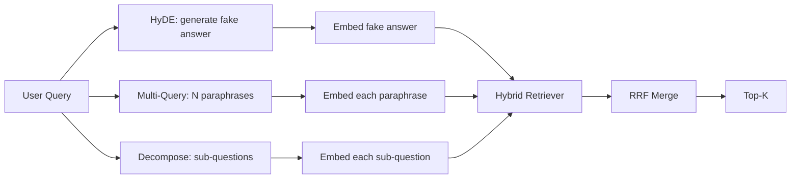

# Query Rewriting: HyDE, Multi-Query, and Decomposition

> Запрос, который печатает пользователь, — не тот запрос, который хочет ваш ретривер. Переписывание наводит мост до retrieval, чтобы индекс видел что-то ближе к тому, как выглядит ответ.

**Тип:** Практика
**Языки:** Python
**Пререквизиты:** Фаза 11, уроки 04 (эмбеддинги), 06 (RAG); Фаза 19, фундамент трека B (уроки 20–29); Фаза 19, уроки 64 и 65
**Время:** ~90 минут

## Цели обучения
- Реализовать Hypothetical Document Embeddings (HyDE): сгенерировать фиктивный ответ, заэмбеддить его, извлекать по этому вектору вместо вектора запроса.
- Реализовать multi-query-расширение: переписать один запрос в N парафраз, извлечь по каждой, слить объединение через reciprocal rank fusion.
- Реализовать декомпозицию запроса: разбить сложный вопрос на подвопросы, извлечь по каждому, слить.
- Сравнить три переписывателя лоб в лоб на фикстуре и объяснить, когда какая стратегия побеждает.
- Подключить mock-LLM, порождающую детерминированные, посаженные на фикстуру выходы, чтобы цикл переписывателя работал офлайн.

## Проблема

Пользователь печатает «что наша команда делает, когда загрузки падают и бюджет кончился?». Корпус содержит документ: «AbortMultipartOnFail прерывает S3 multipart-загрузку в полете и декрементит пер-бакетный бюджет ретраев при провале загрузки». Запрос и документ не делят ни одной именной группы. BM25 промахивается. Bi-encoder ранжирует документ третьим или четвертым, потому что вектор запроса приземляется в области пространства эмбеддингов, предпочитающей документ об отмененных джобах, а не о прерванных загрузках. Двухстадийное реранжирование из урока 66 может спасти ответ, если он в топ-N, но если он даже до топ-N не добрался, reranker его никогда не увидит.

Лечение — переписать запрос до того, как он коснется ретривера. Статья 2023 года «Precise Zero-Shot Dense Retrieval without Relevance Labels» (Gao et al.) ввела HyDE: попросить LLM написать документ, который отвечал бы на запрос, заэмбеддить этот гипотетический документ и использовать его эмбеддинг как retrieval-вектор. Гипотетический документ сидит в правильной области пространства эмбеддингов, потому что написан голосом корпуса. Вектор запроса — нет.

С HyDE соседствуют две родственные техники. Multi-query-расширение (термин, который использовал GraphRAG Microsoft) генерирует N парафраз запроса, извлекает по каждой и сливает. Декомпозиция (популяризованная как «subquery decomposition» в стэнфордской работе DSPy 2024 года) разбивает «что наша команда делает, когда загрузки падают и бюджет кончился» на два вопроса: «что происходит при провале загрузки» и «что происходит, когда бюджет ретраев кончился». Два retrieval, один слитый результат, обе части ответа достижимы.

Этот урок реализует все три и гоняет их против одного фикстурного корпуса.

## Концепция



### HyDE в деталях

HyDE заменяет вектор пользовательского запроса вектором гипотетического документа, написанного LLM. Промпт короткий:

```
You are a domain expert. Write a one-paragraph passage that answers the question
below. Use the same vocabulary and phrasing the documentation in this domain would
use. Do not refuse. Do not say you do not know.

Question: {user_query}

Passage:
```

Ответ LLM неверен как фактический ответ, потому что LLM не знает ваш корпус. Это нормально. Ретриверу не важна фактическая корректность — только распределение токенов. Гипотетический пассаж содержит слова «abort», «multipart», «bucket», «budget», потому что именно это сказал бы документационный пассаж на эту тему. Заэмбеддите его. Вектор приземляется рядом с настоящим пассажем.

В продакшене гипотетический документ ограничивают двумя-тремя предложениями. Более длинные гипотетики собирают больше шума. Более короткие теряют лексический сигнал, нужный HyDE.

### Multi-query-расширение в деталях

Сгенерировать N парафраз пользовательского запроса. Простейший промпт:

```
Rewrite the following question in {N} different ways. Each rewrite must preserve
the original intent. Number them 1 to {N}. Do not add explanations.
```

Извлечь топ-k по каждой парафразе. Слить N ранжированных списков через RRF (тот же алгоритм из урока 65). Дешево, параллельно, детерминированно.

Multi-query побеждает, когда формулировка пользователя — одна из многих равноценных, и любая из перезаписей задала бы вопрос лучше. Проигрывает, когда все перезаписи одинаково плохи, потому что оригинал был плох тем же образом.

### Декомпозиция в деталях

Один retrieval не может удовлетворить многогранный вопрос. Декомпозиция просит LLM разбить вопрос на подвопросы, и система извлекает по каждому. Промпт:

```
The following question may require information from multiple distinct topics.
Decompose it into a list of sub-questions. Each sub-question must be answerable
independently. If the question is already atomic, return it unchanged.

Question: {user_query}
```

Извлечь по каждому подвопросу. Слить. Декомпозиция — правильный инструмент для вопросов с союзами, многочленными сравнениями или двумя несвязанными темами. Неправильный — для атомарных вопросов; работа декомпозера там — вернуть единственный вопрос и не изобретать фиктивные подвопросы.

### Почему существуют все три

Три техники взаимодополняющие. HyDE мостит токенный разрыв запрос-корпус. Multi-query покрывает дисперсию парафраз. Декомпозиция — многотемные запросы. Продакшен-система гоняет все три и выбирает стратегию на запрос (селектор показывает end-to-end-система урока 69).

## Mock-LLM

Урок работает офлайн. Mock-LLM — маленькая таблица поиска с ключом по запросу пользователя плюс fallback для невиданных запросов. Таблица содержит:

- Для каждого фикстурного запроса: написанный гипотетический пассаж, три парафразы и декомпозицию.
- Для неизвестного запроса: детерминированную трансформацию — взять содержательные слова запроса, расширить их через карту синонимов и вернуть результат.

Важна форма mock'а, а не данные. В продакшене mock меняется на настоящий вызов модели. Ретривер не меняется.

## Соберите это

`code/main.py` реализует:

- `MockLLM` — детерминированную замену, описанную выше.
- `HyDERewriter` — вызывает LLM для написания гипотетического документа, возвращает выход переписывателя как `RewriteResult` с гипотетическим текстом и запросом, который должен использовать ретривер.
- `MultiQueryRewriter` — вызывает LLM для N парафраз, возвращает список запросов.
- `DecomposeRewriter` — вызывает LLM для декомпозиции, возвращает подвопросы.
- `retrieve_with_rewriter` — берет переписыватель и ретривер, гоняет перезаписи, сливает результаты.
- Демо: гоняет три переписывателя на фикстуре и печатает, какая стратегия вернула эталонный документ-ответ первым.

Форма ретривера переиспользована из урока 65 (гибрид BM25 + dense). Слияние — тот же RRF. Единственная новая форма — интерфейс переписывателя, и он мал.

Запустите:

```bash
python3 code/main.py
```

Выход — ранжирование по стратегиям и финальная сводка. HyDE побеждает на запросе с несовпадением формулировок. Multi-query — на запросе с дисперсией парафраз. Декомпозиция — на многотемном запросе. Fallback (без переписывателя) проигрывает хотя бы на одном из трех.

## Режимы отказа, которые демо спрячет

**HyDE галлюцинирует корпус-специфичные идентификаторы неверно.** Модель выдумывает имя функции. BM25-скор гипотетика на правильном документе рушится, потому что выдуманное имя — теперь высоковесный токен, отсутствующий в индексе. Ограничьте длину гипотетика и понизьте вес BM25 в слиянии.

**Все перезаписи multi-query сходятся.** Слабая модель порождает три почти идентичные парафразы. N retrieval'ов возвращают тот же топ-k. RRF-слияние не лучше одиночного retrieval. Добавьте явную инструкцию разнообразия в промпт перезаписи и детектите дубликаты по Жаккару.

**Декомпозиция пересплитовывает.** Декомпозер превращает атомарный вопрос в список. Все retrieval'ы возвращают тот же документ, но с пониженным рангом. Слияние хуже оригинала. Детектите это проходом «достаточно ли различны эти подвопросы» до fan-out.

**Задержка умножается.** HyDE стоит один LLM-вызов. Multi-query — один LLM-вызов на генерацию N перезаписей, затем N retrieval'ов. Декомпозиция — один LLM-вызов на декомпозицию, затем M retrieval'ов. Retrieval'ы идут параллельно; LLM-вызов — это пол.

## Используйте это

Production-паттерны:

- Пер-запросный выбор стратегии по длине запроса: атомарные короткие запросы — multi-query, сложные многочленные — декомпозиция, жаргонные — HyDE.
- Кэшируйте выход переписывателя по хешу запроса. Многие запросы повторяются.
- Гоняйте все три параллельно и сливайте три набора результатов в один через RRF. Цена — три LLM-вызова и одно слияние; качество — объединение покрытия всех трех стратегий.

## Отгрузите это

Урок 69 подключает эту стадию переписывания перед ретривером урока 65 и reranker'ом урока 66. Урок 68 оценивает прирост, который переписыватель добавляет recall retrieval.

## Упражнения

1. Реализуйте RAG-Fusion (вариант multi-query 2024 года), где парафразы переписывателя намеренно разнообразны, а финальный список выбирает шаг реранжирования (урок 66).
2. Добавьте четвертую стратегию: step-back-промптинг (спросить LLM более общий вопрос, извлечь по нему, затем сузить). Сравните на фикстуре.
3. Научите декомпозер распознавать атомарные запросы, добавив голову «атомарен ли вопрос». Измерьте частоту пересплитовки до и после.
4. Замените mock-LLM настоящим вызовом модели. Измерьте задержку по стратегиям на вашем стеке.
5. Добавьте оценку уверенности на перезапись. Отбрасывайте перезаписи ниже порога. Измерьте влияние на recall.

## Ключевые термины

| Термин | Как говорят | Что это на самом деле |
|------|-----------------|------------------------|
| HyDE | «Retrieval по фиктивному документу» | LLM пишет ответ; эмбеддим и извлекаем по нему вместо запроса |
| Multi-query | «Расширение парафразами» | N перезаписей запроса; N retrieval'ов, слияние через RRF |
| Декомпозиция | «Разбиение на подзапросы» | Многотемные запросы режутся на подвопросы, извлекаемые раздельно |
| Атомарный запрос | «Однотемный» | Не декомпозируется без изобретения фиктивных подвопросов |
| Step-back | «Абстрагируй запрос» | Спросить более общий вопрос, извлечь, затем сузить |

## Дополнительное чтение

- Gao, Ma, Lin, Callan, "Precise Zero-Shot Dense Retrieval without Relevance Labels" (HyDE), 2023
- Microsoft Research, "Multi-Query Expansion for Retrieval"
- Stanford DSPy, "Subquery Decomposition for Multi-Hop QA"
- [Документация LlamaIndex по трансформациям запросов](https://docs.llamaindex.ai/en/stable/optimizing/advanced_retrieval/query_transformations/)
- Фаза 11, урок 07 — продвинутые RAG-паттерны
- Фаза 19, урок 65 — ретривер, который кормит этот переписыватель
- Фаза 19, урок 68 — eval, меряющий прирост переписывателя
