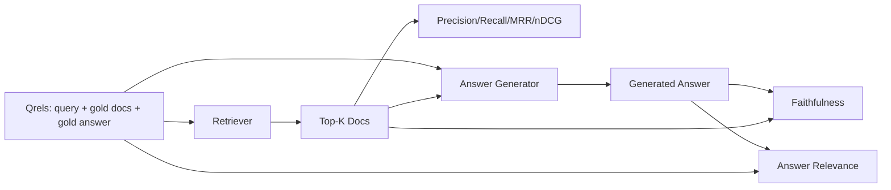

# RAG Evaluation: Precision, Recall, MRR, nDCG, Faithfulness, Answer Relevance

> Если вы не можете оценить свой retrieval и свой ответ одновременно, систему отгружать нельзя. Это не одна и та же метрика, и один и тот же промпт отказывает по разным осям.

**Тип:** Практика
**Языки:** Python
**Пререквизиты:** Фаза 11, уроки 06 (RAG), 10 (оценка); Фаза 19, фундамент трека B (уроки 20–29); Фаза 19, уроки 64, 65, 66, 67
**Время:** ~90 минут

## Цели обучения
- Вычислить четыре retrieval-метрики из эталонных qrels: precision@k, recall@k, MRR (mean reciprocal rank) и nDCG@k.
- Вычислить две метрики оценки ответа: faithfulness (каждое утверждение заземлено в извлечённом контексте) и answer relevance (ответ адресует вопрос).
- Построить фикстурный qrels-файл (запросы, эталонные id документов, эталонный текст ответа), который eval читает end to end.
- Читать значения метрик, диагностируя, где отказывает пайплайн: retrieval, ранжирование, генерация или заземление.

## Проблема

В RAG-системе минимум четыре движущиеся части: чанкер, ретривер, reranker, генератор. Любая из них может быть причиной неверного ответа. Без по-стадийных метрик вы летите вслепую.

Пользователь репортит неверный ответ. Это чанкер разрезал спан ответа? Ретривер не включил чанк в топ-k? Reranker вытолкнул правильный чанк дальше первой позиции? Или генератор проигнорировал чанк и сочинил? По одному ответу не скажешь. Нужны:

- Retrieval-метрики — оценивать, что вышло из ретривера.
- Метрики ранжирования — оценивать, где правильный чанк стоял в порядке.
- Faithfulness — оценивать, остался ли генератор внутри извлечённого контекста.
- Answer relevance — оценивать, адресует ли ответ вопрос вообще.

Урок строит все шесть поверх фикстурного qrels-файла. Eval офлайновый и детерминированный; в продакшене mock-LLM-судья меняется на настоящего.

## Концепция



### Precision@k

Из топ-k документов, которые вернул ретривер, какая доля — в эталонном множестве? Если эталон — три документа, а топ-3 вернул два из них плюс один неверный, precision@3 равен 2 / 3. Используйте precision, когда цена нерелевантного извлечённого чанка высока (генератор тратит на него токены, или чанк отравляет ответ).

### Recall@k

Из эталонных документов какая доля попала в топ-k? Если эталон — три документа, а топ-5 содержит все три, recall@5 равен 1.0. Используйте recall, когда цена пропущенного ответа высока (лучше увидеть один лишний неверный чанк, чем полностью упустить чанк с ответом).

В продакшен-RAG обычно цитируют recall@k. Генерация легко отбрасывает нерелевантные чанки; она не может изобрести ответ из чанка, которого не видела.

### MRR (Mean Reciprocal Rank)

Для каждого запроса найти позицию первого релевантного документа в ранжированном списке. Обратный ранг — 1 / позиция. Среднее по набору запросов. MRR — однозначная сводка того, насколько хорошо ретривер ставит лучший ответ наверх.

MRR сильно взвешивает первую позицию. Запрос с эталоном на ранге 1 вносит 1.0. Ранг 2 — 0.5. Ранг 10 — 0.1. Метрика доминируется верхом списка.

### nDCG@k

Normalized Discounted Cumulative Gain. Полная формула назначает gain каждому извлечённому документу (часто 1 для релевантного, 0 для нет), дисконтирует логарифмом позиции, суммирует и делит на идеальный DCG (тот DCG, который был бы при идеальном ранжировании). Диапазон от 0 до 1.

nDCG вмещает градуированную релевантность: эталон может сказать «документ A — 3, B — 2, C — 1». MRR и recall@k уплощают всё до бинарного. Используйте nDCG, когда в корпусе несколько частично-релевантных документов на запрос.

### Faithfulness

Для каждого утверждения сгенерированного ответа проверить, поддержано ли оно извлечённым контекстом. Стандартная реализация — LLM-судья, берущий (утверждение, контекст) и возвращающий да или нет. Метрика — доля прошедших утверждений.

Faithfulness ловит режим отказа генератора, изобретающего содержание. Даже если ретривер вернул правильные чанки, галлюцинирующий генератор сломан. Faithfulness также называют groundedness, support, attribution.

Урок реализует faithfulness детерминированным mock-судьёй, проверяющим пересечение токенов утверждения с извлечённым контекстом по порогу. В продакшене меняете на настоящий вызов модели. Форма метрики та же.

### Answer relevance

Адресует ли ответ вопрос вообще? Faithfulness спрашивает: «заземлён ли ответ в контексте?». Answer relevance спрашивает: «заземлён ли ответ в вопросе?». Верный контексту, но не по теме ответ — высокая faithfulness, низкая relevance. Короткий по теме ответ, игнорирующий контекст, — высокая relevance, низкая faithfulness.

Стандартная реализация тоже LLM-судья: взять (вопрос, ответ) и спросить, адресует ли ответ вопрос. Урок реализует заменитель из пересечения токенов плюс судьи.

## Фикстурные qrels

```python
{
  "qid": "q1",
  "query": "what is the abort threshold for multipart uploads",
  "gold_doc_ids": ["d1", "d3"],
  "gold_answer_substring": "three failed parts",
  "graded_relevance": {"d1": 3, "d3": 2},
}
```

Каждый запрос несёт:
- строку запроса,
- множество эталонных id документов (для precision / recall / MRR),
- dict градуированной релевантности (для nDCG),
- эталонную подстроку ответа (хранится как референсная метаданная на каждом qrel; faithfulness в уроке считается судейством извлечённых утверждений против извлечённого контекста, а не против этой подстроки).

В продакшене вы это размечаете. Урок поставляет собранную вручную фикстуру, чтобы eval работал из коробки.

## Соберите это

`code/main.py` реализует:

- `precision_at_k(retrieved, gold, k)` — буквальное определение.
- `recall_at_k(retrieved, gold, k)` — буквальное определение.
- `mean_reciprocal_rank(retrieved_list_of_lists, gold_list)` — среднее по запросам.
- `ndcg_at_k(retrieved, graded_relevance, k)` — DCG / IDCG с бинарными или градуированными gains.
- `extract_claims(answer)` — режет ответ на утверждения-предложения.
- `faithfulness(claims, context_texts, judge)` — доля утверждений, признанных поддержанными.
- `answer_relevance(question, answer, judge)` — судья на тему, адресует ли ответ вопрос.
- `MockJudge` — детерминированный судья по пересечению токенов, чтобы eval работал офлайн.
- `evaluate_pipeline(pipeline_fn, qrels, ks)` — оркестратор, гоняющий каждую метрику.
- Демо: гоняет три варианта пайплайна (бейзлайн-чанкер, гибридный retrieval, гибрид + rerank) против qrels и печатает таблицу метрик.

Запустите:

```bash
python3 code/main.py
```

Вывод показывает precision@k, recall@k, MRR, nDCG@k, faithfulness и answer relevance каждого варианта одной таблицей метрик. Строка гибридного retrieval бьёт бейзлайн-чанкер по recall; строка rerank бьёт гибрид по MRR.

## Чтение метрик для диагностики отказов

| Симптом | Вероятная причина | Что чинить |
|---------|-------------|-------------|
| Низкие recall@k и precision@k | Чанкер разрезал ответ или ретривер его не находит | Границы чанкера (урок 64) или модальность ретривера (урок 65) |
| Приличный recall@k, низкий MRR | Правильный чанк в топ-k, но не на первой позиции | Reranker (урок 66) |
| Высокий MRR, низкая faithfulness | Генератор изобретает содержание при правильном контексте | Промпт генерации; force-cite-or-refuse |
| Высокая faithfulness, низкая relevance | Ответ заземлён, но не по теме | Переписыватель запросов (урок 67) или промпт генерации |
| Все четыре высокие, пользователи всё равно жалуются | Eval-набор нерепрезентативен | Расширьте qrels настоящими пользовательскими запросами |

## Режимы отказа, которые демо спрячет

**Смещение LLM-судьи.** Модель судит собственные выходы как более верные, чем они есть. Берите судью из другого семейства моделей, чем генератор, или вручную оценивайте выборку.

**Гниение qrels.** Эталонные ответы дрейфуют с изменением корпуса. Документ, бывший эталоном для q1 в январе 2024-го, к октябрю 2024-го — уже не правильный ответ, потому что команда переименовала функцию. Планируйте квартальную ревизию qrels.

**Микропроверки faithfulness упускают макроутверждения.** По-предложенческая faithfulness может проходить, пока общая структура ответа вводит в заблуждение. Добавьте качественную ревизию на уровне сэмплов поверх автоматической метрики.

**Recall@k маскирует пер-запросные отказы.** Средний recall 90% может прятать то, что один класс запросов всегда промахивается. Режьте qrels по классам запросов (буквальный, перефразированный, многотемный) и репортите по срезам.

## Используйте это

Production-паттерны:

- Гоняйте eval на каждом изменении ретривера или генератора. Трактуйте регрессию recall@k как падение теста.
- Персистите трейс метрик на запрос. Когда пользователь жалуется, находите соответствующую запись qrels и смотрите, поймалось ли бы это.
- Разделите qrels на ярусы: smoke-набор из 20 запросов в CI; регрессионный из 200 еженощно; глубокий из 2000 еженедельно.

## Отгрузите это

Урок 69 сшивает весь пайплайн (чанкер, ретривер, reranker, генератор) и гоняет этот eval против end-to-end-системы.

## Упражнения

1. Добавьте пятую retrieval-метрику: hit-rate@k. Сравните с recall@k. Объясните, когда они различаются.
2. Реализуйте градуированную faithfulness: 0 (не поддержано), 1 (частично), 2 (полностью). Обновите метрику соответственно.
3. Замените mock-судью настоящим вызовом модели. Измерьте расхождение mock и настоящего судьи на фикстуре.
4. Добавьте срез по классу запроса («буквальный», «перефразированный», «многотемный»). Репортите метрики по срезам.
5. Добавьте метрику «длина ответа» и скоррелируйте её с faithfulness. Постройте кривую.

## Ключевые термины

| Термин | Как говорят | Что это на самом деле |
|------|-----------------|------------------------|
| Precision@k | «Hit rate по извлечённому» | Доля топ-k, являющихся эталоном |
| Recall@k | «Hit rate по эталону» | Доля эталона в топ-k |
| MRR | «Позиция первого попадания» | Среднее 1 / ранга первого релевантного документа |
| nDCG@k | «Градуированное качество ранжирования» | DCG по топ-k, делённый на идеальный DCG |
| Faithfulness | «Groundedness» | Доля утверждений ответа, поддержанных извлечённым контекстом |
| Answer relevance | «Адресован ли вопрос?» | Совпадает ли ответ с замыслом вопроса |
| Qrels | «Эталонные метки» | Размеченный набор запросов с эталонными документами и ответами |

## Дополнительное чтение

- Buckley, Voorhees, "Evaluating Evaluation Measure Stability", SIGIR 2000 — каноническая статья о метриках ранжирования
- Jarvelin, Kekalainen, "Cumulated Gain-based Evaluation of IR Techniques" — статья nDCG
- [Ragas: Automated Evaluation of RAG Pipelines](https://docs.ragas.io)
- [Anthropic, Evaluating RAG](https://www.anthropic.com/news/evaluating-rag)
- Фаза 11, урок 10 — основы фреймворка оценки
- Фаза 19, уроки 64–67 — компоненты, оцениваемые здесь
- Фаза 19, урок 69 — end-to-end-пайплайн, который этот eval оценивает
