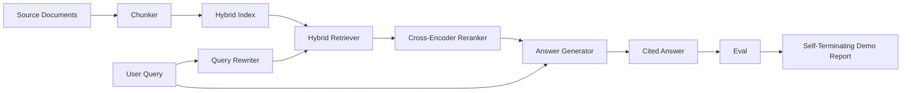

# End-to-End RAG System

> Шесть уроков компонентов. Один пайплайн. Один eval-цикл. Одно самозавершающееся демо. Это та система, которую вы отгружаете.

**Тип:** Практика
**Языки:** Python
**Пререквизиты:** Фаза 11, уроки 06 (RAG), 10 (оценка); Фаза 19, фундамент трека B (уроки 20–29); Фаза 19, уроки 64, 65, 66, 67, 68
**Время:** ~90 минут

## Цели обучения
- Скомпоновать чанкер, гибридный ретривер, переписыватель запросов, cross-encoder-reranker и генератор ответов в единый end-to-end-пайплайн.
- Реализовать генератор ответов, цитирующий свои утверждения якорями чанков, с fallback'ом «отказаться при низкой уверенности».
- Прогнать eval урока 68 против собранного пайплайна и доказать, что стадийная сборка побеждает по каждой метрике те же компоненты в изоляции.
- Собрать самозавершающееся CLI-демо, которое поглощает фикстурный корпус, гоняет фиксированный набор запросов и выходит с нулем со сводным отчетом.

## Проблема

Шесть компонентов в изоляции не доказывают ничего. Чанкер может побеждать по recall@5 против корпуса и проигрывать по recall@5 системы, потому что ретривер не может ранжировать то, что излучает чанкер. Reranker может поднимать MRR на синтетическом пуле кандидатов и проваливаться на настоящих bi-encoder-кандидатах, потому что recall bi-encoder'а на бюджете реранжирования слишком низок. Переписыватель запросов может продвинуть эталонный документ на одном запросе и сломаться на следующем, потому что LLM-mock вернул вырожденный гипотетик.

Интеграционный тест — это весь пайплайн end to end против тех же фикстурных qrels, с той же метрикой, с одним файлом-оркестратором, сшивающим все вместе. Именно это строит этот урок. Если метрики интегрированного пайплайна бьют метрики изолированных демо каждой стадии, вы доказали систему.

## Концепция



### Решения проводки

Пайплайн — маленький граф. Каждая стадия — функция с ясной сигнатурой.

| Стадия | Вход | Выход |
|-------|-------|--------|
| Чанкер | Текст документа | Список записей Chunk |
| Ретривер | Строка запроса | Топ-N записей Chunk |
| Переписыватель (опционально) | Строка запроса | Список перезаписей + гипотетик |
| Reranker | Запрос, кандидаты | Топ-K записей Chunk с cross-скорами |
| Генератор | Запрос, топ-K записей Chunk | Строка ответа с цитированиями |

Композиция прямолинейна, когда каждая сигнатура стабильна. Класс `Pipeline` урока держит пять стадий и метод `query`, гоняющий их по порядку. Каждая стадия заменяема: передайте другой чанкер, ретривер, переписыватель, reranker или генератор — пайплайн все равно работает.

### Генератор ответов с цитированиями

Генератор — последняя стадия и самая легкая на поломку. Урок поставляет детерминированный mock-генератор, который:

1. Берет топ-K реранжированных чанков.
2. Выбирает до двух чанков с наибольшим пересечением содержательных токенов с запросом.
3. Излучает ответ — конкатенацию по одному предложению из каждого выбранного чанка, где за каждым предложением следует якорь `[doc_id:chunk_index]`.
4. Если ни у одного чанка пересечение не выше порога отказа, излучает «Я не знаю» без цитирования.

В продакшене mock меняется на настоящий LLM-вызов с шаблоном промпта:

```
You are answering a question using only the snippets below.
Cite every claim with the anchor in parentheses.
If the snippets do not answer the question, say "I do not know".

Question: {query}

Snippets:
{enumerated chunks with anchors}

Answer:
```

Путь «отказаться при низкой уверенности» — вся причина, по которой логируется cross-encoder-скор ранга 1. Если он ниже корпусного порога, генератор отказывается. Это предохранительный клапан против галлюцинированных ответов.

### Самозавершающееся демо

Демо гоняет все end to end. Печатает по-стадийную разбивку одного запроса, гоняет eval по четырем фикстурным qrels, печатает таблицу метрик и выходит со статусом ноль, если все метрики урока 68 достигают порогов, заданных в демо. Если какая-то метрика ниже порога, демо выходит с ненулевым статусом и сообщением с именем провалившейся метрики.

Это форма, которую принимает CI-smoke-тест. Пайплайн работает офлайн, быстро, детерминированно. Пороги на фикстуре намеренно жесткие, чтобы регрессия любого из шести уроков валила демо.

## Соберите это

`code/main.py` реализует:

- `Chunk` — запись, проносимая через все стадии (расширяет форму урока 64 полями chunk_index и source doc_id).
- `Chunker` — выбирает стратегию из урока 64 (по умолчанию рекурсивный разрез).
- `HybridIndex` — связывает BM25 + dense + RRF из урока 65.
- `Rewriter` (опционально) — выбирает HyDE, multi-query или декомпозицию из урока 67 по длине запроса и наличию союзов.
- `Reranker` — обученный cross-encoder из урока 66, с меньшим фикстурным обучающим набором, чтобы сходился за секунды.
- `Generator` — детерминированный mock-генератор с цитированиями и отказом при низкой уверенности.
- `Pipeline` — компонует пять стадий с методом `query(question)`, возвращающим `Result(answer, top_k, latency_ms_per_stage)`.
- `run_demo()` — поглощает корпус, гоняет три фикстурных запроса, гоняет eval, печатает результаты, выставляет код выхода по порогу.

Запустите:

```bash
python3 code/main.py
```

Вывод — один напечатанный трейс запроса, полная eval-таблица и финальный pass/fail-статус. Возвращает код выхода 0 на фикстуре.

## Режимы отказа, которые демо спрячет

**Дрейф границ чанкера.** Смените стратегию чанкера между проходом разметки eval-qrels и демо — и эталонные id документов больше не сходятся. Зафиксируйте стратегию чанкера в qrels-файле. Демо включает заголовок с именем чанкера.

**Обучающий набор reranker'а утекает в eval.** 14 обучающих троек урока 66 включают запросы, похожие на eval-запросы. В продакшене строго откладывайте eval-запросы. Eval-запросы демо намеренно не пересекаются с обучающим набором реранжирования.

**Mock-генератор прячет риск галлюцинаций.** Mock не может галлюцинировать, потому что излучает только текст из извлеченных чанков. Урок это отмечает и указывает путь продакшен-замены на настоящую модель.

**Нет стриминга.** Пайплайн возвращает полный ответ в конце каждой стадии. Продакшен-система стримила бы выход генератора. Стриминг за рамками; метрики оценки ответа работают на финальной строке в любом случае.

**Задержка офлайновая.** Mock-LLM-вызовы — константное время. Настоящие LLM-вызовы доминируют. Планируйте бюджет задержки в скоупе запроса; по-стадийные тайминги урока меряют только CPU-работу.

## Используйте это

Production-паттерны:

- Отгружайте файл пайплайна под одним оркестратором с явными интерфейсами стадий. Не размазывайте проводку по репозиторию.
- Гоняйте eval перед каждым merge, трогающим стадию. Если eval падает — merge не приземляется.
- Персистите трейс метрик на CI-прогон, чтобы атрибутировать регрессии замене стадии.
- Добавьте smoke-набор из 20 запросов (подмножество регрессионного), укладывающийся в 30 секунд; полный регрессионный набор гоняется еженощно.

## Отгрузите это

Файл пайплайна этого урока — та форма, которую предполагают остальные уроки трека F Фазы 19. Последующие уроки добавили бы автоматизацию инжеста, инкрементальную переиндексацию, телеметрию и serving-слой сверху. Половины retrieval, rerank, rewrite и eval здесь завершены.

## Упражнения

1. Добавьте пер-запросный селектор стратегии внутрь переписывателя: эвристики урока 67 (длина, союзы, доля жаргона) выбирают HyDE, multi-query или декомпозицию.
2. Добавьте настоящий LLM-вызов для генератора за env-флагом. По умолчанию — mock. Измерьте дельту задержки.
3. Расширьте демо флагом `--corpus path`, загружающим настоящий корпус. Перегоните eval и проверку порогов.
4. Добавьте чанкеру флаг `--strategy`. Измерьте вклад каждой стратегии в end-to-end recall.
5. Добавьте стриминговый интерфейс генератора и подайте его в eval. Подтвердите, что faithfulness считается на финальной строке, а не на стриманном префиксе.

## Ключевые термины

| Термин | Как говорят | Что это на самом деле |
|------|-----------------|------------------------|
| Пайплайн | «RAG-пайплайн» | Скомпонованные стадии от инжеста до цитированного ответа |
| Якорь цитирования | «Ссылка на источник» | Ссылка (doc_id, chunk_index), прикрепленная к каждому утверждению |
| Отказ при низкой уверенности | «Я не знаю» | Генератор не отвечает, когда топ-1-скор reranker'а ниже порога |
| Smoke-набор | «CI-eval» | Минимальное подмножество qrels, работающее в каждой PR-проверке |
| Интерфейс стадии | «Сигнатура функции» | Стабильные типы входа и выхода каждой стадии пайплайна |

## Дополнительное чтение

- [Anthropic, Building search and retrieval](https://www.anthropic.com/news/contextual-retrieval)
- [Pinterest, внутренний MCP-поиск](https://medium.com/pinterest-engineering) — референсная продакшен-архитектура
- [Ragas: Automated Evaluation of RAG Pipelines](https://docs.ragas.io)
- Фаза 11, урок 06 — основы RAG
- Фаза 19, уроки 64–68 — компоненты, компонуемые здесь
