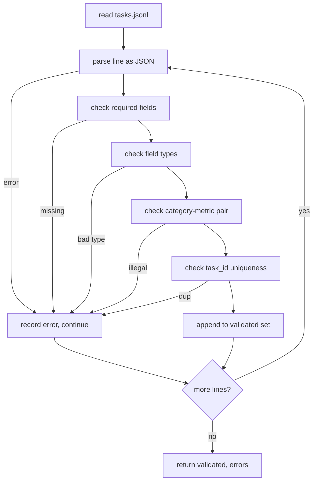

# Task Spec Format

> Eval-харнес хорош ровно настолько, насколько хорош контракт, который чтут его задачи. Заморозьте JSONL-форму и словарь метрик до того, как напишете хоть одну скоринг-функцию.

**Тип:** Практика
**Языки:** Python
**Пререквизиты:** Фаза 19, фундамент трека B
**Время:** ~90 минут

## Цели обучения

- Определить схему JSONL-записи задачи, покрывающую одной формой арифметику, multiple choice, исполнение кода, классификацию и свободную суммаризацию.
- Запинить закрытый словарь имён метрик, чтобы последующие уроки (71–73) диспетчеризовались по одному полю.
- Специфицировать few-shot-примеры и правила постобработки как часть задачи, а не раннера, чтобы один промпт давал одну цель на любых моделях.
- Реализовать строгий валидатор, отклоняющий битые записи до того, как они дойдут до раннера.
- Отгрузить фикстурный набор из 10 задач, прогоняющий каждую ветку спецификации, чтобы валидатору было что жевать.

## Почему замороженная спецификация

Исследовательская кодовая база накапливает eval-скрипты быстрее, чем тесты. Через полгода у каждого ноутбука своя JSON-форма, каждая метрика реализована дважды, и ничего нельзя сравнить между прогонами. Лечение скучное. Выберите схему. Напишите валидатор. Отклоняйте всё остальное. Именно это делает этот урок.

Форма заимствует идеи у BIG-bench, HELM и харнесов в стиле lm-eval, но имена полей наши. У каждого поля один владелец. Раннер читает задачу. Метрика читает цели. Шаг постобработки нормализует генерацию. Ни одно поле не мутируется посреди пайплайна.

## Форма записи

Задача — JSON-объект на одной строке. Харнес читает `tasks.jsonl` и валидирует каждую строку независимо. Плохая строка прерывает эту запись, а не прогон.

```json
{
  "task_id": "arith_001",
  "category": "arithmetic",
  "prompt": "Compute the result. Question: 17 + 24\nAnswer:",
  "targets": ["41"],
  "metric_name": "exact_match",
  "few_shot_examples": [
    {"prompt": "Question: 2 + 2\nAnswer:", "completion": "4"}
  ],
  "post_process": "strip_whitespace",
  "metadata": {"difficulty": "easy"}
}
```

Обязательные поля — `task_id`, `category`, `prompt`, `targets`, `metric_name`, `post_process`. `few_shot_examples` и `metadata` опциональны. Неизвестные верхнеуровневые поля валят валидацию.

## Правила полей

`task_id` — строка без пробелов. Валидатор насаждает уникальность по файлу.

`category` — одно из `arithmetic`, `mcq`, `code_exec`, `classification`, `summary`. Категория ограничивает, какая пара метрики и постобработки легальна. Задача `code_exec` обязана использовать `metric_name = code_exec`, а `mcq` — `exact_match` против однобуквенной цели.

`prompt` — непустая строка. Валидатор запрещает хвостовые пробелы и отклоняет записи, уже содержащие few-shot-блок в теле промпта. Рендер few-shot происходит в раннере, а не у автора.

`targets` — непустой список строк. Для `exact_match` засчитывается совпадение с любым элементом. Для `f1` и `rouge_l` побеждает цель с наивысшим скором. Для `mcq` список держит ровно один элемент.

`metric_name` — одно из `exact_match`, `f1`, `bleu_4`, `rouge_l`, `accuracy`, `code_exec`. Словарь закрыт. Новая метрика требует нового урока и новой записи здесь.

`few_shot_examples` — список пар `{prompt, completion}`. Валидатор ограничивает список восемью элементами, чтобы промпты оставались ограниченными.

`post_process` — одно из `none`, `strip_whitespace`, `lower`, `extract_letter`, `extract_code_block`, `extract_first_line`. У каждого правила одно детерминированное поведение. Валидатор запрещает комбинировать правила.

## Поведение валидатора



Валидатор возвращает два списка: валидированные записи и записи-ошибки с проблемной строкой, нарушенным правилом и виновным полем. Раннер отказывается стартовать при непустом списке ошибок, если явно не выставлен флаг `--allow-bad-tasks`.

## Рендер few-shot

Раннер конкатенирует few-shot-примеры перед промптом с разделителем — пустой строкой. Один и тот же код-путь работает для каждой модели, поэтому единственный источник дисперсии — сама модель. Авторы пишут примеры один раз, а не по разу на провайдера.

```python
def render(task):
    parts = []
    for ex in task.get("few_shot_examples", []):
        parts.append(ex["prompt"] + " " + ex["completion"])
    parts.append(task["prompt"])
    return "\n\n".join(parts)
```

## Правила постобработки

Шаг постобработки работает после генерации, до метрики. Он детерминирован и stateless.

- `none` возвращает строку без изменений.
- `strip_whitespace` обрезает ведущие и хвостовые пробелы.
- `lower` переводит строку в нижний регистр.
- `extract_letter` возвращает первый символ, совпадающий с `[A-E]`, — для MCQ.
- `extract_code_block` возвращает тело первого блока в тройных бэктиках — для code-exec.
- `extract_first_line` возвращает первую непустую строку — для классификации саммари.

Задаче, которой нужно правило вне этого списка, место в новом уроке.

## Чего этот урок не делает

Он не скорит. Не вызывает модель. Не исполняет код. Это уроки 71, 72 и 75. Этот урок замораживает контракт, который они все чтут.

Фикстура из 10 задач покрывает две арифметические, две MCQ, две code-exec, две классификационные и две суммаризационные. Валидатор проходит на всех 10. Отдельная фикстура (`tasks_bad.jsonl`) спотыкает каждое правило, и валидатор возвращает ровно столько ошибок.

## Как читать код

`main.py` определяет `TaskSpec`, `validate_task`, `validate_file` и точку входа CLI. Загрузчик фикстур — `load_fixtures`. Хелперы рендера и постобработки живут рядом с валидацией, чтобы раннер из урока 75 импортировал один модуль.

Прочитайте `main.py` сверху вниз. Затем — `code/tests/test_spec.py`. Тесты фиксируют каждое правило валидации и каждое поведение постобработки. Демо внизу `main.py` валидирует комплектную фикстуру и печатает сводку.

## Куда двигаться дальше

Настоящие eval-наборы обрастают категориями так же, как схемы — колонками. Трезвый ход — отказываться добавлять категорию без одновременного добавления метрики, правила постобработки и хотя бы одной фикстурной задачи. Трактуйте спецификацию как миграцию базы данных. Каждое изменение ревьюится, версионируется и сопровождается тестами. Валидатор этого урока — тот самый gate.
