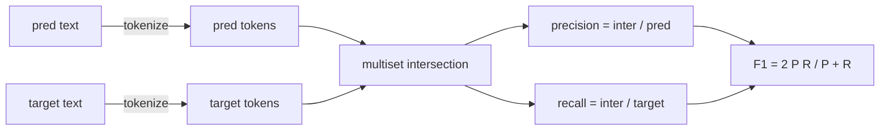
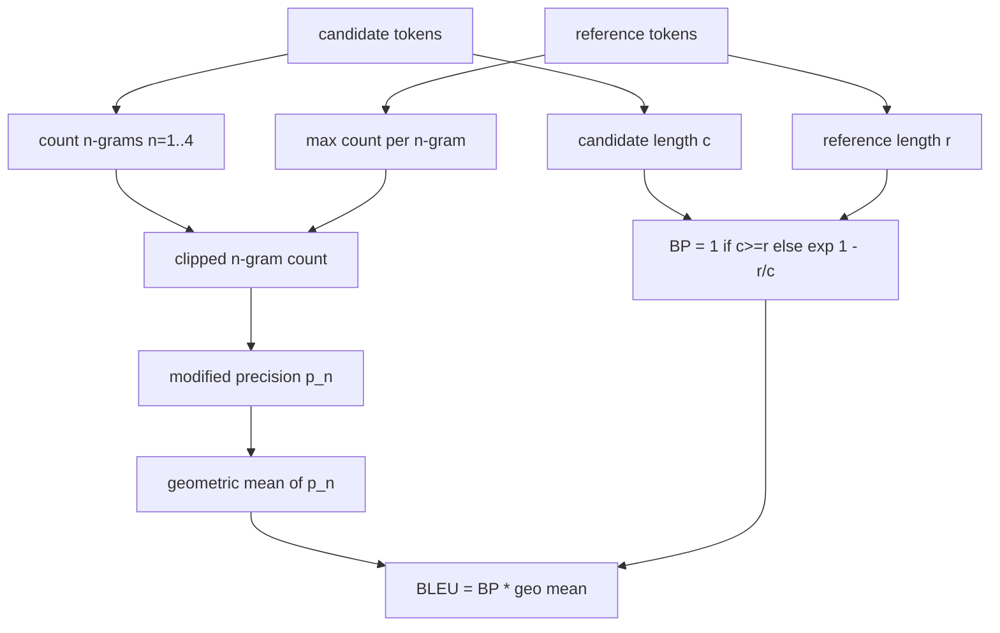

# Classical Metrics

> BLEU, ROUGE-L, F1, exact-match, accuracy. Пять метрик, которые до сих пор отвечают за большинство публикуемых чисел LLM-eval. Реализуйте каждую из первых принципов, чтобы знать, что означает число.

**Тип:** Практика
**Языки:** Python
**Пререквизиты:** Фаза 19, фундамент трека B, урок 70
**Время:** ~90 минут

## Цели обучения

- Реализовать токенные exact-match, F1 и accuracy с явными правилами токенизации.
- Реализовать BLEU-4 с нуля: модифицированная n-граммная точность, геометрическое среднее по n от 1 до 4, штраф за краткость.
- Реализовать ROUGE-L через наибольшую общую подпоследовательность, с F-beta-сочетанием точности и полноты.
- Диспетчеризоваться по полю metric_name из урока 70, чтобы раннер оставался метрико-агностичным.
- Зафиксировать поведение референсными векторами из разобранных примеров, а не из сторонней библиотеки.

## Зачем реализовывать заново

Вы будете читать статьи, репортящие BLEU 28.3, и другие — BLEU 0.283. Найдёте ROUGE-L, расходящиеся на десять пунктов между двумя библиотеками, потому что одна приводит к нижнему регистру, а другая нет. Самый быстрый способ перестать путаться — написать метрики самим, а потом указать на строку, где выбирается токенизатор, и строку, где применяется сглаживание. После этого сравнение чисел между статьями становится чтением сетапа метрики, а не спором о библиотеках.

Stdlib плюс numpy достаточно. BLEU — это подсчёт и клипинг. ROUGE-L — динамическое программирование. F1 — пересечение множеств токенов. Самое трудное — выбрать токенизатор и придерживаться его.

## Токенизация

Токенизатор — `re.findall(r"\w+", text.lower())`. Нижний регистр, алфавитно-цифровые серии, пунктуация отбрасывается. Каждая метрика урока использует ровно этот токенизатор. Раннер не выбирает. Смените токенизатор — гоняете другой бенчмарк.

```python
TOKEN_RE = re.compile(r"\w+", re.UNICODE)
def tokenize(text):
    return TOKEN_RE.findall(text.lower())
```

Это намеренное упрощение. Продакшен-сетапы будут заботиться о CJK, сокращениях и код-идентификаторах. Смысл урока: токенизатор — контракт, а не ручка.

## Exact match

```python
def exact_match(pred, targets):
    return float(any(pred.strip() == t.strip() for t in targets))
```

Возвращает 1.0 или 0.0 на задачу. Агрегат по датасету — среднее. Это рабочая лошадка арифметики, MCQ и коротких классификационных задач.

## Токенный F1

Соберите мультимножества токенов предсказания и цели. Precision — пересечение мультимножеств, делённое на мультимножество предсказания. Recall — то же пересечение, делённое на мультимножество цели. F1 — гармоническое среднее. Реализация обрабатывает краевые случаи пустого предсказания и пустой цели.



Для многоцелевых задач берём лучший F1 по списку целей. Это соответствует SQuAD-подобному поведению, широко репортящемуся в литературе.

## BLEU-4

BLEU — каноническая метрика машинного перевода, всё ещё встречающаяся в работах по суммаризации. Мы используем корпусный BLEU-4 со стандартным штрафом за краткость и аддитивно-единичным сглаживанием на модифицированных n-граммных счётчиках, чтобы одна отсутствующая 4-грамма не роняла скор в ноль.

Для каждой пары кандидат-референс мы считаем модифицированную n-граммную точность для n от 1 до 4. Модифицированная точность клипит счётчик n-грамм кандидата максимальным счётчиком этой n-граммы в любом референсе — кандидат не может накрутить повторением одной фразы. Геометрическое среднее четырёх точностей оборачивается штрафом за краткость.



Правило сглаживания — то, что Лин и Оч назвали методом 1: добавить единицу и в числитель, и в знаменатель каждой n-граммной точности перед логарифмом. Это избегает `log 0`, когда у референса нет совпадающей 4-граммы, и остаётся близким к несглаженному значению на длинных кандидатах.

## ROUGE-L

ROUGE-L сравнивает наибольшую общую подпоследовательность токенных последовательностей кандидата и референса. LCS ловит порядок слов, не требуя непрерывности, — поэтому это дефолтная метрика суммаризации. Мы считаем длину LCS стандартной таблицей динамического программирования, затем выводим recall как `lcs / длина референса`, precision как `lcs / длина кандидата` и сочетаем через F-beta, где beta равна единице для симметричной F1-формы.

```python
def lcs_length(a, b):
    n, m = len(a), len(b)
    dp = numpy.zeros((n + 1, m + 1), dtype=int)
    for i in range(n):
        for j in range(m):
            if a[i] == b[j]:
                dp[i+1, j+1] = dp[i, j] + 1
            else:
                dp[i+1, j+1] = max(dp[i+1, j], dp[i, j+1])
    return int(dp[n, m])
```

Numpy-таблица делает реализацию читаемой; чистые Python-списки тоже сработали бы. Задачи, выбравшие ROUGE-L, платят O(n m) на задачу. Для типичных длин саммари это остаётся под миллисекундой.

## Accuracy

Для многоцелевых классификационных задач accuracy сводится к exact-match против одной нормализованной цели. Мы выносим её отдельной функцией, чтобы диспетчер диспетчеризовался по `metric_name` без строковых сравнений внутри раннера.

## Контракт диспетчеризации

Единая точка входа — `score(metric_name, prediction, targets)`. Возвращает float в `[0, 1]`. Раннер не ветвится по имени метрики. Он передаёт вызов и пишет результат. Это та поверхность, которую урок 75 приклеит к спецификации задач из урока 70.

```python
def score(metric_name, pred, targets):
    if metric_name == "exact_match":
        return exact_match(pred, targets)
    if metric_name == "f1":
        return max(f1_score(pred, t) for t in targets)
    if metric_name == "bleu_4":
        return max(bleu4(pred, t) for t in targets)
    if metric_name == "rouge_l":
        return max(rouge_l(pred, t) for t in targets)
    if metric_name == "accuracy":
        return accuracy(pred, targets)
    raise ValueError(f"unknown metric_name: {metric_name}")
```

`code_exec` обрабатывается в уроке 72 и там же встаёт в диспетчер.

## Чего этот урок не делает

Он не вызывает модель. Не нормализует генерации сверх того, что уже сделали правила постобработки урока 70. Не считает доверительные интервалы. Не делает BLEURT или BERTScore (им нужна модель, и они живут в другом уроке). Смысл — пол: пять метрик, один токенизатор, одна таблица диспетчеризации.

## Как читать код

`main.py` определяет каждую метрику свободной функцией плюс диспетчер. Референсные векторы живут в блоке `_reference_examples` внизу файла. Демо гоняет диспетчер на восьми примерах и печатает пер-метричные скоры. Тесты в `code/tests/test_metrics.py` фиксируют референсные векторы и прогоняют каждый краевой случай (пустое предсказание, пустой референс, ни одного общего токена, точное совпадение, клипинг повторяющейся фразы).

Прочитайте `main.py` сверху вниз. Функции упорядочены по сложности. exact_match и accuracy — по одной строке. F1 — шесть строк. BLEU и ROUGE-L — тяжёлые части, и они включают развёрнутые комментарии о правиле сглаживания и рекуррентности LCS.

## Куда двигаться дальше

Классические метрики необходимы, но недостаточны. Они вознаграждают поверхностное пересечение и упускают смысл. Лечение — наслоить модельные метрики сверху (BLEURT, BERTScore, GEval), когда классическому полу уже доверяете. Это более поздний урок. Пока: заставьте эти пять работать, зафиксируйте тестами — и у вас метрический стек, который аудируем, быстр и воспроизводим.

## Дополнительное чтение

- Papineni et al., «BLEU» (ACL 2002); Lin, «ROUGE» (2004) — референсные определения метрик.
- Фаза 19, урок 72 — метрика исполнения кода, урок 63 — мультимодальная оценка теми же формами.
