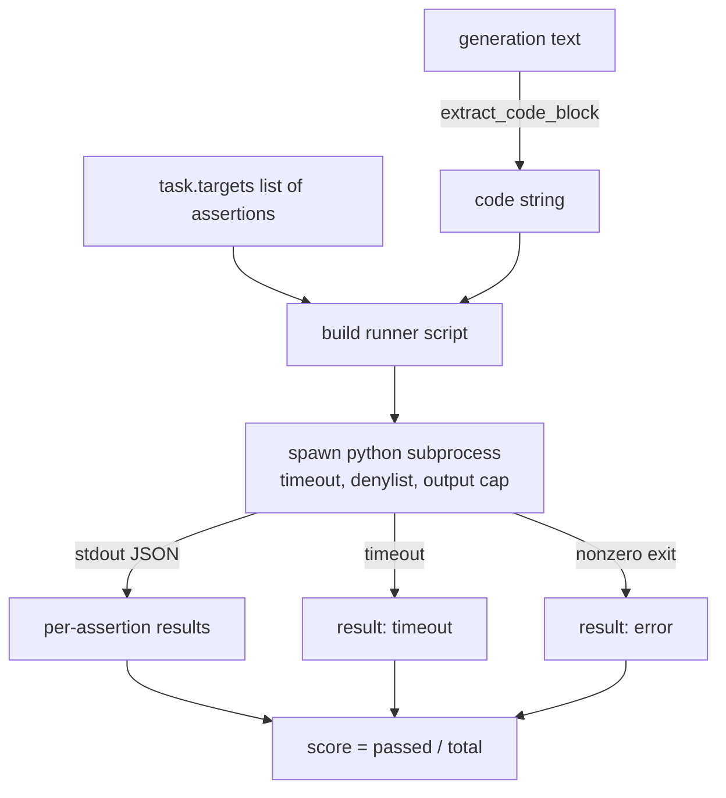
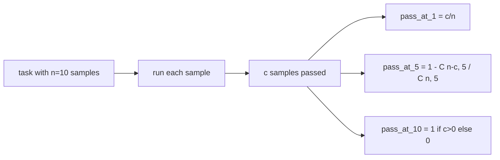

# Code Exec Metric

> Сгенерированный код верен, когда проходит тесты. Eval-харнес обязан извлечь код, запустить его, не уронив хост, и честно подбить pass-rate. Этот урок строит эту поверхность.

**Тип:** Практика
**Языки:** Python
**Пререквизиты:** Фаза 19, фундамент трека B, уроки 70 и 71
**Время:** ~90 минут

## Цели обучения

- Извлекать код-блок из генерации вольной формы способом, совпадающим с правилом постобработки урока 70.
- Исполнять код-кандидат в изолированном subprocess с wall-clock-таймаутом, потолком вывода и denylist импортов.
- Оценивать задачу как долю переданных assertion-строк, прошедших против кандидата.
- Вычислять pass-at-k для задач, сэмплирующих несколько генераций одной модели.
- Трактовать краши sandbox, синтаксические ошибки и таймауты как первоклассные режимы отказа с различимыми кодами выхода, которые раннер может логировать.

## Почему изолированный subprocess

Инлайновый `exec` — опасность для безопасности и стабильности. Сгенерированный `while True: pass` блокирует eval навсегда. Сгенерированный `import shutil; shutil.rmtree('/')` ровно настолько катастрофичен, как звучит. Лечение — порождать свежий Python-интерпретатор на кандидата, передавать код на stdin, писать результаты assertion'ов в stdout и убивать процесс при перерасходе. Хост-процесс eval'а продолжает работать.

Настоящие eval'ы — HumanEval, MBPP, BigCodeBench, LiveCodeBench — все используют subprocess-sandbox. Некоторые слоят сверху Docker. Мы останавливаемся на subprocess не случайно: он портируем, он stdlib, и он ловит те режимы отказа, которые важны для учебного eval'а. Продакшен-деплои добавляют seccomp, сетевую изоляцию и read-only-файловую систему. Урок о харденинге живёт вне этого трека.

## Форма code-exec-задачи

Задача `code_exec` несёт assertion-строки в `targets`. Раннер извлекает огороженный код-блок из генерации, строит вокруг него тестовый харнес и запускает результат.



Скор — дробь в `[0, 1]`. Задача с тремя assertion'ами, где два прошли, набирает 0.667. Раннер возвращает ту же форму независимо от того, что упало: краши subprocess маппятся на нормализованный код ошибки, а не на Python-трейсбек, всплывающий до харнеса.

## Denylist

Denylist основан на импортах. Перед запуском кода-кандидата скрипт раннера переписывает импорты опасных модулей на заглушку, кидающую `ImportError("denied")`. Список намеренно консервативен: `os.system`, `subprocess`, `socket`, `requests`, `urllib`, `urllib.request`, `urllib.error`, `urllib.parse`, `ctypes`, `shutil`, `http.client`, `asyncio.subprocess`.

Мы не притворяемся, что это пуленепробиваемо. Решительный враждебный код может сбежать из любого in-process-sandbox в Python. Denylist — страховка. Wall-clock-таймаут и потолок вывода — несущие контроли.

```python
DENIED = {
    "os.system": True,
    "subprocess": True,
    "socket": True,
    "shutil": True,
    "requests": True,
    "urllib": True,
    "ctypes": True,
}
```

Мы оборачиваем кандидата, приписывая `import sys` и guard, монки-патчащий `os.system` на исключение. Полный шаблон — в `main.py`.

## Wall-clock-таймаут

Каждый subprocess получает дефолтный бюджет в три wall-clock-секунды. Раннер использует `subprocess.run(..., timeout=t)`. Если таймаут срабатывает, раннер ловит `TimeoutExpired`, убивает процесс и записывает причину выхода `timeout` для задачи. Скор этой задачи — ноль. Раннер идёт дальше.

Таймаут настраивается на задачу через `task.metadata.timeout_s`. Долгие юнит-тесты могут просить больше; валидатор из урока 70 ограничивает значение тридцатью секундами, чтобы набор оставался ограниченным.

## Потолок вывода

Subprocess может залить stdout, исчерпав память хоста. Раннер стримит stdout в буфер и убивает потомка, как только бегущая сумма пересекает 256 КБ. Результат записывается как `exit_code = error` с детальной строкой `"output overflow"`. На практике это всплывает, когда генерация случайно пишет бесконечный печатающий цикл.

## Pass-at-k

Pass-at-k — несмещённый оценщик, используемый HumanEval и компанией. Даны `n` независимых сэмплов на задачу, из которых `c` прошли; вероятность, что выборка размера `k` из `n` содержит хотя бы одно проходящее решение:

```
pass_at_k(n, c, k) = 1 - C(n - c, k) / C(n, k)
```

Когда `n - c < k`, числитель не определён и значение равно `1`. Реализация обрабатывает краевой случай напрямую. Мы открываем `pass_at_k(n, c, k)` для слоя лидерборда в уроке 74.



## Коды выхода

Раннер возвращает один из пяти исходов на задачу:

- `pass` — каждый assertion прошёл.
- `assertion_fail` — код выполнился, но хотя бы один assertion упал.
- `syntax_error` — код не импортировался или содержал SyntaxError.
- `timeout` — истёк wall clock.
- `error` — любой другой краш, включая попадания в denylist и переполнение вывода (переполнение всплывает с деталью `"output overflow"`).

Скор — по-прежнему дробь. Код выхода — метаданные. Последующие уроки могут решать, считать таймаут нулём или отсутствующими данными.

## Чего этот урок не делает

Он не даёт настоящий sandbox. Не гоняет недоверенный код из открытого веба. Не обрабатывает stateful-задачи вроде файлового I/O или сетевых вызовов. Им нужен контейнер или microVM. Смысл урока — контракт: изолированный subprocess, denylist, таймаут, потолок вывода, чистый словарь кодов выхода и математика pass-at-k.

## Как читать код

`main.py` определяет `extract_code`, `run_candidate`, `score_code_exec` и `pass_at_k`. Скрипт-раннер subprocess строится строкой и передаётся через `-c` свежему Python-интерпретатору. Тесты в `code/tests/test_exec.py` прогоняют четыре кода выхода плюс pass-at-k против разобранных примеров в стиле HumanEval.

Прочитайте `main.py` сверху вниз. Шаблон раннера — несущая часть. Смотрите на цикл assertion'ов, пока не сможете предсказать JSON-конверт, который он пишет обратно родительскому процессу.

## Куда двигаться дальше

Когда subprocess-форма работает, следующая забота — портируемость. Разные версии Python по-разному обращаются с SIGKILL на Windows. Чистейшее лечение — положить раннер в Docker-образ. Следующее после этого — заменить assertion-строки настоящими файлами юнит-тестов, чтобы eval совпадал с тем, что делает продакшен-CI. С этого момента перестаньте называть assertion-строки тестами; это игрушечные тесты с игрушечными режимами отказа.

## Дополнительное чтение

- Chen et al., [Evaluating Large Language Models Trained on Code (HumanEval, arXiv 2107.03374)](https://arxiv.org/abs/2107.03374) — pass@k и оценка исполнения кода.
- Фаза 19, урок 27 — eval-харнес, урок 74 — агрегация pass@k на уровне лидерборда.
