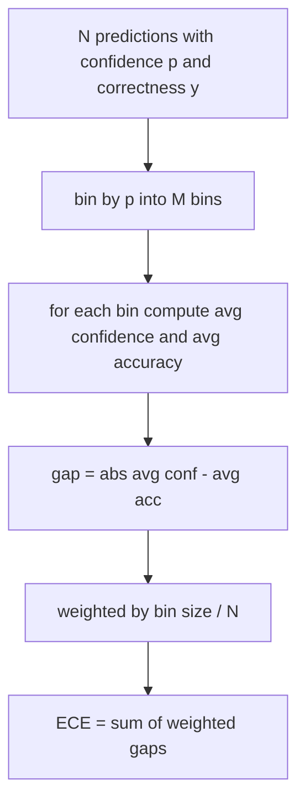
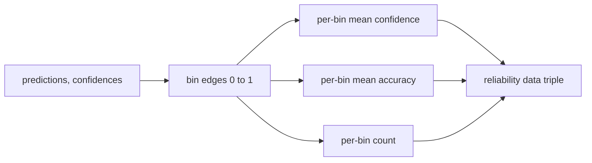

# Perplexity and Calibration

> Если модель говорит «90 процентов уверенности» на тысяче ответов и права в шестистах, она плохо откалибрована. Калибровка — половина заслуживающего доверия eval'а. Вторая половина — перплексия, которая говорит, считает ли модель отложенный текст вообще правдоподобным.

**Тип:** Практика
**Языки:** Python
**Пререквизиты:** Фаза 19, фундамент трека B, уроки 70 и 71
**Время:** ~90 минут

## Цели обучения

- Вычислить токенную перплексию на отложенном корпусе из токенных отрицательных лог-вероятностей, поставляемых адаптером модели.
- Вычислить expected calibration error (ECE) классификатора или multiple-choice-eval'а из бинованных предсказанных вероятностей.
- Вычислить Brier score (среднеквадратичная ошибка против индикатора корректности) и объяснить, когда он делает то, чего не делает ECE.
- Построить данные reliability-диаграммы, нужные для графика уверенность-против-точности.
- Подключить все три к eval-харнесу, чтобы раннер мог прикрепить числа `perplexity`, `ece` и `brier` к отчету модели.

## Что говорит перплексия

Перплексия — экспонента среднего отрицательного лог-правдоподобия на токен. Меньше — лучше. Перплексия единица означает, что модель назначает вероятность единица каждому фактическому токену. Перплексия размера словаря — модель равномерна и не выучила ничего. Настоящие числа лежат между: сильная базовая модель 2026 года на WikiText-103 сидит около восьми-двенадцати. Плохая на том же тексте — за пятьдесят.

Харнес не считает лог-вероятности сам. Они приходят из адаптера модели. Харнес агрегирует: берет список потокенных лог-вероятностей, список счетчиков токенов по последовательностям и возвращает корпусную перплексию.

```python
def perplexity(neg_log_probs, token_counts):
    total_nll = sum(neg_log_probs)
    total_tokens = sum(token_counts)
    return math.exp(total_nll / total_tokens)
```

Реализация обрабатывает краевые случаи нуля токенов и утверждает, что отрицательные лог-вероятности неотрицательны. Частая ошибка — забыть отрицание: адаптер, возвращающий `log p` вместо `-log p`, дает перплексию ниже единицы, что невозможно. Функция ловит это как нарушение контракта.

## Что меряет ECE

Expected calibration error группирует предсказания по их уверенности в фиксированное число бинов, затем меряет средний зазор между уверенностью и точностью по бинам, взвешенный размером бина.



Стандартная формулировка — десять бинов равной ширины на `[0, 1]`. Реализация поддерживает любое положительное целое. Мы открываем параметр `bins`, чтобы раннер выбирал между конвенцией публикаций (10) и конвенцией сравнений (15).

ECE смещен числом бинов и размером выборки. С десятью бинами и сотней предсказаний вы не отличите ECE 0.02 от случайного шума. Реализация возвращает число населенных бинов вместе с ECE, чтобы раннер мог отказаться репортить одно число на слишком малой выборке.

## Что Brier score делает, чего не делает ECE

ECE заботят только средние зазоры. Модель, переуверенная на половине бинов и недоуверенная на другой, может иметь низкий ECE, будучи локально плохо откалиброванной. Brier score меряет квадратичную ошибку против истинного исхода на предсказание, поэтому наказывает разброс напрямую.

Для бинарных исходов Brier — `mean((p_i - y_i)^2)`. Он разлагается на reliability, resolution и uncertainty. Мы считаем скор и разложение. Раннер репортит скаляр, но логирует разложение для дашборда.

```python
def brier(p, y):
    return float(np.mean((p - y) ** 2))
```

## Данные reliability-диаграммы

Reliability-диаграмма строит предсказанную уверенность против эмпирической точности в каждом бине. Диагональ — идеальная калибровка. Функция возвращает три массива: пер-биновую среднюю уверенность, пер-биновую среднюю точность и пер-биновый счетчик. Код построения графиков живет ниже по течению; урок останавливается на форме данных.



Возвращаемый кортеж — то, что нужно вызывающему слою для отрисовки графика или расчета кастомного ECE-варианта (adaptive ECE, sweep ECE и т. п.). Мы возвращаем numpy-массивы, чтобы коду ниже по течению не приходилось конвертировать.

## Источники уверенности

Харнес не предполагает, что уверенность приходит из softmax. Он принимает любое число в `[0, 1]` на предсказание. Для multiple-choice естественная уверенность — `softmax по лог-правдоподобиям вариантов`. Для свободного текста — самоотчет модели о вероятности или экспонента среднего лог-правдоподобия. Eval просто потребляет число. Откуда оно — работа адаптера.

## Краевые случаи

- Все предсказания неверны: ECE — средняя уверенность, Brier высок, перплексия — что модель думает о тексте.
- Все предсказания верны с высокой уверенностью: ECE около нуля, Brier около нуля.
- Идеально неуверенный предиктор на p=0.5: ECE — 0.5 минус точность, Brier — 0.25 минус поправка.
- Пустой вход: ECE, Brier и reliability возвращают `0.0` (или зануленные массивы). Перплексия возвращает `NaN` для нуля токенов. Ни один из этих путей не излучает предупреждения; раннер инспектирует значения и решает, репортить или пропустить.

Эти случаи вшиты в тесты. Настоящая модель на настоящем бенчмарке в них не попадет, а багованный адаптер или крошечная выборка — попадут, и раннер не должен падать.

## Диспетчеризация

Калибровка — не пер-задачная метрика вроде F1. Это пер-модельный отчет. Раннер накапливает пары `(уверенность, корректность)` по всему eval'у и считает ECE, Brier и данные reliability один раз. Перплексия считается по отложенному текстовому корпусу, отдельно от по-задачного скоринга.

Интерфейс:

```python
report = CalibrationReport.from_predictions(confidences, correct)
report.ece          # float
report.brier        # float
report.reliability  # tuple of three numpy arrays
report.populated_bins  # int
```

`PerplexityResult.from_token_nll(neg_log_probs, token_counts)` возвращает перплексию и среднее отрицательное лог-правдоподобие на токен.

## Чего этот урок не делает

Он не вызывает модель. Не реализует softmax. Не оценивает уверенность из выходных токенов — это работа адаптера. Не делает temperature scaling или Platt scaling — это post-hoc-лечения из другого урока. Смысл этого урока — сделать три числа (перплексия, ECE, Brier) заслуживающими доверия и воспроизводимыми.

## Как читать код

`main.py` определяет `perplexity`, `expected_calibration_error`, `brier_score`, `reliability_diagram` и датаклассы `CalibrationReport` / `PerplexityResult`. Демо гоняется на синтетических предсказаниях с известной истиной: хорошо откалиброванная модель, переуверенная и недоуверенная. Тесты в `code/tests/test_calibration.py` фиксируют каждый краевой случай плюс референсные значения синтетических предикторов.

Прочитайте `main.py` сверху вниз. Порядок функций — от скаляра к вектору к отчету. У каждой функции короткий docstring с математикой и контрактом.

## Куда двигаться дальше

Калибровка — самая игнорируемая ось публикуемого eval'а. Большинство лидербордов репортят одно число точности и считают дело сделанным. Модель, побеждающая по точности и проигрывающая по Brier, — худший продакшен-деплой, чем модель на несколько пунктов ниже по точности, но надежно сообщающая свою неуверенность. Когда обвязка калибровки на месте, добавьте temperature scaling на отложенном валидационном срезе, пересчитайте ECE и наблюдайте сокращение зазора. Это отдельный урок, но пол живет здесь.

## Дополнительное чтение

- Guo et al., [On Calibration of Modern Neural Networks (arXiv 1706.04599)](https://arxiv.org/abs/1706.04599) — ECE, reliability и temperature scaling.
- Фаза 19, урок 36 — цикл обучения и отложенная оценка, урок 74 — лидерборд.
