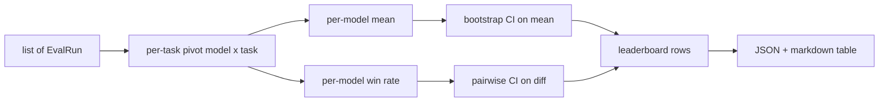
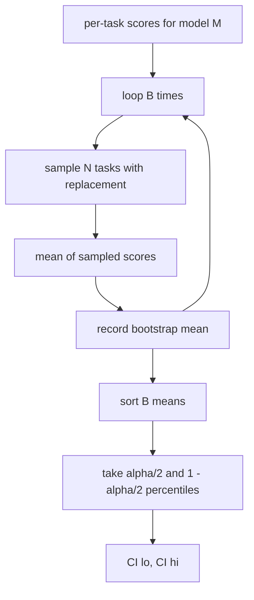

# Leaderboard Aggregation

> Пер-задачные скоры — легко. Пер-модельные ранжирования по разнородным задачам — труднее. Статистическая значимость на лидерборде из тысячи предсказаний — та часть, которую все пропускают. Этот урок не пропускает.

**Тип:** Практика
**Языки:** Python
**Пререквизиты:** Фаза 19, фундамент трека B, уроки 70, 71, 73
**Время:** ~90 минут

## Цели обучения

- Агрегировать пер-задачные скоры по нескольким моделям и нескольким задачам в аккуратную пер-модельную строку.
- Нормализовать разнородные скоры так, чтобы pass rates и BLEU-значения не пере-влияли на агрегат.
- Ранжировать модели по среднему и по win-rate и объяснять, когда какая сводка правильная.
- Вычислять bootstrap-доверительные интервалы на средний скор модели и на попарные разности.
- Выдавать лидерборд JSON-отчётом и markdown-таблицей, которую раннер урока 75 может вставить в CI-комментарий.

## Форма входа

Агрегатор потребляет список записей `EvalRun`:

```python
@dataclass
class EvalRun:
    model_id: str
    task_id: str
    metric_name: str
    score: float          # in [0, 1]
    category: str
```

Раннер урока 75 излучает по записи на пару `(модель, задача)`. Агрегатору всё равно, как получен скор. Он ожидает, что нормализация уже произошла: каждый скор в `[0, 1]`.

## Выход

Наружу выходят три таблицы:



Строка лидерборда содержит: `model_id`, `mean_score`, `mean_ci_lo`, `mean_ci_hi`, `win_rate`, `tasks_completed` и опциональную карту `categories` для пер-категорийного среднего.

## Нормализация

Если одна задача скорится в `[0, 1]`, а другая в `[0, 100]`, вторая молча доминирует в среднем. Агрегатор валидирует, что каждый входной скор сидит в `[0, 1]`, и иначе отказывает прогону. Лечение живёт выше по течению: метрика должна уже возвращать дробь. Уроки 71–73 насаждают этот контракт.

## Среднее и win-rate

Две схемы ранжирования служат разным целям.

Средний скор — среднее пер-задачных скоров одной модели. Это заголовочное число, которое репортят лидерборды. Оно чувствительно к выбросам и дисбалансу задач.

Win-rate считает, как часто модель бьёт каждую другую модель на одной задаче. Для каждой задачи побеждает модель с наивысшим скором (ничьи делятся). Win rate равен победам, делённым на число задач, где у модели есть скор. Он менее чувствителен к выбросам и различиям масштабов, но теряет информацию.

```python
def win_rate(model_id, runs_by_task, all_models):
    wins, total = 0, 0
    for task_id, runs in runs_by_task.items():
        scores = {r.model_id: r.score for r in runs if r.model_id in all_models}
        if model_id not in scores:
            continue
        total += 1
        best = max(scores.values())
        if scores[model_id] >= best:
            wins += 1
    return wins / total if total else 0.0
```

Харнес репортит оба. Раннер урока 75 по умолчанию ранжирует по среднему; markdown-колонка win-rate стоит рядом, если пользователь предпочтёт её.

## Bootstrap-доверительные интервалы

Пер-модельные средние идут с доверительным интервалом, оцениваемым bootstrap-ресэмплированием по задачам. Мы ресэмплируем id задач с возвращением, считаем среднее по ресэмплированному набору, повторяем `B` раз и берём перцентильный интервал уровня `alpha`.



Для попарных сравнений мы бутстрапим пер-задачную разность `score_A - score_B`, берём перцентильный интервал и репортим его. Пользователь считывает, исключает ли интервал ноль. Если да — разница значима на уровне alpha. Если нет — лидерборд трактует модели как ничью.

Низкоуровневые хелперы (`bootstrap_mean_ci`, `bootstrap_pairwise_diff`) по умолчанию используют `B=1000`; публичные агрегаторы (`aggregate`, `pairwise_diffs`) — `b=500`, чтобы демо и тесты оставались быстрыми. Дефолтная alpha — 0.05. Урок держит bootstrap чистым numpy, без scipy.

## Категории

Если `EvalRun.category` задана, агрегатор также репортит пер-категорийное среднее. Это та колонка на каждом лидерборде, где написано `math`, `reasoning`, `code`, `safety`. Она позволяет раннеру замечать, что модель хороша в целом, но слаба в коде, — информацию, которую заголовочное среднее прячет.

## Markdown-рендер

Лидерборд рендерится markdown-таблицей:

```text
| Rank | Model | Mean | 95% CI | Win rate | Tasks |
|------|-------|------|--------|----------|-------|
| 1    | gpt   | 0.78 | 0.74-0.82 | 0.62 | 50 |
| 2    | claude| 0.75 | 0.71-0.79 | 0.34 | 50 |
| 3    | random| 0.10 | 0.07-0.13 | 0.04 | 50 |
```

Таблица отсортирована по среднему скору. CI рендерится до двух знаков. Длинные id моделей обрезаются до двадцати символов.

## Чего этот урок не делает

Он не гоняет модели. Не вызывает слой метрик. Не реализует adaptive ECE и другие варианты калибровки — это урок 73. Не реализует взвешивание задач. Каждая задача здесь весит одинаково. Продакшен-лидерборды взвешивают задачи; мы оставляем этот крюк открытым через поле `weight`, но игнорируем его в агрегаторе. Добавьте взвешивание в follow-up-уроке, если нужно.

## Как читать код

`main.py` определяет `EvalRun`, `LeaderboardRow`, `aggregate`, `bootstrap_mean_ci`, `bootstrap_pairwise_diff` и `render_markdown`. Демо строит синтетический набор из трёх моделей и двенадцати задач, агрегирует и печатает лидерборд плюс таблицу попарных разностей. Тесты в `code/tests/test_leaderboard.py` фиксируют bootstrap, markdown-рендер, краевые случаи win-rate и поведение на пустом входе.

Прочитайте `main.py` сверху вниз. Форма данных (EvalRun, LeaderboardRow) идёт первой, агрегатор — вторым, bootstrap — третьим, рендер — последним. У каждой функции сфокусированный контракт.

## Куда двигаться дальше

Естественный следующий шаг — парная значимость по задачам вместо непарного bootstrap. Если модели A и B обе прогнали одну сотню задач, уместный тест — парный bootstrap на по-задачных разностях, который мы реализуем. Дальше вам понадобится иерархический bootstrap, уважающий семейства задач (математические задачи не независимы друг от друга; паттерн арифметической ошибки затрагивает десяток). Это follow-up. Смысл этого урока — правильно поставить пол, чтобы eval репортил число, которое вы можете защитить.

## Дополнительное чтение

- Efron & Tibshirani, *An Introduction to the Bootstrap* — перцентильный bootstrap за доверительными интервалами.
- Фаза 19, урок 73 — отчёт калибровки, урок 75 — end-to-end eval-раннер.
