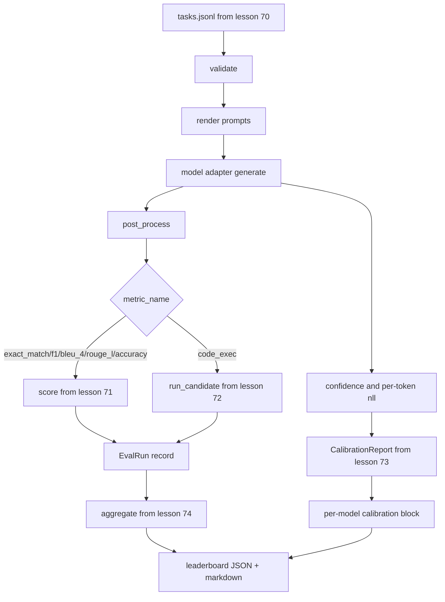

# End-to-End Eval Runner

> Пять уроков обвязки, один урок, чтобы их склеить. Раннер читает спецификацию задач из урока 70, вызывает модель через адаптер, скорит уроками 71 и 72, прикрепляет отчёт калибровки из урока 73 и излучает лидерборд из урока 74. Демо самозавершается.

**Тип:** Практика
**Языки:** Python
**Пререквизиты:** Фаза 19, фундамент трека B, уроки 70–74
**Время:** ~90 минут

## Цели обучения

- Определить интерфейс `ModelAdapter`, который любая модель (mock, локальная, API) удовлетворяет маленькой поверхностью методов.
- Прогнать eval по фикстурному JSONL-файлу с параллельным исполнением задач через пул воркеров.
- Скомпоновать слой метрик (exact_match, F1, BLEU-4, ROUGE-L, code_exec) со слоем калибровки за один проход.
- Излучать пер-модельные записи `EvalRun` и подавать их прямо в агрегатор лидерборда.
- Выдавать и JSON-отчёт, и markdown-таблицу; самозавершаться с нулём на чистом прогоне и ненулём при провале валидации или рантайма.

## Пайплайн



Раннер — точка интеграции. Каждый урок с 70 по 74 владеет одним модулем, который раннер компонует. Раннер не дублирует никакую логику этих модулей: он их импортирует.

## Интерфейс адаптера

Адаптер — шов между раннером и любой моделью. Интерфейс намеренно мал.

```python
class ModelAdapter:
    model_id: str

    def generate(self, prompt: str, task: TaskSpec) -> Generation: ...
```

`Generation` — датакласс с полями:

- `text`: свободный вывод модели
- `confidence`: float в `[0, 1]` — самоотчёт модели о вероятности ответа
- `token_nll`: опциональная сумма отрицательных лог-правдоподобий по сгенерированным токенам
- `token_count`: опциональное число сгенерированных токенов

Mock-адаптеры раннера дают три вкуса: `RuleBasedAdapter` (детерминированный, почти идеальный), `NoisyAdapter` (переуверенный, часто неправый) и `BiasedAdapter` (хорош в одной категории, ужасен в другой). Демо гоняет все три по фикстуре урока 70.

## Параллельное исполнение

Раннер использует `concurrent.futures.ThreadPoolExecutor` для параллельного исполнения задач на модель. Число воркеров по умолчанию — меньшее из восьми и числа задач. Тредов достаточно, потому что узкое место настоящих вызовов моделей — сетевой I/O. Путь code-exec порождает собственный subprocess внутри задачи, а executor планирует только ожидание.

Для детерминированных тестов раннер открывает `run_eval(adapters, tasks, parallel=False)`, чтобы тесты могли зафиксировать порядок исполнения.

## Однопроходный скоринг-цикл

Для каждой задачи:

1. Отрендерить промпт (few-shot-префикс плюс тело промпта).
2. Вызвать адаптер и замерить вызов.
3. Постобработать генерацию по правилу задачи.
4. Диспетчеризовать в слой метрик.
5. Собрать запись `EvalRun` со скором и метаданными метрики.
6. Дописать пару `(confidence, correct)` в буфер калибровки.

Сигнал `correct` — это `score >= 1.0` для метрик exact-match-стиля (`exact_match`, `accuracy`, `code_exec`) и `score >= 0.5` для градуированных. Порог живёт в `_correct_from_score`, и раннер не открывает публичного переопределения.

## Агрегация

Когда у каждой задачи есть результат, раннер вызывает `aggregate` и `pairwise_diffs` из урока 74 и `CalibrationReport.from_predictions` из урока 73. Выход — единый JSON-конверт:

```json
{
  "leaderboard": [...],
  "pairwise": [...],
  "calibration": {
    "model_id_a": {"ece": 0.04, "brier": 0.10, "populated_bins": 8, ...},
    ...
  },
  "summary": {
    "tasks": 10,
    "models": 3,
    "wall_seconds": 1.2
  }
}
```

Раннер также пишет markdown-таблицу в stdout, чтобы пользователь мог вставить результат в PR-ревью.

## Самозавершающееся демо

Демо гоняет три mock-адаптера по десяти фикстурным задачам урока 70. Wall time должен сидеть под десятью секундами. Код выхода — ноль на чистом прогоне.

Критерии чистого прогона:

- Каждая задача провалидирована по уроку 70.
- Каждая задача оскорена по урокам 71 и 72.
- Отчёт калибровки агрегирован по уроку 73 без ошибок.
- Лидерборд поставил rule-based-адаптер строго выше случайного.

Если что-то из этого ломается, раннер выходит с ненулём со структурной ошибкой в JSON-конверте.

## Чего этот урок не делает

Он не вызывает настоящую модель. Не реализует поток API-ключей или обработку rate limits. Не реализует стриминг или частичную генерацию; адаптер возвращает одну генерацию на вызов. Не делает ретраев и кэширования. Эти заботы живут на слое адаптера; раннер метрико-агностичен и провайдеро-агностичен.

## Как читать код

`main.py` — интеграция. Он импортирует из остальных пяти модулей уроков через маленький хелпер `_load_sibling`, резолвящий их по относительному пути. Датаклассы `Generation`, `EvalReport` и `ModelAdapter` определены локально. Mock-адаптеры — внизу файла.

Прочитайте `main.py` сверху вниз. Пролистайте импорты, затем посмотрите `run_eval`, затем `_score_one`, затем адаптеры. Демо в конце — точка входа.

Тесты в `code/tests/test_runner.py` фиксируют интерфейс адаптера, однопроходный цикл, эквивалентность параллельного и последовательного исполнения, буфер калибровки и форму JSON-конверта.

## Куда двигаться дальше

Этот раннер — пол. Продакшен-система eval'а добавляет: кэш результатов с ключом `(task_id, model_id, model_version)`, cost ledger, отслеживающий доллары и токены на прогон, retry-слой с backoff на rate limits, политику сэмплирования для pass-at-k-задач и стриминговый формат вывода для длинных наборов. Каждое из этого — отдельная забота, оборачивающая раннер, не меняя слои метрик и агрегации. Это разделение и есть смысл контракта.

Добавьте адаптер настоящего провайдера, когда mock'и работают. Возьмите провайдера с бесплатным ярусом, напишите тридцать строк клея, наблюдайте, как лидерборд оживает. Затем добавьте второго провайдера — и пусть харнес работает сам.
