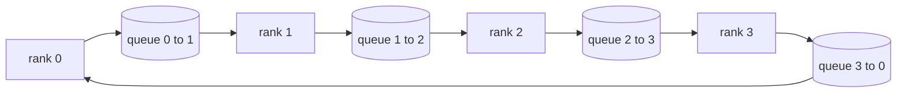

# Collective Ops From Scratch

> Четыре коллективные операции, на которых держится распределенное обучение, — allreduce, broadcast, allgather и reduce_scatter. Любой другой примитив, который предлагает обучающий фреймворк, — обертка над ними. Соберите их один раз над mesh'ем из `multiprocessing.Queue`, верифицируйте против референсной реализации — и остальной трек станет обвязкой.

**Тип:** Практика
**Языки:** Python
**Пререквизиты:** Фаза 19, трек C, уроки 42–49
**Время:** ~90 минут

## Цели обучения

- Реализовать ring allreduce в два прохода (reduce-scatter, затем allgather) и доказать, что коммуникационный объем на ранг — 2(N-1)/N байт на элемент.
- Построить broadcast, allgather и reduce_scatter поверх точка-точка-отправок через `multiprocessing.Queue`.
- Верифицировать каждый примитив против gloo-референса `torch.distributed` на том же входе.
- Обосновать выбор кольца против дерева по форме кластера, полу задержки и потолку пропускной способности.

## Проблема

Наивный allreduce на N рангах шлет тензор N раз корню и N раз обратно бродкастом. Пропускная способность масштабируется как O(N) на ранг, корень становится узким местом, а пол по wall-clock — самый медленный линк, умноженный на N. Ring allreduce расплющивает это в 2(N-1) чанков размера T/N, и байты на ранг падают до 2T(N-1)/N независимо от размера кластера. Tree allreduce выигрывает на малых N и высоколатентных линках, потому что глубина — log2(N) прыжков вместо 2(N-1). Выберите неправильную топологию под форму кластера — и время шага диктует самая медленная GPU.

Каждый фреймворк распределенного обучения, который вы будете читать в этом треке, зависит от этих четырех примитивов. PyTorch DDP синхронизирует градиенты одним allreduce на бакет параметров. ZeRO шардирует состояние оптимизатора через reduce_scatter и бродкастит обновленные параметры через allgather. FSDP превращает полный forward в allgather плюс reduce_scatter. Pipeline parallel'у нужен broadcast активаций между группами стадий. Если вы не можете реализовать четыре коллектива, вы не можете рассуждать о том, почему обучение стопорится, почему рассинхрон градиентов вылезает на ранге 3 или почему pipeline bubble удваивается при смене топологии.

## Концепция



### Ring allreduce в два прохода

Разрежьте тензор на N равных чанков с индексами 0..N-1. Каждый ранг владеет чанком с индексом, равным своему рангу. Проход 1, reduce-scatter, идет N-1 шагов. На шаге s ранг r шлет чанк (r - s) mod N рангу (r + 1) mod N и получает чанк (r - s - 1) mod N от ранга (r - 1) mod N, аккумулируя полученный чанк в свою локальную копию. После N-1 шагов ранг r владеет полной суммой чанка r. Проход 2, allgather, идет еще N-1 шагов и вращает готовые чанки по кольцу, пока каждый ранг не держит полную сумму каждого чанка.

| Примитив | Байт на ранг | Шагов | Когда использовать |
|-----------|---------------|-------|-------------|
| Ring allreduce | 2T(N-1)/N | 2(N-1) | Большой T, однородный кластер с толстой трубой |
| Tree allreduce | T log2(N) | 2 log2(N) | Маленький T или высоколатентные линки |
| Broadcast | T | Дерево log2(N) | Инициализация параметров, скалярный конфиг |
| Allgather | T(N-1)/N | N-1 | Шардированный forward, unshard в ZeRO |
| Reduce_scatter | T(N-1)/N | N-1 | Шардирование градиентов в ZeRO |

### Queue-mesh как замена NCCL

NCCL работает поверх PCIe и NVLink с аппаратно-разгруженными редукциями. На CPU этого нет. По одному `multiprocessing.Queue` на ребро кольца дают упорядоченную точка-точка-доставку с одним производителем и одним потребителем. Редукция происходит в user space, поэтому вы платите Python-накладные, но паттерн провода идентичен ring allreduce NCCL. Разберитесь с корректностью на queue-версии — и поведение кластера последует.

### Верификация против gloo

Каждый примитив приземляется с юнит-тестом, сравнивающим его выход с `torch.distributed`, инициализированным gloo-бэкендом, на том же тензоре при том же world size. Если ваш ring allreduce расходится с gloo больше чем на float32-эпсилон, тест падает. Верификация против референсной реализации не обсуждается; без нее примитив выглядит корректным до шага 10000 настоящего обучающего прогона.

## Соберите это

`code/main.py` реализует:

- Класс `Mesh`, свивающий N экземпляров `multiprocessing.Queue` в кольцо и открывающий `send(dst, tensor)` и `recv(src)` на ранг.
- `ring_allreduce(mesh, rank, world_size, tensor)` с двухпроходным алгоритмом.
- `broadcast(mesh, rank, world_size, tensor, src)` по логарифмическому дереву.
- `allgather(mesh, rank, world_size, tensor)` через N-1 вращений.
- `reduce_scatter(mesh, rank, world_size, tensor)` как первую половину allreduce.
- `_gloo_reference(op, world_size, tensor)` — гоняет тот же вход через `torch.distributed` с gloo для байт-точного сравнения.

Запустите:

```bash
python3 code/main.py
```

Вывод: таблица верификации по примитивам, сравнивающая выходы queue-mesh и gloo, за которой следует пер-ранговый счетчик байтов, доказывающий масштабирование 2T(N-1)/N.

## Production-паттерны в реальной практике

Три паттерна укрепляют примитивы до отгружаемого состояния.

**Бакетируйте градиенты до allreduce.** У модели на 1B параметров десятки тысяч градиентных тензоров. Один allreduce на тензор платит пол задержки N раз. DDP бакетирует градиенты чанками ~25 МБ и запускает один allreduce на бакет; маленькие тензоры едут на спине больших. Без бакетирования накладные задержки доминируют в шаге.

**Перекрывайте коммуникацию с вычислениями.** Backward считает градиенты слой за слоем в обратном порядке. Как только градиент последнего слоя готов, запускайте его allreduce, пока следующий слой продолжает считаться. PyTorch DDP свивает это через bucket-ready-хуки. Перекрытие половинит видимое время коммуникации, когда у сети есть запас.

**Выбирайте кольцо или дерево по размеру сообщения, а не по религии.** NCCL поставляет детектор топологии, выбирающий кольцо для сообщений выше ~1 МБ и дерево ниже. Точка перелома — пропускная способность против задержки: выше 1 МБ доминирует полосный член 2T(N-1)/N и побеждает кольцо; ниже — побеждает log2(N) прыжков. Захардкоженная топология стоит throughput на неправильном размере сообщения.

## Используйте это

Production-паттерны:

- **PyTorch DDP.** Вызывает `dist.all_reduce` на бакетированных градиентах после backward. Размер бакета настраиваем; дефолт 25 МБ разумен для 100Gbit Ethernet.
- **DeepSpeed ZeRO.** Запускает reduce_scatter для шардирования градиентов и allgather для реконструкции полных параметров перед forward. Примитивы урока — в точности вызовы, которые делает ZeRO.
- **FSDP.** Forward начинается с allgather для unshard слоя, считает, затем редьюсит через reduce_scatter и сбрасывает unshard. Те же примитивы, другое расписание.

## Отгрузите это

Используйте queue-mesh-примитивы в уроках 77–81. Урок 77 свивает allreduce в DDP. Урок 78 — reduce_scatter в ZeRO. Урок 79 — broadcast в pipeline-активации. Урок 81 компонует все четыре в end-to-end-демо.

## Упражнения

1. Добавьте tree-вариант allreduce и переключайтесь между кольцом и деревом по размеру сообщения. Измерьте точку перелома.
2. Добавьте `recv_timeout_ms`, чтобы застрявший ранг поднимал ошибку дедлайна вместо вечного зависания.
3. Замените `multiprocessing.Queue` TCP-сокетами для четырех примитивов. Те же тесты, настоящий провод.
4. Добавьте хук инструментирования полосы, чтобы пер-ранговый счетчик байтов логировался в JSONL.
5. Сравните wall-clock кольца против дерева на 4 рангах для тензоров 1КБ, 1МБ, 16МБ. Обоснуйте точку перелома эмпирически.

## Ключевые термины

| Термин | Как говорят | Что это на самом деле |
|------|----------------|------------------------|
| Allreduce | «Сумма по рангам» | После вызова каждый ранг держит один и тот же средуцированный тензор |
| Кольцо | «Быстрая топология» | N-1 чанков размера T/N текут по циклу дважды |
| Дерево | «Логарифмическая топология» | Редукция идет по бинарному дереву; глубина — log2(N) прыжков |
| Allgather | «Конкатенация шардов» | Каждый ранг заканчивает с шардом каждого другого ранга |
| Reduce_scatter | «Раздели сумму» | Каждый ранг заканчивает с суммой только одного чанка |
| Бакет | «Слить маленькие тензоры» | Схлопнуть N маленьких allreduce в один большой |

## Дополнительное чтение

- [PyTorch Distributed: коллективы NCCL](https://pytorch.org/docs/stable/distributed.html#collective-functions)
- [Статья Horovod о ring allreduce](https://arxiv.org/abs/1802.05799)
- [Выбор топологии и алгоритма в NCCL](https://docs.nvidia.com/deeplearning/nccl/user-guide/docs/index.html)
- [Patarasuk and Yuan, Bandwidth optimal allreduce algorithms](https://www.cs.fsu.edu/~xyuan/paper/09jpdc.pdf)
- Фаза 10, урок 05 — обзор распределенного обучения
- Фаза 19, урок 77 — DDP, свитый поверх этих примитивов
