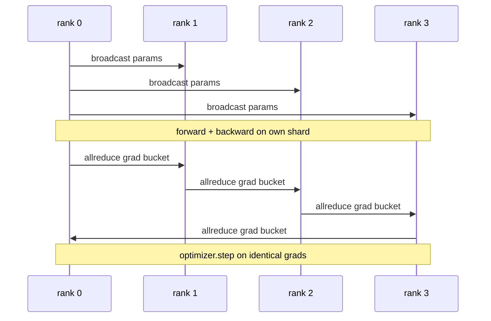

# Data Parallel DDP From Scratch

> DistributedDataParallel — это хук поверх allreduce. Оберните модель, забродкастите начальные параметры с ранга 0, чтобы каждый ранг стартовал идентично, поставьте backward-хук на каждый параметр, запускающий allreduce градиента, — и остальное — градиентный спуск. Весь паттерн — 200 строк.

**Тип:** Практика
**Языки:** Python
**Пререквизиты:** Фаза 19, трек C, уроки 42–49
**Время:** ~90 минут

## Цели обучения

- Свить обёртку в форме `DistributedDataParallel`, бродкастящую начальные параметры и делающую allreduce градиентов после backward.
- Породить N CPU-рангов через `torch.multiprocessing.spawn` поверх gloo-бэкенда с файловым rendezvous.
- Доказать корректность синхронизации градиентов, обучив ту же модель на тех же данных последовательно и показав пошаговую эквивалентность параметров.
- Обосновать бакеты (слияние градиентов) и перекрытие (коммуникация во время backward) как два изменения, превращающие работающий DDP в продакшен-DDP.

## Проблема

Модель на 1 миллиард параметров с 12 ГБ активаций не помещается на одну потребительскую GPU. Даже когда помещается, обучение занимает недели. Data parallel режет батч на N рангов, каждый ранг считает forward и backward на своём шарде, и на каждом шаге градиенты каждого ранга суммируются, чтобы все N копий оставались идентичными. Просуммированный градиент — то, по чему шагает оптимизатор.

Без синхронизации градиентов N реплик расходятся ко второму шагу. Модель — больше не «одна модель, обученная на большем числе данных», а N отдельных моделей, случайно деливших начальные веса. При плохо сделанной синхронизации (один allreduce на параметр, без перекрытия, без бакетирования) узкое место — сеть, и GPU простаивают в ожидании провода. Ремесло DDP — сделать синхронизацию градиентов почти бесплатной относительно вычислений. Канонический PyTorch DDP достигает этого бакетированием градиентов, перекрытием allreduce с backward следующего слоя и NCCL на NVLink. Мы можем сделать все три на CPU с gloo и выучить те же уроки.

## Концепция



### Три операции, нужные DDP

| Стадия | Коллектив | Почему |
|-------|-----------|-----|
| Init | broadcast с ранга 0 | Каждый ранг стартует с одних параметров |
| После backward | allreduce каждого градиента | Оптимизатор шагает по среднему градиенту |
| Иногда | broadcast буферов | Бегущая статистика batchnorm остаётся синхронной |

### Почему среднее, а не сумма

Allreduce-SUM, делённый на world_size, даёт средний градиент. Среднее инвариантно к world_size: learning rate, настроенный на одном ранге, работает на четырёх, потому что величина градиента на шаг не меняется. Allreduce-SUM без деления заставляет перенастраивать learning rate при каждой смене размера кластера. DDP оборачивает SUM и делит; делайте в уроке то же.

### Почему бакетировать градиенты

У трансформера тысячи тензоров параметров. Один allreduce на тензор платит пол задержки gloo тысячи раз. DDP группирует градиенты в бакеты ~25 МБ и запускает один allreduce на бакет. По проводу идут те же суммарные байты, но задержка амортизируется по бакету. Для крошечной модели урока мы группируем всё в один бакет; переносится сама структура.

### Почему пинить сид

Каждый ранг обязан вызвать `torch.manual_seed(seed + rank)` для шаффла, но `torch.manual_seed(seed)` для инициализации параметров. Один общий сид означает, что каждый ранг видит один порядок батчей (что убивает data parallel); ранго-специфичный сид для параметров означает, что начальные параметры расходятся на float-эпсилон, и синхронизация градиентов больше не делает реплики идентичными. Сделайте паттерн сидов правильно — или тест эквивалентности параметров упадёт на шаге 1.

## Соберите это

`code/main.py` реализует:

- `MiniMLP`: трёхслойный MLP, достаточно маленький, чтобы сойтись за секунды, и достаточно большой, чтобы обнажить проводку.
- `DistributedDataParallel(model, world_size)`: бродкастит параметры при конструировании, возвращает обёртку, чей `sync_grads` делит аккумулированные allreduce-суммированные градиенты на world_size.
- `worker(rank, world_size, ...)`: полный обучающий цикл с инициализацией `torch.distributed` поверх gloo, forward, backward, sync, step.
- `_reference_single_process_loop(...)`: обучает ту же модель на тех же данных последовательно на одном ранге; используется тестом для байт-точной эквивалентности параметров после каждого шага.

Запустите:

```bash
python3 code/main.py
```

Вывод: пошаговая обучающая таблица, сравнивающая однопроцессный лосс и чексумму параметров с DDP-прогоном на 4 рангах. Два пути дают идентичные кривые лосса до float-эпсилон, доказывая корректность синхронизации градиентов.

## Production-паттерны в реальной практике

Три паттерна укрепляют DDP до отгружаемого состояния.

**Ищите неиспользуемые параметры.** Некоторые forward-пути условно пропускают параметры (ранний выход, router mixture-of-experts). У пропущенных параметров нет градиента, но bucket-ready-хук DDP всё равно их ждёт, и allreduce дедлочится. `find_unused_parameters=True` велит DDP смотреть, какие параметры получили градиенты, до редукции. Цена — обход графа на шаг, поэтому держите выключенным, если forward не ветвится.

**Оптимизация статического графа.** Когда forward стабилен между шагами, `static_graph=True` позволяет DDP предвычислить расписание бакетов. Оптимизация важна на масштабе: предвычисление экономит несколько мс на шаг, что накапливается за 10000 шагов.

**Накопление градиентов требует аккуратности.** Аккумулировать градиенты по K микробатчам без синка каждого — выигрыш throughput в 10 раз. DDP открывает `no_sync()` — контекст-менеджер, приостанавливающий post-backward-allreduce. Забудьте менеджер — и будете делать allreduce K раз впустую; throughput падает до пола.

## Используйте это

Production-паттерны:

- **PyTorch DDP.** Каноническая реализация. `torch.nn.parallel.DistributedDataParallel(model)` свивает бакетирование, перекрытие и no_sync-контекст.
- **HuggingFace Accelerate.** Добавляет launcher, обслуживающий env-переменные `torchrun` и обёртку модели. Под капотом тот же DDP.
- **Data parallel в Megatron-LM.** Сочетает DDP с tensor parallel для больших моделей; data-parallel-часть — тот же паттерн allreduce-после-backward.

## Отгрузите это

Урок 78 (ZeRO-шардирование) заменяет пер-параметровый allreduce на reduce_scatter, чтобы каждый ранг хранил только свой шард состояния оптимизатора. Урок 81 компонует DDP с ZeRO в end-to-end-демо.

## Упражнения

1. Добавьте градиентные бакеты настраиваемого размера и измерьте ускорение против одного allreduce на параметр на более глубокой модели.
2. Реализуйте `no_sync()` контекст-менеджером и убедитесь, что накопление градиентов совпадает с однопроцессным бейзлайном по K микробатчам.
3. Добавьте режим `find_unused_parameters`, где forward иногда пропускает один слой MLP; без флага прогон должен дедлочиться.
4. Замените gloo синхронизацией только через `torch.distributed.barrier()`, чтобы почувствовать разницу между allreduce-синком и barrier-синком.
5. Измерьте накладные синхронизации градиентов как долю времени шага для размеров батча 1, 16, 256 и объясните масштабирование.

## Ключевые термины

| Термин | Как говорят | Что это на самом деле |
|------|----------------|------------------------|
| DDP | «Data parallel» | Обёртка, бродкастящая параметры и делающая allreduce градиентов каждый шаг |
| Бакет | «Слить градиенты» | Сгруппировать N маленьких allreduce в один большой |
| Перекрытие | «Спрятать коммуникацию» | Запускать allreduce, пока поздние слои ещё считают backward |
| no_sync | «Накопление» | Пропустить post-backward-allreduce для накопления градиентов |
| find_unused | «Ветвящийся forward» | Детектить параметры без градиента до редукции |

## Дополнительное чтение

- [Документация PyTorch DistributedDataParallel](https://pytorch.org/docs/stable/generated/torch.nn.parallel.DistributedDataParallel.html)
- [Туториал по внутренностям PyTorch DDP](https://pytorch.org/tutorials/intermediate/ddp_tutorial.html)
- [Li et al, PyTorch Distributed: Experiences on Accelerating Data Parallel Training](https://arxiv.org/abs/2006.15704)
- Фаза 19, урок 76 — коллективы, на которых построен DDP
- Фаза 19, урок 78 — ZeRO-шардирование заменяет пер-параметровый allreduce на reduce_scatter
