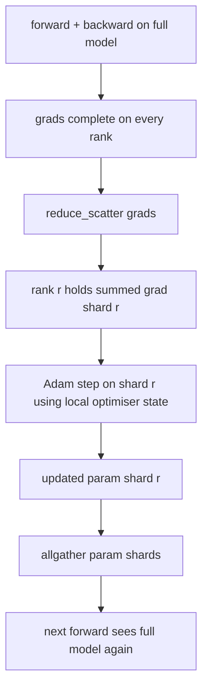

# ZeRO Optimizer State Sharding

> Adam хранит две оценки моментов на параметр, обе во float32. Модель на 7B параметров несёт 56 ГБ состояния оптимизатора. ZeRO stage 1 шардирует его по N рангам; каждый ранг владеет 1/N оптимизатора. После локального шага обновлённые шарды параметров бродкастятся обратно, каждый ранг реконструирует полную модель, и начинается следующий шаг. Выигрыш — линейное падение памяти на самой большой одиночной аллокации обучающего стека.

**Тип:** Практика
**Языки:** Python
**Пререквизиты:** Фаза 19, трек C, уроки 42–49
**Время:** ~90 минут

## Цели обучения

- Шардировать состояние оптимизатора (первый момент, второй момент, fp32-мастер-копию) по N рангам, чтобы каждый ранг владел 1/N.
- Использовать reduce_scatter, чтобы доставлять каждому рангу только сумму градиента его шарда, затем allgather, чтобы бродкастить обновлённые шарды параметров обратно.
- Посчитать таблицу экономии памяти для stage 1, stage 2, stage 3 против обычного DDP.
- Обосновать выбор stage 1 против stage 2 против stage 3 по размеру модели и бюджету полосы.

## Проблема

Обычный DDP реплицирует всё: параметры, градиенты и состояние оптимизатора присутствуют целиком на каждом ранге. Для модели на 7B параметров в fp16 это 14 ГБ параметров, 14 ГБ градиентов и 28 ГБ состояния оптимизатора на ранг. Состояние оптимизатора — самый большой член и самый лёгкий для шардирования, потому что его трогают только во время шага, а не в forward или backward.

ZeRO stage 1 шардирует состояние оптимизатора. Каждый ранг держит 1/N Adam-моментов. После backward, вместо allreduce полного градиента и локального шага, ZeRO делает reduce_scatter, и каждый ранг получает только суммированный градиент своего шарда. Ранг применяет шаг оптимизатора к своему шарду мастер-параметров. Обновлённые шарды параметров затем allgather'ятся обратно, и каждый ранг имеет полную модель для следующего forward. Память оптимизатора падает в N раз. Провод на шаг тот же, что у DDP: один reduce_scatter плюс один allgather равны одному allreduce по полосе. Память выигрывает, throughput держится.

## Концепция



### Стадии ZeRO

| Stage | Что шардируется | Память на ранг | Коммуникация на шаг |
|-------|----------------|------------------|---------------|
| DDP | ничего | params + grads + optim | 1x allreduce |
| ZeRO-1 | состояние оптимизатора | params + grads + optim/N | 1x reduce_scatter + 1x allgather |
| ZeRO-2 | optim + grads | params + grads/N + optim/N | 1x reduce_scatter + 1x allgather |
| ZeRO-3 | optim + grads + params | params/N + grads/N + optim/N | 1x allgather на слой + 1x reduce_scatter на слой |

Stage 1 — самый дешёвый выигрыш, потому что состояние оптимизатора доминирует в бюджете. Stage 2 нуждается в логике аккумуляции градиентных шардов, но полоса та же. Stage 3 (FSDP) платит пер-слойную коммуникацию на каждый forward и backward, получая взамен падение памяти шардов параметров. Урок реализует stage 1 полностью.

### Математика памяти в настоящих числах

Для модели с P параметрами, обучаемой Adam в смешанной точности:

| Член | Обычный | ZeRO-1 | Почему |
|------|---------|--------|-----|
| fp16-параметры | 2P байт | 2P байт | нужны для forward |
| fp16-градиенты | 2P байт | 2P байт | нужны для backward |
| fp32-мастер-копия | 4P байт | 4P/N байт | нужна только оптимизатору |
| fp32 первый момент | 4P байт | 4P/N байт | нужен только оптимизатору |
| fp32 второй момент | 4P байт | 4P/N байт | нужен только оптимизатору |
| Итого | 16P байт | 4P + 12P/N байт |   |

При N=8: обычный 16P, ZeRO-1 5.5P — падение на 65%. При N=64: обычный 16P, ZeRO-1 4.19P — падение на 74%.

### Почему reduce_scatter бьёт allreduce-затем-шардируй

Allreduce даёт каждому рангу полный суммированный градиент. Если рангу r нужен только шард r, (N-1)/N средуцированного градиента потрачены впустую. Reduce_scatter доставляет ровно тот шард, которым владеет ранг; байты на ранг те же, что у allreduce (поскольку allreduce — это reduce_scatter + allgather), но вторая половина заменяется на allgather шардов параметров позже. Итоговый провод идентичен DDP, память делится.

## Соберите это

`code/main.py` реализует:

- `flatten_params(module)` и `unflatten_into(module, flat)` — пакуют параметры модели в один непрерывный тензор и обратно. Плоская раскладка — то, что делает шардирование по рангу простым срезом.
- `ZeroOptimizer(model, world_size, rank, lr)` — владеет шардом мастер-копии и Adam-моментов своего ранга.
- `step()` — гоняет reduce_scatter на плоском градиенте, применяет Adam к шарду ранга и allgather'ит обновлённые параметры обратно.
- Демо: обучает трёхслойный MLP 20 шагов и печатает пошаговый бюджет памяти рядом с бейзлайном обычного DDP.

Запустите:

```bash
python3 code/main.py
```

Вывод: пошаговый лосс и таблица памяти, показывающая, что ZeRO-1 держит 1/N состояния оптимизатора на каждом ранге против полной копии DDP.

## Production-паттерны в реальной практике

Три паттерна укрепляют ZeRO до отгружаемого состояния.

**Шардированный чекпоинтинг важен.** Состояние оптимизатора ZeRO-1 разрезано по рангам; чекпоинт обязан записать, какой ранг чем владеет. Урок 80 строит манифест шардированного чекпоинта, возобновляющий ZeRO-прогон на том же world size. Без него сохранённое состояние нечитаемо при рестарте.

**Смешанная точность — сама суть.** ZeRO — техника смешанной точности; шардируется именно fp32-мастер-копия. Запуск ZeRO без смешанной точности платит налог памяти за fp32-мастера без соответствующего fp16-выигрыша в forward. Продакшен-прогоны всегда спаривают ZeRO с autocast или bf16-весами.

**Stage 1 — почти бесплатный выигрыш.** Коммуникация идентична DDP по полосе. Экономия памяти линейна в N. Единственная цена — бухгалтерия шарда оптимизатора. Продакшен-стеки по умолчанию берут stage 1, если память шардов параметров тоже не проблема; тогда stage 2 или 3 меняют коммуникацию на память.

## Используйте это

Production-паттерны:

- **DeepSpeed ZeRO.** Референсная реализация. `deepspeed_config.json` выбирает stage 1/2/3 и размеры партиций.
- **PyTorch FSDP.** PyTorch-нативный эквивалент. `ShardingStrategy.SHARD_GRAD_OP` — это ZeRO-2; `FULL_SHARD` — ZeRO-3.
- **HuggingFace Accelerate.** Оборачивает и DeepSpeed, и FSDP под единым конфигом.

## Отгрузите это

Урок 79 (pipeline parallel) — ортогональная ось шардирования: вместо шардирования состояния оптимизатора по одной модели pipeline шардирует слои по рангам. Урок 81 компонует DDP + ZeRO в end-to-end-демо.

## Упражнения

1. Расширьте до ZeRO-2, шардировав градиенты: каждый ранг хранит градиент только своего шарда — занулением не-шардовой части после backward.
2. Добавьте профилировщик памяти, печатающий фактические fp32-байты на ранге 0 против предсказания формулы.
3. Измерьте пошаговый wall-clock обычного DDP против ZeRO-1 и разложите на forward, backward, коммуникацию.
4. Реализуйте клиппинг градиентов под ZeRO-1: L2-норму нужно считать по всем шардам через allreduce локального квадрата нормы.
5. Реализуйте «наивный ZeRO» с allreduce вместо reduce_scatter, измерьте разницу времени на проводе. Обоснуйте выбор reduce_scatter числами.

## Ключевые термины

| Термин | Как говорят | Что это на самом деле |
|------|----------------|------------------------|
| ZeRO-1 | «Шардируй оптимизатор» | Каждый ранг держит 1/N fp32-мастера + Adam-моментов |
| ZeRO-2 | «Шардируй и градиенты» | Каждый ранг также сбрасывает не-шардовые градиенты после reduce_scatter |
| ZeRO-3 | «Шардируй параметры» | Каждый ранг держит 1/N fp16-параметров; allgather на слой в forward |
| Мастер-копия | «fp32-веса» | Высокоточная копия параметров, которую обновляет оптимизатор |
| Reduce_scatter | «Раздели сумму» | Доставить каждому рангу только суммированный градиент его шарда |

## Дополнительное чтение

- [Rajbhandari et al, ZeRO: Memory Optimizations Toward Training Trillion Parameter Models](https://arxiv.org/abs/1910.02054)
- [Документация DeepSpeed ZeRO](https://www.deepspeed.ai/tutorials/zero/)
- [Документация PyTorch FSDP](https://pytorch.org/docs/stable/fsdp.html)
- Фаза 19, урок 76 — reduce_scatter и allgather, на которых стоит этот урок
- Фаза 19, урок 80 — шардированный чекпоинтинг, который обязано использовать состояние ZeRO
