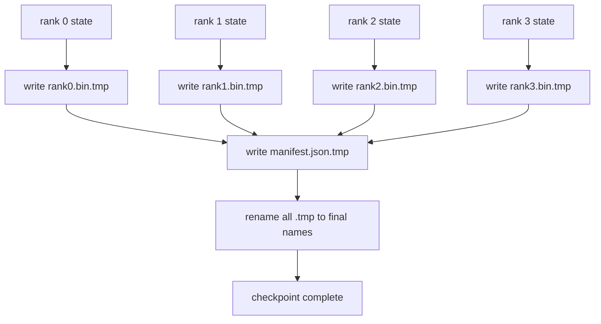

# Sharded Checkpoint and Atomic Resume

> Обучающая джоба на 70B параметров ставится на паузу отказом ноды каждые несколько часов. Формат чекпоинта решает, потеряете вы 30 минут или 30 часов. Шардированный чекпоинт пишет шард каждого ранга параллельно и записывает принадлежность в манифест. Resume загружает шард каждого ранга из его файла, реконструирует состояние на том же world size, и оптимизатор шагает так, будто ничего не случилось. Атомарная запись не дает полузаписанному чекпоинту отравить следующий resume.

**Тип:** Практика
**Языки:** Python
**Пререквизиты:** Фаза 19, трек C, уроки 42–49
**Время:** ~90 минут

## Цели обучения

- Сохранить мульти-ранговый чекпоинт как пер-ранговый файл-шард плюс манифест, записывающий, какой ранг чем владеет.
- Использовать паттерн атомарной записи (запись во временный путь, затем rename), чтобы краш посреди записи никогда не порождал полузаписанный чекпоинт.
- Возобновиться из манифеста, верифицируя байт-точное состояние и fp16-параметров, и состояния оптимизатора ZeRO на каждом ранге.
- Защитить схему манифеста от трех режимов отказа: смена world-size, несовпадение числа шардов и частичная запись.

## Проблема

Обычный чекпоинт читает все параметры и состояние оптимизатора в ранг 0, гатерит и пишет один файл. Для модели 70B это 1.1 ТБ состояния через сетевой порт одного ранга. Запись блокирует каждый другой ранг, потому что они простаивают в ожидании гатера. Полоса IO — сетевой линк самой медленной одиночной GPU, а не агрегат. На настоящем кластере шаг гатер-затем-запись может занять дольше предыдущего часа обучения, а значит, джоба отгружает меньше одного чекпоинта за день обучения.

Шардированные чекпоинты переворачивают паттерн: каждый ранг пишет свой шард в свой файл параллельно. Манифест записывает, какой ранг чем владел, чтобы resume мог положить каждый шард обратно откуда он взялся. Агрегатная полоса записи масштабируется с кластером. Чекпоинт на 1 ТБ, занимавший 4 часа через один ранг, занимает 4 минуты через 64 ранга. Плюс манифест дает контракт для несовместимых resume: смена world-size обнаружима, частичные записи обнаружимы, а путь загрузки может падать громко, а не молча использовать протухшие данные.

## Концепция



### Схема манифеста

```json
{
  "world_size": 4,
  "step": 1234,
  "wall_clock_seconds": 4521,
  "shards": [
    {"rank": 0, "path": "rank0.bin", "sha256": "...", "param_shard_offset": 0, "param_shard_numel": 65536},
    {"rank": 1, "path": "rank1.bin", "sha256": "...", "param_shard_offset": 65536, "param_shard_numel": 65536}
  ],
  "schema_version": 1
}
```

Три поля несущие. `world_size` заставляет resume на другом размере громко падать, а не молча портить. `sha256` на шард ловит частичные или поврежденные записи. `param_shard_offset` и `param_shard_numel` на шард позволяют загрузчику реконструировать плоский тензор параметров в правильной позиции.

### Атомарная запись

Стандартный паттерн: писать каждый шард в `<name>.tmp`, писать манифест в `manifest.json.tmp`, fsync каждый, затем rename. POSIX-rename внутри одной файловой системы атомарен; либо новый файл присутствует целиком, либо старый. Краш до финального rename оставляет предыдущий чекпоинт живым. Без атомарной записи краш может оставить частичный шард с присутствующим манифестом, указывающим на него, и загрузка портит состояние оптимизатора при resume.

### Три режима отказа, от которых схема должна защищать

| Отказ | Симптом | Защита |
|---------|---------|---------|
| Смена world-size | resume на N=8 с манифестом от N=4 | несовпадение world_size в манифесте, громкий сбой |
| Несовпадение числа шардов | resume видит меньше файлов rank*.bin, чем шардов в манифесте | перечислить шарды, проверить существование каждого |
| Частичная запись | файл шарда обрезан посреди flush | верификация sha256 при загрузке |

Каждая защита отклоняет плохую загрузку рано; альтернатива — молчаливое повреждение, всплывающее на 100 шагов позже, когда лосс уходит в NaN.

### Почему пер-ранговые файлы, а не один большой

Конкурентная запись в один файл через `O_APPEND` работает на POSIX для байт-выровненных записей, но на практике смещения внутри одного шарда охватывают MB-регионы, и блокировки доминируют. У пер-ранговых файлов нет конкуренции, и они выигрывают от striping, когда нижележащая ФС параллельна (Lustre, GPFS). Продакшен-стеки (DeepSpeed, FSDP, NeMo) все используют пер-ранговые файлы по этой причине.

## Соберите это

`code/main.py` реализует:

- Датакласс `ShardManifest` со схемой выше плюс `to_json`/`from_json`.
- `save_sharded(state_dict_per_rank, dir, step)` — пишет бинарное состояние каждого ранга в его файл паттерном атомарной записи temp-затем-rename, затем пишет манифест.
- `load_sharded(dir, expected_world_size)` — читает манифест, верифицирует sha256 каждого шарда и возвращает пер-ранговые state dict'ы.
- Round-trip-тест: построить пер-ранговое состояние, сохранить, загрузить, утвердить байт-точность.

Запустите:

```bash
python3 code/main.py
```

Вывод: 4 файла-шарда плюс манифест записаны, затем перезагружены с байт-точной верификацией.

## Production-паттерны в реальной практике

Три паттерна укрепляют чекпоинт до отгружаемого состояния.

**Асинхронная запись.** Продакшен-стеки запускают запись чекпоинта на отдельном треде или процессе, чтобы обучение продолжалось. Барьер — на следующем чекпоинте: не начинать следующее сохранение, пока предыдущее не завершено. Флаг `async_io` DeepSpeed делает ровно это. Урок держит запись синхронной, чтобы шаги были видны.

**Локальный быстрый диск сначала, потом async-загрузка.** Писать на локальный NVMe (быстро), затем async-загружать в S3 или GCS. Двухуровневый паттерн держит внутрикластерный чекпоинт быстрым для resume, отправляя долговечную копию за пределы кластера в архив. Манифест несет локальный путь; upload-манифест несет удаленный.

**Ротация важна.** Продакшен-прогоны держат последние K чекпоинтов (обычно 3–5) и ротируют старейший. Без ротации диск заполняется посреди прогона, и следующий чекпоинт падает. С ротацией следующее сохранение сначала удаляет старейший, освобождая бюджет.

## Используйте это

Production-паттерны:

- **Чекпоинтинг DeepSpeed.** `deepspeed.save_checkpoint(tag=step)` пишет пер-ранговые файлы и файл `latest`, указывающий на активный тег.
- **Чекпоинтинг PyTorch FSDP.** `torch.distributed.checkpoint` сохраняет шардированное состояние с `Planner`, решающим пер-ранговую раскладку.
- **NeMo.** Оборачивает DeepSpeed и FSDP единым API `save_to_checkpoint`, добавляющим метаданные.

## Отгрузите это

Урок 81 сохраняет шардированный чекпоинт end-to-end DDP+ZeRO-прогона и перезагружает его на том же world size, доказывая, что контракт resume держится.

## Упражнения

1. Добавьте асинхронную запись: запустите сохранение в треде и дайте обучению продолжаться. Блокируйте следующее сохранение до завершения предыдущего.
2. Добавьте ротацию `last_5_steps`: держать 5 недавних чекпоинтов, удалять старейший перед сохранением нового.
3. Добавьте путь быстрой верификации только по CRC для перезагрузки внутреннего цикла (ротация делает чекпоинт новым активным без полного sha256).
4. Добавьте кросс-world-size-загрузку: перебалансировку шардов с N=4 на N=8 чтением манифеста, конкатенацией и решардированием.
5. Добавьте загрузку в фейковый S3 (вторая директория) и запишите upload-манифест. Обоснуйте двухуровневую политику хранения.

## Ключевые термины

| Термин | Как говорят | Что это на самом деле |
|------|----------------|------------------------|
| Шардированный чекпоинт | «Пер-ранговое сохранение» | Каждый ранг пишет свой файл-шард параллельно |
| Манифест | «Индекс» | JSON-файл, записывающий пути шардов, смещения и sha256 |
| Атомарная запись | «tmp затем rename» | Запись в .tmp, затем POSIX-rename, чтобы краш оставлял предыдущий файл живым |
| Частичная запись | «Обрезанный шард» | Краш во время записи порождает битый шард; sha256 его ловит |
| Ротация | «Держи последние K» | Удалить старейший чекпоинт перед записью нового, чтобы ограничить использование диска |

## Дополнительное чтение

- [Чекпоинтинг DeepSpeed](https://www.deepspeed.ai/tutorials/checkpointing/)
- [PyTorch torch.distributed.checkpoint](https://pytorch.org/docs/stable/distributed.checkpoint.html)
- [Атомарность POSIX rename](https://pubs.opengroup.org/onlinepubs/9699919799/functions/rename.html)
- Фаза 19, урок 78 — состояние ZeRO, под сохранение которого сформирован этот чекпоинт
- Фаза 19, урок 81 — end-to-end-демо совершает round-trip сохраненного состояния
