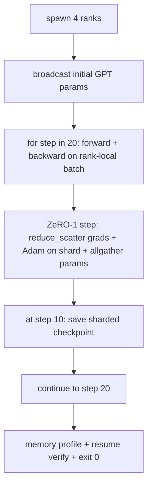

# End-to-End Distributed Training

> Уроки с 76 по 80 каждый построил одну часть. Это сборка: крошечный GPT, обучаемый по 4 симулированным рангам с DDP для синхронизации градиентов, ZeRO-1 для шардирования состояния оптимизатора и шардированным чекпоинтом на середине. Демо гоняет 20 шагов, самозавершается, печатает кривую лосса плюс профиль памяти и пишет возобновляемый чекпоинт.

**Тип:** Практика
**Языки:** Python
**Пререквизиты:** Фаза 19, трек C, уроки 42–49
**Время:** ~90 минут

## Цели обучения

- Скомпоновать DDP (урок 77) плюс ZeRO-1 (урок 78) плюс шардированные чекпоинты (урок 80) в один обучающий цикл.
- Обучить двухслойную трансформерную языковую модель на маленьком синтетическом корпусе 20 шагов по 4 симулированным рангам.
- Напечатать пошаговую таблицу лосса, пер-ранговый профиль памяти и манифест чекпоинта, возобновляющийся байт-точно на том же world size.
- Обосновать композицию: каждая часть независимо тестируема в предыдущих уроках, а этот урок доказывает, что они компонуются.

## Проблема

Capstone — доказательство того, что части подходят друг к другу. Урок 76 реализовал коллективы. Урок 77 обернул их в DDP. Урок 78 зашардировал состояние оптимизатора через reduce_scatter. Урок 79 проанализировал пайплайн. Урок 80 сохранил шардированный чекпоинт. Каждый урок стоял отдельно со своим тестом. Настоящий обучающий прогон использует каждый примитив сразу; если композиция неверна, лосс расходится, чекпоинт отказывается возобновляться или пер-ранговая память растет, когда должна сжиматься.

Этот урок гоняет end-to-end-демо и верифицирует четыре инварианта: (а) лосс монотонно убывает по 20 шагам в пределах float-шума, (б) каждый ранг держит одну и ту же норму параметров на каждом шаге, (в) пер-ранговая память оптимизатора равна формуле ZeRO-1 12P/N байт, (г) чекпоинт на шаге 10 перезагружается байт-точно при рестарте. Демо самозавершается: 20 шагов, одна команда, exit 0.

## Концепция



### Мини-GPT

Модель маленькая намеренно: 2 трансформерных блока, embed dim 32, 4 головы внимания, словарь 64, длина последовательности 16, батч 4. Несколько тысяч параметров. Достаточно велика, чтобы прогнать каждое решение проводки (multi-head attention идет стандартным маскированным путем; у LayerNorm есть веса для синхронизации; LM-голова — отдельная линейная проекция обратно в словарь). Достаточно мала, чтобы 20 шагов на 4 CPU-рангах закончились за секунды.

### Правила композиции

| Часть урока | Чем владеет | Что оставляет циклу |
|--------------|--------------|----------------------------|
| DDP broadcast | Начальная синхронизация параметров | Один вызов при конструировании |
| ZeRO-1 step | Синхронизация градиентов, обновление мастер-копии, broadcast параметров | Один вызов на шаг вместо optimiser.step |
| Шардированный чекпоинт | Персист пер-рангового состояния, манифест с sha256 | Вызывается на ранге 0 с состоянием, собранным через allgather |
| Обучающий цикл | Forward, backward, логирование лосса | Вызывает три вышеупомянутых по порядку |

Цикл не знает про reduce_scatter или rendezvous-файлы. Модули ZeRO и чекпоинта открывают узкие интерфейсы, которые цикл компонует.

### Почему крошечный GPT, а не просто MLP

MLP из урока 77 был достаточен для верификации синхронизации градиентов. Крошечный GPT добавляет три вещи: отдельную LM-голову над словарем (в этом уроке — развязанную ради ясности; полный GPT обычно связывает голову с токенным эмбеддингом), softmax+кросс-энтропию как лосс (больше численных краевых случаев, чем у MSE) и асимметричный forward (эмбеддинги, затем внимание, затем MLP на слой). Оставшись с MLP для capstone, мы бы спрятали, справляется ли композиция с LayerNorm или формой градиента слоя эмбеддингов корректно.

### Самозавершение означает exit 0

Цикл гоняет фиксированные 20 шагов и выходит. Никакого `while True`, никакого вмешательства человека, никакого resume из внешнего состояния. Capstone, который можно оставить работать без присмотра и найти полный лог по завершении, — это capstone, доказывающий, что система свита правильно. Если какая-то часть дедлочится, демо никогда не возвращается, и тестовая оснастка это ловит.

## Соберите это

`code/main.py` реализует:

- `MiniGPT`: двухслойный трансформер с маскированным self-attention и отдельной LM-головой.
- `make_corpus(seed, total_tokens)`: детерминированные данные предсказания следующего токена.
- `_train_worker`: порождается на ранг; бродкастит начальные параметры, гоняет цикл, вызывает шаг ZeRO, пишет шардированный чекпоинт на шаге 10.
- `verify_resume`: после основного прогона перезагружает чекпоинт шага 10 in-process и утверждает, что сохраненные мастер-шарды совпадают со снимком в памяти байт-в-байт.
- `main`: оркеструет все демо, печатает таблицу лосса, профиль памяти и результат верификации.

Запустите:

```bash
python3 code/main.py
```

Вывод: 20-строчная таблица лосса, 4-строчный пер-ранговый профиль памяти, манифест чекпоинта и строка «RESUME VERIFIED» при успехе.

## Production-паттерны в реальной практике

Три паттерна завершают композицию для настоящих прогонов.

**Чекпоинтите каждые K минут, а не каждые K шагов.** Время шага варьируется с длиной последовательности и числом микробатчей. 10-минутная частота чекпоинтов ловит те же вычисления независимо от размера модели. Урок использует шаговую ради простоты; продакшен — по wall-clock.

**Детектите расхождение рано.** Продакшен-прогоны добавляют NaN-guard после backward и детектор всплеска лосса; если лосс прыгает больше чем в 2 раза за один шаг, откатывайтесь к предыдущему чекпоинту вместо того, чтобы дать оптимизатору маршировать в вырожденное состояние. Кривая лосса урока гладкая, поэтому guard не задействован, но крюк остается.

**Агрегируйте профиль памяти по рангам.** Пер-ранговая память в настоящих прогонах различается по рангам (ранг с самой большой стадией пайплайна держит больше активаций). Продакшен логирует max по рангам плюс среднее; урок печатает пер-ранговое, чтобы показать совпадение с формулой.

## Используйте это

Production-паттерны:

- **DeepSpeed.** Сочетает DDP + ZeRO + pipeline + activation checkpointing под одним конфигом. Композиция урока — форма DeepSpeed в миниатюре.
- **PyTorch FSDP.** Нативный эквивалент. `FullyShardedDataParallel` с `ShardingStrategy.SHARD_GRAD_OP` — это ZeRO-2.
- **NeMo и Megatron-LM.** Добавляют tensor parallel для крупнейших моделей; иначе композиция той же формы.

## Отгрузите это

Полный трек заканчивается здесь. 6 уроков вместе — подсистема распределенного обучения, которую настоящая команда построила бы перед адаптацией DeepSpeed; абстракция доказана против gloo, а режимы отказа прогнаны. Фаза 17 (инфраструктура и продакшен) — место, чтобы вынести это на настоящий кластер.

## Упражнения

1. Добавьте tensor-parallel-разрез головы внимания и убедитесь, что лосс совпадает с однорангов��м бейзлайном. Два ранга: половина голов на ранг, allreduce выхода внимания.
2. Добавьте накопление градиентов по 4 микробатчам и докажите, что градиент равен градиенту одного большого батча.
3. Добавьте путь resume-со-шага-10, который реально продолжает обучение до шага 20 и дает тот же финальный лосс, что оригинальный прогон.
4. Добавьте экспорт метрик (лосс, норма градиента, время шага) в JSONL, чтобы прогон можно было визуализировать постфактум.
5. Добавьте NaN-guard, откатывающийся к предыдущему чекпоинту на всплеске лосса, и форсируйте всплеск одношаговым LR-множителем, чтобы прогнать откат.

## Ключевые термины

| Термин | Как говорят | Что это на самом деле |
|------|----------------|------------------------|
| End-to-end | «Свяжи все вместе» | Один прогон компонует каждую часть, а не юнит-тест на часть |
| Профиль памяти | «ГБ на ранг» | Байты, удерживаемые на каждом ранге под параметры, градиенты, состояние оптимизатора |
| Контракт resume | «Сохрани и загрузи» | Пер-ранговое состояние байт-точно после round-trip чекпоинта |
| Самозавершение | «Ограниченный прогон» | Фиксированное число шагов, exit 0 по завершении, без человека в цикле |

## Дополнительное чтение

- [Туториал end-to-end-обучения DeepSpeed](https://www.deepspeed.ai/getting-started/)
- [Продвинутый туториал PyTorch FSDP](https://pytorch.org/tutorials/intermediate/FSDP_advanced_tutorial.html)
- [Референс обучающего скрипта Megatron-LM](https://github.com/NVIDIA/Megatron-LM)
- Фаза 19, уроки 76–80 — каждая часть, которую компонует этот урок
- Фаза 17 — вынос композиции на настоящий кластер
