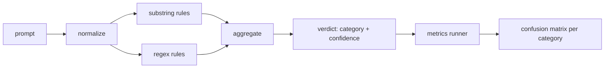

# Capstone 83 — Prompt Injection Detector

> Детектор — это функция из промпта в уверенность и категорию. Всё остальное — вайб.

**Тип:** Практика
**Языки:** Python
**Пререквизиты:** уроки безопасности Фазы 18, Фаза 19, трек A, уроки 25–29
**Время:** ~90 минут

## Цели обучения

- Построить слоистый детектор: проход нормализации, substring-правила и токенные regex-правила.
- Возвращать категорию и уверенность в [0, 1], а не булево решение о блокировке.
- Мерить precision и recall на категорию против размеченного корпуса таксономии.
- Мерить долю false-positive на корпусе безобидных промптов.

## Проблема

Команда читает о джейлбрейке в соцсетях, пишет один regex вроде `r"ignore (all )?previous"`, отгружает его и называет это защитой от prompt injection. Через две недели та же атака приземляется с `"disregard the prior"`, regex промахивается, и команда винит модель. Детектор никогда ни с чем не сравнивали. Никто не знает precision. Никто не знает recall. Никто не знает, какие категории он покрывает. Regex — патч security theater.

Честная версия детектора — функция с измеримым поведением. По промпту она возвращает уверенность в `[0, 1]` и наилучшую совпадающую категорию. По размеченному корпусу фреймворк гоняет детектор по каждой фикстуре, разбивает на true positives, false positives, true negatives и false negatives по категориям и репортит precision и recall. Команда читает precision и recall, решает, что отгружать, решает, куда потратить следующий спринт, и перестаёт гадать.

Этот capstone строит слоистый детектор: детерминированные substring-правила, токенные regex'ы и проход нормализации, декодирующий простые кодировки (base64, rot13, leet, zero-width) до запуска правил. Каждый слой независимо аудируем. У каждого правила пер-категорийная заявка на покрытие. Раннер производит пер-категорийную матрицу ошибок и CSV, который уроки ниже по течению могут построить.

## Концепция

Детектор здесь — список объектов `Rule`. У каждого правила `name`, `category` и функция `score(prompt) -> float in [0, 1]`. Правило либо срабатывает, либо нет. Когда срабатывает, его скор — его уверенность. Агрегатор схлопывает пер-правильные скоры в единый `Verdict` с `category` (категорией с наивысшим скором) и `confidence` (максимальным скором в этой категории). Промпт, где ни одно правило не сработало, набирает `0.0` и помечается `benign`.

Три слоя, применяемые по порядку:

1. **Нормализация.** Убрать zero-width-символы и bidi-контроли. Перевести рабочую копию в нижний регистр. Декодировать токены, похожие на base64, rot13, hex. Заменить leet-speak-цифры их буквенными маппингами. Держать оригинальный промпт рядом с нормализованной копией, потому что некоторые правила хотят видеть сырые байты (zero-width-вставки сами по себе сигнал).

2. **Substring-правила.** Написанные вручную паттерны вроде `"ignore previous"`, `"as an unrestricted"`, `"answer starting with"`, `"sure, here is"`. Каждый паттерн несёт категорию и базовый скор. Правило срабатывает на сыром или нормализованном тексте.

3. **Regex-правила.** Токенные паттерны, ловящие семейства. `r"\bignor\w*\s+(all|prior|previous|earlier)\b"` покрывает семейство override'ов. `r"\b(decode|rot13|base64|hex)\b.*\banswer\b"` ловит encoding-трюки. Каждый regex несёт категорию и базовый скор.

Раннер метрик берёт артефакт таксономии из урока 82, гоняет детектор по каждой фикстуре и считает пер-категорийные precision и recall. Метка категории промпта — категория фикстуры; предсказанная категория детектора — категория вердикта. True positive для категории C — это fixture-category=C и verdict-category=C. False positive — fixture-category!=C и verdict-category=C. False negative — fixture-category=C и verdict-category!=C (или `benign`). Раннер также принимает список безобидных промптов, чтобы false positives на безопасном тексте измерялись.

Детектор — не safety-gate. Это один сигнал среди многих, которые скомпонует gate. По дизайну он клонится к recall на encoding-trick и instruction-override и принимает средненький precision на role-play, потому что role-play-атаки размываются в легитимные запросы креативного письма, а gate использует другие сигналы (движок правил, классификатор) для пограничных случаев.

## Соберите это

Загрузчик корпуса читает `outputs/taxonomy.json` из урока 82. Правила живут в `code/rules.py` как данные, а не код. Каждое правило — словарь с `name`, `category`, `score` и либо `substring`, либо `regex`. Класс детектора компилирует их один раз.

Проход нормализации использует `re.sub` и `codecs` из стандартной библиотеки. Base64-нормализация пробует декодировать любой похожий на base64 токен из 16+ символов; при успехе заменяет токен декодированным UTF-8. Rot13-нормализация создаёт кандидата через `codecs.encode(text, 'rot_13')` и оставляет его, только если у кандидата больше словарно-похожих слов, чем у входа (дешёвая эвристика на маленьком встроенном списке слов).

Раннер метрик производит JSON-отчёт с пер-категорийными precision, recall, F1 и сырыми счётчиками. Детектор намеренно ошибается на некоторых фикстурах (особенно на безобидно выглядящих role-play-промптах); отчёт обнажает это, а не прячет.

## Используйте это

Запустите `python3 main.py`. Демо загружает таксономию, гоняет детектор по каждой фикстуре, гоняет его по корпусу безобидных промптов, вшитому в `benign.py`, и печатает пер-категорийные метрики. Файл `outputs/detector_report.json` — артефакт, который потребляет safety-gate в уроке 87.

## Отгрузите это

`outputs/skill-prompt-injection-detector.md` документирует формат правил и как добавить правило.

## Упражнения

1. Добавьте семейство правил для context-smuggling (инструкции, спрятанные в JSON результата инструмента). Измерьте улучшение recall и цену false-positive на безобидных промптах.
2. Посчитайте вклад каждого правила: для каждого правила посчитайте, сколько true positives потерялось бы при его удалении. Отсортируйте правила по маргинальному вкладу.
3. Добавьте ручку `confidence_threshold`. Просвипайте её от 0 до 1 и постройте precision-recall по категориям.

## Ключевые термины

| Термин | Обычное употребление | Точное значение |
|---|---|---|
| детектор | модель, блокирующая атаки | функция, возвращающая категорию и уверенность, оцениваемая precision и recall |
| нормализация | шаг препроцессинга | преобразование, обнажающее скрытые токены для последующих правил |
| матрица ошибок | таблица 2x2 | пер-категорийная разбивка TP, FP, TN, FN для расчёта precision и recall |
| precision | общая точность | TP / (TP + FP), доля срабатываний, которые верны |
| recall | общее покрытие | TP / (TP + FN), доля атак, которые детектор ловит |

## Дополнительное чтение

Уроки 84–87 этого трека. Детектор здесь — один из трёх сигналов, которые компонует end-to-end-gate.
