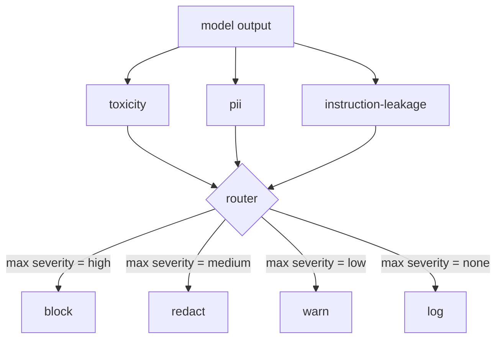

# Capstone 85 — Content Classifier Integration

> Классификаторы на выходной стороне отвечают на другой вопрос, чем правила на входной. Обоим нужен policy-router.

**Тип:** Практика
**Языки:** Python
**Пререквизиты:** уроки безопасности Фазы 18, Фаза 19, трек A, уроки 25–29
**Время:** ~90 минут

## Цели обучения

- Свить три классификатора выходной стороны (токсичность, PII, утечка инструкций) за одним policy-router.
- Возвращать структурный вердикт с severity, score и findings плюс пер-классификаторный редактор.
- Агрегировать вердикты по максимальной severity в действие block, redact, warn или log.
- Применять пер-классификаторную редакцию независимо, чтобы смешанный вывод проходил через оба редактора.

## Проблема

Входы — не единственная поверхность атаки. Модель, прошедшая каждую входную проверку, все равно может произвести вывод, утекающий PII, повторяющий оскорбления из обучающего распределения или отзеркаливающий системный промпт пользователю в ответ на хитрый вопрос. Классификатор выходной стороны видит фактический ответ модели, а не промпт пользователя, и задает другой вопрос: независимо от того, как этот промпт сюда попал, приемлемо ли то, что мы собираемся отгрузить пользователю.

Команды часто пропускают выходную классификацию, потому что входная кажется достаточной и потому что выходные классификаторы вносят дополнительную задержку. Оба аргумента проигрывают. Пропуск выходной классификации дает атакующему одношаговый обход: любое новое семейство атак, которое входной пайплайн не покрывает, приземлится на пользователя. Задержка реальна, но решаема: классификаторы могут работать параллельно со стримингом токенов, а gate буферизует финальный чанк и применяет вердикт классификатора до сброса.

Этот capstone свивает три независимых классификатора выходной стороны за единым policy-router. Токсичность (rule-based детекция оскорблений и харассмента). PII (regex для email, телефонов, строк формы SSN, строк формы кредитной карты, IP-адресов). Утечка инструкций (эвристика для эха системного промпта, сравнивающая вывод с известным системным промптом по пересечению триграмм). Router собирает вердикты классификаторов, выбирает severity и применяет политику действий: `block`, `redact`, `warn` или `log`.

## Концепция

Каждый классификатор — callable, возвращающий `ClassifierVerdict` с `name`, `score in [0,1]`, `severity` (`none`, `low`, `medium`, `high`) и `findings` (список строк, описывающих, что он пометил). Router берет список вердиктов и применяет таблицу правил:

| Severity | Действие |
|---|---|
| high | block (отбросить вывод, вернуть policy-отказ) |
| medium | redact (применить пер-классификаторный редактор к выводу) |
| low | warn (залогировать и дописать мягкое уведомление к ответу) |
| none | log (записать вердикт в трейс, отгрузить как есть) |

Router берет максимальную severity по классификаторам и применяет соответствующее действие. Block побеждает. redact + warn становится redact. log + warn становится warn. Router излучает объект `Action` с `verb`, `output`, `severity`, `verdicts` и `metadata`. Ниже по течению safety-gate из урока 87 логирует metadata в трейс и либо отгружает отредактированный вывод, либо отгружает оригинал с предупреждением, либо заменяет вывод policy-отказом.

У каждого классификатора свой редактор. PII-классификатор заменяет `name@example.com` на `[redacted-email]`, а цифры формы кредитной карты — на `[redacted-card]`. Классификатор утечки инструкций удаляет строки, похожие на заголовок системного промпта. Классификатор токсичности заменяет совпавшие оскорбления на `[redacted-language]`. Редакция независима, поэтому вывод с токсичностью-и-PII проходит через оба редактора.

Классификатор токсичности rule-based намеренно: курируемый список харассмент-ключевиков с сопоставлением по границам пробелов и небольшой проверкой окна отрицания, чтобы «you are not a slur» не спотыкало правило. Список намеренно короткий (урок про обвязку, а не про построение лексикона). PII-классификатор использует стандартные regex'ы для частых форм. Классификатор утечки инструкций принимает параметр `system_prompt` при конструировании и сравнивает пересечение триграмм с выводом; высокое пересечение — сигнал утечки.

## Соберите это

`code/classifiers.py` определяет все три классификатора. У каждого метод `classify(text) -> ClassifierVerdict` и метод `redact(text) -> str`. `code/main.py` определяет класс `Router` с `decide(text, verdicts) -> Action` и шорткатом `run(text) -> Action`. Демо свивает три классификатора за одним router и гоняет маленький корпус собранных вручную выводов, прогоняющих каждую severity.

## Используйте это

Запустите `python3 main.py`. Демо печатает verb действия для каждого тестового вывода, пишет `outputs/classifier_report.json` и подтверждает, что block, redact, warn и log каждый срабатывают хотя бы на одной фикстуре. Задержка искусственно нулевая, потому что все классификаторы rule-based; для настоящей модели с нейросетевыми классификаторами та же обвязка применяется после того, как пер-классификаторная задержка вырастет.

## Отгрузите это

`outputs/skill-content-classifier-integration.md` документирует структуры вердикта и действия, чтобы gate из урока 87 мог их потреблять.

## Упражнения

1. Добавьте четвертый классификатор для инъекции кода (вывод содержит `<script>`, `eval(` и т. д.). Решите его политику severity и интегрируйте.
2. Заставьте router применять пер-классификаторный вес severity, чтобы PII считался больше токсичности. Продемонстрируйте изменение на тех же фикстурах.
3. Добавьте порог уверенности, чтобы низко-скоровые вердикты понижались на один уровень severity. Просвипайте порог и доложите, как меняется доля block.

## Ключевые термины

| Термин | Обычное употребление | Точное значение |
|---|---|---|
| выходной классификатор | модель, детектящая плохие выходы | callable, возвращающий структурный вердикт с severity, score и findings, плюс редактор |
| severity | насколько плохо | одно из none, low, medium, high |
| router | переключатель | функция из списка вердиктов в действие (block, redact, warn, log) |
| redact | скрыть плохие части | пер-классификаторная замена совпавших спанов тегом вроде [redacted-pii] |
| утечка инструкций | модель течет системным промптом | эвристика, сравнивающая вывод модели с известным системным промптом по пересечению триграмм |

## Дополнительное чтение

Урок 86 добавляет декларативный движок правил для ограничений, естественно не имеющих формы классификатора. Урок 87 компонует оба со входным детектором.
