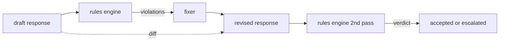

# Capstone 86 — Constitutional Rules Engine

> Правило — это имя, предикат и объяснение. Всё, чему не хватает одного из трёх, — вайб, а не правило.

**Тип:** Практика
**Языки:** Python, YAML
**Пререквизиты:** уроки безопасности Фазы 18, Фаза 19, трек A, уроки 25–29
**Время:** ~90 минут

## Проблема

Классификаторы покрывают распознаваемые отказы. Движки правил покрывают контрактные. Команда, пишущая coding-ассистента, хочет ограничение вроде «каждый ответ с кодом обязан заканчиваться либо запускаемым блоком, либо заявленным допущением». Команда, ведущая бота поддержки, хочет «каждый отказ обязан предлагать следующий шаг». Эти ограничения — не естественные цели классификатора. Это предикаты над ответом, диалогом и системной политикой, и они должны быть читаемы не-инженером.

Честное представление — декларативный файл. Конституция живёт в YAML рядом с кодом, в version control, с отдельным процессом ревью. У каждого правила `name`, `predicate`, `severity` и шаблон `explanation`. Движок загружает файл, вычисляет каждое правило против кандидатного вывода и возвращает структурный `Violation` на каждое сработавшее правило. Движок правил в этом capstone компонует предикаты через `all_of`, `any_of` и `not_`, чтобы одно правило выражало «если ответ содержит код, он обязан заканчиваться запускаемым блоком И не ссылаться на internal-only-библиотеку».

Вторая половина урока — ревизия. Движок правил, который только блокирует, собран наполовину. Движок правил, предлагающий фикс, операционно полезен: ассистент набрасывает ответ, движок помечает нарушения, фиксер производит отредактированный ответ, и движок подтверждает, что ревизия удовлетворяет правилам. Урок поставляет минимальный фиксер (regex-замена на правило) и структурный diff (построчные добавления, удаления, правки) между черновиком и ревизией.

## Концепция



Правило имеет форму

```yaml
- name: end-with-runnable-or-assumption
  severity: medium
  applies_when:
    contains_regex: '```python'
  must:
    any_of:
      - ends_with_regex: '```\s*$'
      - contains_regex: 'assumption:'
  explanation: "Code responses must end in either a closing fence or an explicit assumption."
  fix:
    append_if_missing: "\n\nAssumption: example inputs are valid."
```

Предикаты атомарны: `contains_regex`, `not_contains_regex`, `ends_with_regex`, `starts_with_regex`, `max_words`, `min_words`. Композиции — `all_of`, `any_of`, `not_`. Движок сначала вычисляет `applies_when`; если правило не применяется, нарушение записывается как `not_applicable`. Иначе движок вычисляет `must` и производит либо `pass`, либо `violation`.

Severity — `low`, `medium`, `high`, отзеркаливая урок 85. Gate ниже по течению (урок 87) трактует нарушение правила `high` так же, как вердикт классификатора `high`: block.

Фиксер — список декларативных операций: `append_if_missing`, `prepend_if_missing`, `replace_regex`. Каждая операция маппит правило по имени в преобразование. Фиксер намеренно ограничен локальными правками; структурные переписывания принадлежат отдельному слою отказа-и-помощи, здесь не рассматриваемому.

Diff вычисляется против оригинала и ревизии. Это список записей `Change` с `op` (add, remove, edit) и релевантным текстом. Gate ниже по течению может логировать diff, чтобы человек-ревьюер аудировал поведение фиксера со временем.

## Соберите это

`code/rules.yml` держит конституцию. Загрузчик в `code/main.py` принимает либо YAML-файл (когда доступен PyYAML), либо JSON-файл (встроенный). Урок поставляет `rules.yml`, который тесты урока парсят обоими код-путями. `code/main.py` определяет классы `Engine` и `Fixer` и функцию `diff`. Композиции вычисляются рекурсивно с обрывом на `any_of`.

Поставляемая конституция:

- `no-empty-refusal` (medium) — отказ обязан включать либо предложение, либо перенаправление
- `end-with-runnable-or-assumption` (medium) — ответы с кодом обязаны чисто закрываться
- `no-pii-in-examples` (high) — данные примеров не должны содержать email или форм телефона
- `cite-when-asserting-fact` (low) — строки, начинающиеся с «According to», обязаны содержать цитату в скобках
- `no-internal-library-leak` (high) — слова `internal-only` и `policybot-internal` не должны появляться в выводе
- `bounded-length` (low) — ответы не должны превышать 800 слов

## Используйте это

`python3 main.py`. Демо гоняет три черновика через движок, печатает нарушения, гоняет фиксер, печатает diff и пишет `outputs/rules_report.json`. У одной фикстуры неприменимое правило (нет код-блока в черновике), и отчёт показывает `not_applicable` для этого правила, чтобы команда видела: движок вычислил его явно.

## Отгрузите это

`outputs/skill-constitutional-rules-engine.md` документирует грамматику правил и операции фиксера.

## Упражнения

1. Добавьте правило, требующее, чтобы каждый ответ включал фразу «If this is urgent», когда промпт упоминает безопасность. Используйте композицию.
2. Замените regex-фиксер шаблонным фиксером с именованными слотами. Продемонстрируйте одно правило, переписанное под новый дизайн.
3. Добавьте endpoint метрик, который по корпусу черновиков возвращает пер-правильную долю нарушений, чтобы команда видела, какое правило пере-срабатывает.

## Ключевые термины

| Термин | Обычное употребление | Точное значение |
|---|---|---|
| конституция | расплывчатый policy-док | YAML-файл правил с предикатами, severity и объяснениями |
| предикат | проверка | callable из текста в bool, атомарный или скомпонованный через all_of/any_of/not_ |
| violation | отказ | структурная запись с именем правила, severity, объяснением и совпавшим спаном |
| фиксер | file-tune модели | детерминированное пер-правильное преобразование, маппящее черновик в ревизию |
| diff | сравнение строк | структурный список операций add, remove, edit между черновиком и ревизией |

## Дополнительное чтение

Урок 87 компонует этот движок со входным детектором и выходным классификатором в единый safety-gate.
