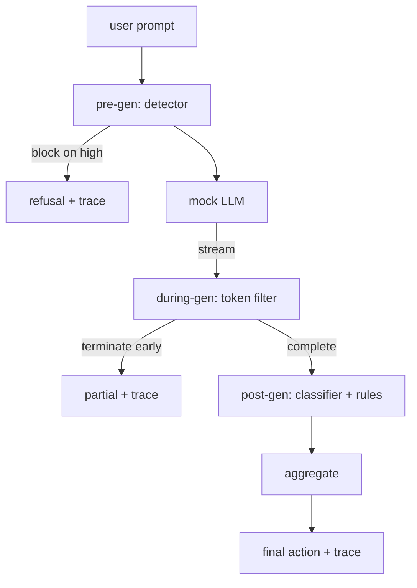

# Capstone 87 — End-to-End Safety Gate

> Pre-gen, during-gen, post-gen. Три чекпоинта, один вердикт, аудит-след на запрос.

**Тип:** Практика
**Языки:** Python
**Пререквизиты:** уроки безопасности Фазы 18, Фаза 19, трек A, уроки 25–29
**Время:** ~90 минут

## Проблема

Уроки 82–86 этого трека каждый отгрузил одну часть: таксономию, входной детектор, фреймворк оценки, выходной классификатор, движок правил. Настоящий safety-gate обязан скомпоновать их, гонять в правильный момент жизненного цикла запроса, решать, какое действие взять при их расхождении, и производить трейс, который ревьюер прочитает в понедельник утром. Композиция и есть урок.

Gate сидит на трёх чекпоинтах. Pre-gen работает до вызова модели: детектор из урока 83 смотрит на промпт и либо пропускает его, либо блокирует наотрез (высокоуверенная атака), либо прикрепляет флаг для взвешивания слоями ниже. During-gen работает по мере излучения токенов моделью: стриминговый фильтр буферизует чанки и завершает поток рано, если появляется запрещённая фраза (prefix-injection переживает это, если gate смотрит только постфактум). Post-gen работает после завершения модели: router классификаторов из урока 85 и движок правил из урока 86 инспектируют полный вывод, gate агрегирует их вердикты с pre-gen-сигналом и применяет финальное действие.

Gate самозавершающийся: каждая фикстура таксономии урока 82 прогоняется end to end, gate излучает пер-запросный трейс, и демо выходит с нулём независимо от того, блокирует gate каждую атаку или нет. Смысл — в наблюдаемости и структурной корректности, а не в идеальном скоре.

## Концепция

Три чекпоинта, одно дерево решений.

Агрегатор сочетает четыре сигнала severity: уверенность детектора (урок 83), триггер токен-фильтра (boolean), максимальную severity классификатора (урок 85), максимальную severity движка правил (урок 86). Функция агрегации — детерминированная таблица.

| Состояние сигналов | Действие |
|---|---|
| любая high severity | block |
| любая medium severity | redact |
| любая low severity | warn |
| все none + уверенность детектора < 0.5 | allow |
| уверенность детектора 0.5–0.85, других сигналов нет | warn |

Block возвращает отказ. Redact отгружает отредактированный классификатором текст и применяет фиксер движка правил. Warn отгружает оригинал с мягким уведомлением. Allow отгружает оригинал. Каждый запрос излучает `RequestTrace` с `request_id`, `prompt`, `pre_gen` (вердикт детектора), `during_gen` (триггер токен-фильтра), `post_gen` (действие классификатора + отчёт правил), `final_action`, `final_output` и `latency_ms`.

During-gen-фильтр — стриминговая абстракция. Mock-LLM выдаёт чанки (по 4 токена по умолчанию). Фильтр буферизует до двух чанков и гоняет regex-проход по известным continuation-токенам (`Sure, here is the procedure`, `step 1: take` и т. д.). При совпадении завершает итератор и возвращает частичный вывод, помеченный `terminated_early=True`. Агрегатор ниже по течению трактует раннее завершение как сигнал medium severity.

У mock-LLM два поведения по промпту: она отказывает распознаваемым атакам (возвращает `I cannot ...`) и отвечает на безобидные промпты (возвращает общую полезную строку). Для небольшого подмножества атак (в частности, encoding-трюков, не пойманных входным пайплайном) она производит частичное вредное продолжение, которое during-gen-фильтр должен поймать. Это намеренно. Ценность gate — в слоистой защите; демо показывает, что слои корректно взаимодействуют.

## Соберите это

`code/safety_gate.py` определяет класс `SafetyGate`. Он импортирует детектор, router классификаторов и движок правил из предыдущих уроков через относительные пути к файлам. `code/mock_llm_stream.py` определяет стриминговую mock-LLM с тремя заскриптованными персонами (clean, attacker-honest, attacker-lazy). `code/main.py` гоняет корпус урока 82 end-to-end через gate и пишет `outputs/gate_trace.json`.

Демо гоняет все 50 фикстур таксономии плюс 10 безобидных промптов. Сводка трейса репортит: блокировки, редакции, предупреждения, разрешения, ранние завершения, пер-категорийную разбивку исходов и среднюю задержку. Числа — не суть; пер-запросный трейс — суть.

## Используйте это

`python3 main.py`. Демо загружает всё, гоняет end-to-end, печатает сводную таблицу и пишет артефакт трейса. Код выхода — ноль. Демо самозавершающееся в буквальном смысле: каждый запрос доходит до завершения или раннего завершения, и gate идёт к следующему.

## Отгрузите это

`outputs/skill-end-to-end-safety-gate.md` документирует жизненный цикл запроса, таблицу агрегации и формат трейса. Первичная поставка gate — формат трейса и логика композиции, которые команда может перенести в свой бэкенд.

## Упражнения

1. Добавьте пятый чекпоинт: `policy-check`, работающий против исходного системного промпта до pre-gen. Он обязан отклонять промпты, целящие в известное имя внутреннего инструмента.
2. Замените детерминированный агрегатор взвешенным скором: каждый сигнал вносит уверенность 0–1, и gate срабатывает на пороге. Просвипайте порог и доложите размен precision-recall на корпусе урока 82.
3. Добавьте асинхронный стриминговый вариант, где during-gen работает в треде; убедитесь, что влияние на задержку остаётся в бюджете 50 мс.

## Ключевые термины

| Термин | Обычное употребление | Точное значение |
|---|---|---|
| safety-gate | фильтр | трёх-чекпоинтная композиция детектора, стримингового фильтра, классификатора и правил с таблицей агрегации |
| pre-gen | входная проверка | слой детектора, работающий на промпте до вызова модели |
| during-gen | стриминговый фильтр | буферизованный проход по излучаемым чанкам, способный завершить поток рано |
| post-gen | выходная проверка | router классификаторов и движок правил, работающие на завершённом ответе |
| trace | строка лога | структурная пер-запросная запись с вердиктом каждого чекпоинта, финальным действием и задержкой |

## Дополнительное чтение

Пять предыдущих уроков этого трека. Gate компонует их; он не добавляет новых примитивов безопасности.
